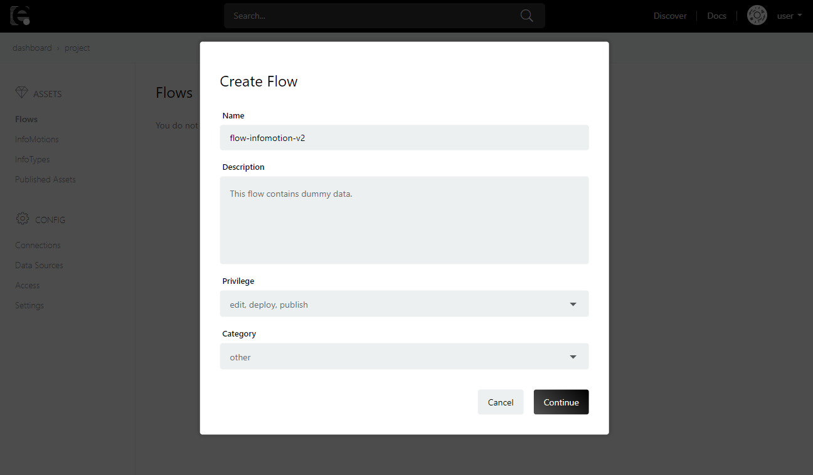
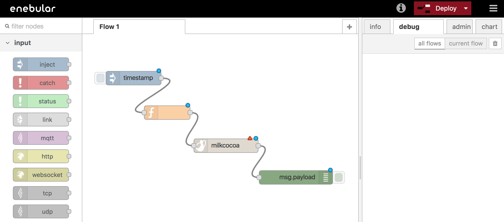
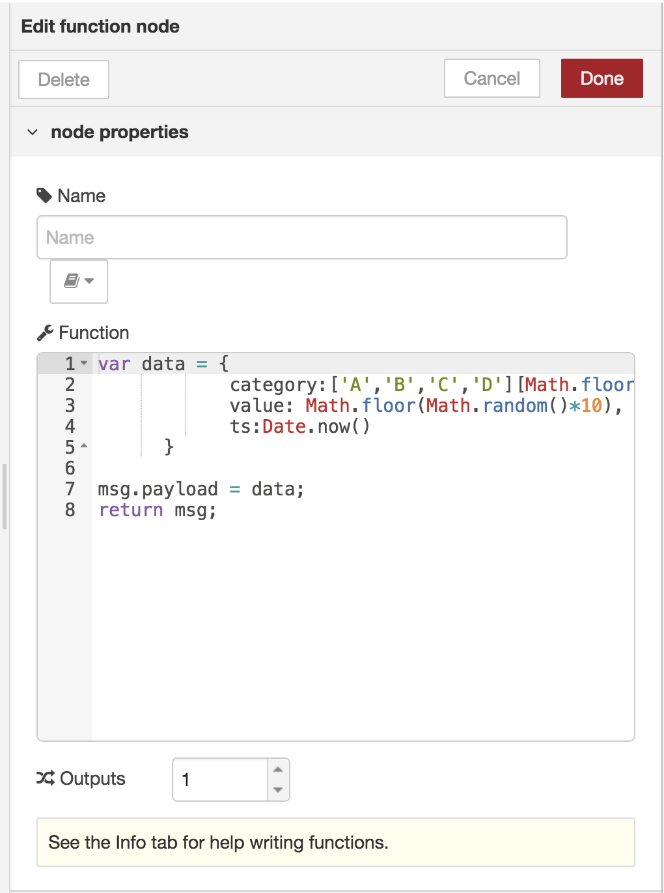
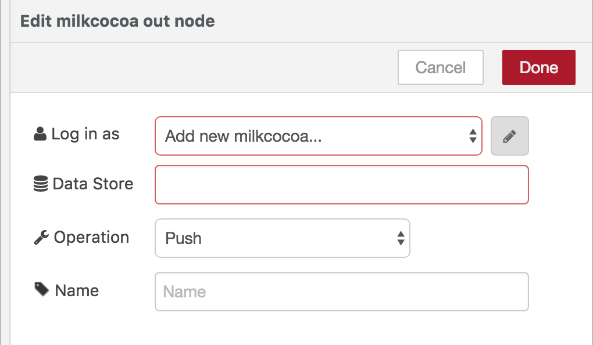
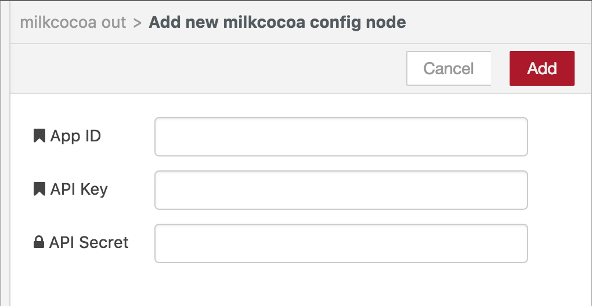
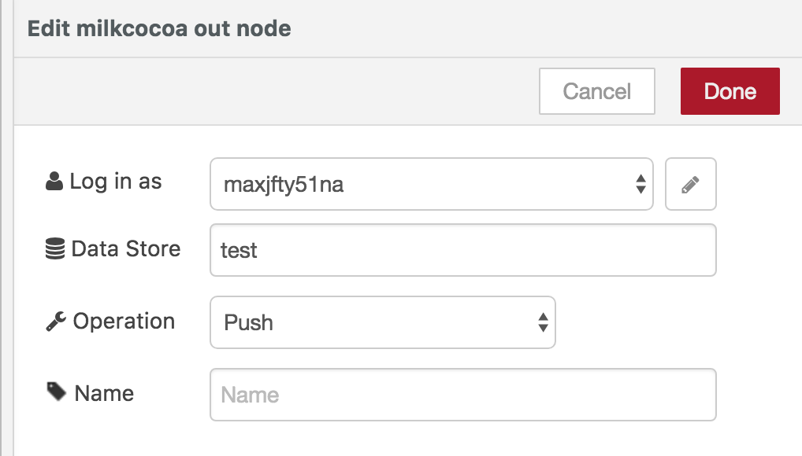
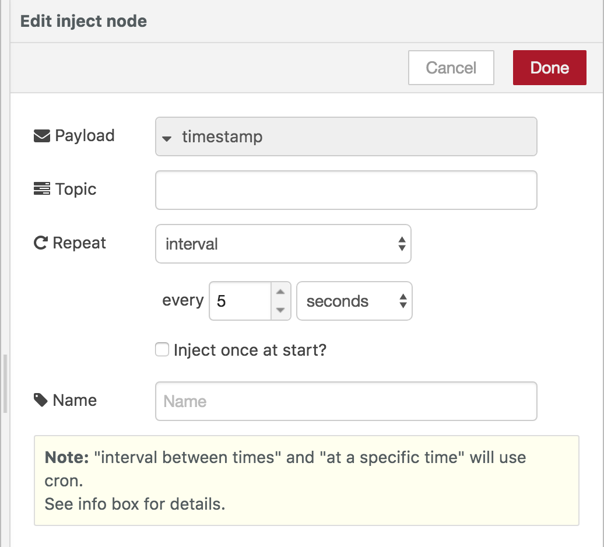
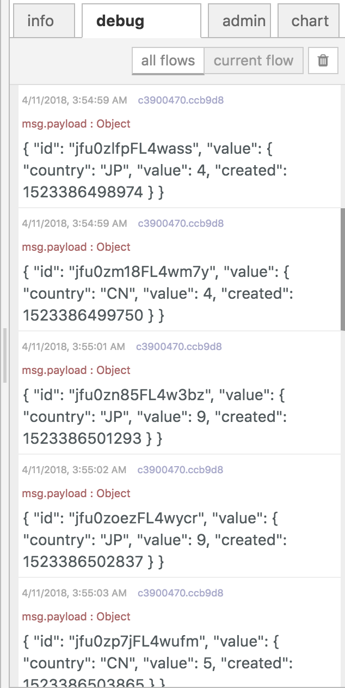
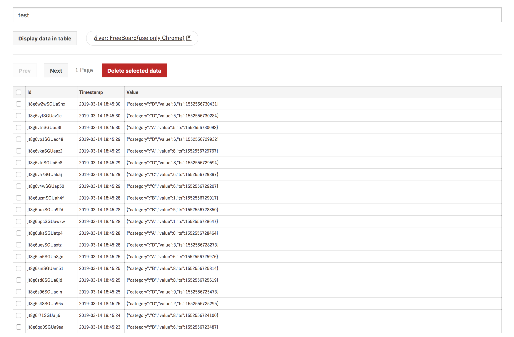

###Create a Flow  {#Create a Flow}

The Milkcocoa datastore will be used to push data.
At your enebular project create a new Flow. 



Click the `Edit Flow` button 

In the flow editor arrange the nodes as follows. 

Inject -> function -> milkcocoa(output) -> debug 



Double click the function node to open the `edit function node` modal. 
Use the following script as the Function

```javascript
var data = {
    country:['JP','USA','CN'][Math.floor(Math.random()*3)],
    value: Math.floor(Math.random()*10),
    created:Date.now()
}

msg.payload = data; 
return msg;
```




Next double click the Milkcocoa node to open the `edit milkcocoa out node`. 



Click on the pencil icon and enter the `app_id` of your milkcocoa project. 
You can leave `API Key` and `API Secret` empty for this simple example and 
click `add` to set it. 




Set the `Data Store` to "test" and `operation` to Push then click done to set the node. 




Double click the inject/timestamp and set `repeat` to `interval` for every 5 seconds. 
Click done to set the node. 




Now with all nodes ready click `Deploy` to execute the nodes. 


If you can see data being logged in `debug` then the nodes are executing correctly. 



You can also double check by going to mlkcca.com  and checking your projects datastore.
Search the store name and click `リスト表示（更新）` to refresh the store list. 


