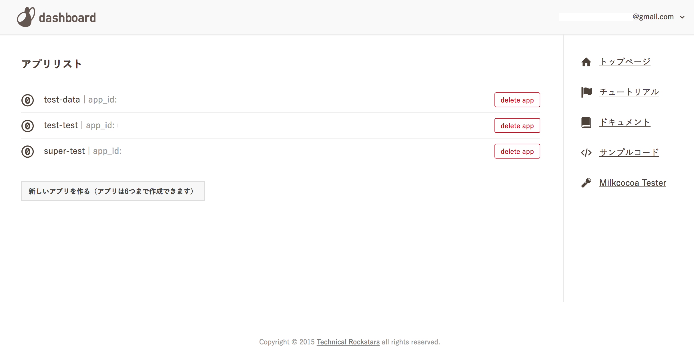
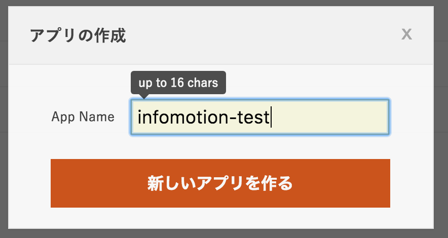
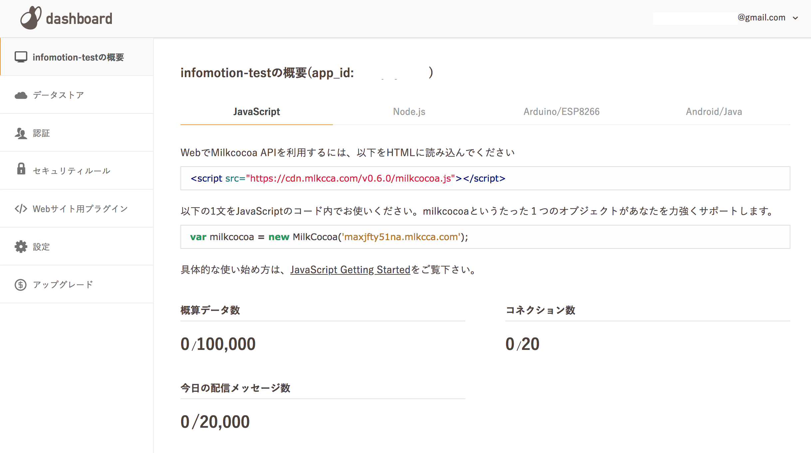

###Set-up {#Set-up}

Register at https://mlkcca.com/. 
Once you are registered and logged in at dashboard click on `新しいアプリを作る)`　

Name the application. 

The new applicaiotn will be added to the list. 

For this example we will only use the `app_id`. 
Authentication (`認証`) is set to public by default. 

