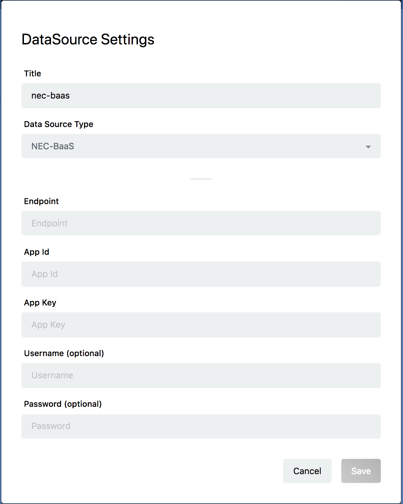
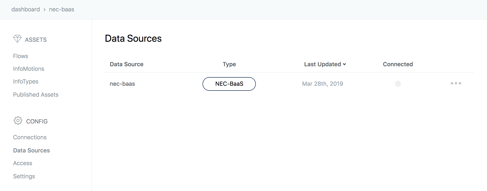

###Create NEC BaaS Data Source {#Create NEC BaaS Data Source}

※ Not Applicable with livemode

NEC BaaS is an "NEC Mobile Backend Platform". Please see [this page](https://nec-baas.github.io/index.html) for more details.

Please refer to [this page](https://github.com/nec-baas/baas-infomotion) for InfoMotion support of NEC BaaS.

In the same enebular project click `Data Source` then the plus button to open the `Data Source` settings.

Enter the following information.

* Title
	* Please enter the name of Data Source.
* Data Source Type
	* Please select NEC BaaS.
* Endpoint
	* `https://{API server host name}/api/1/{tenant name}/api/infomotion/search/{bucket name}?{search condition}`
	* For the API server host name, specify the server host name on which NEC BaaS is operating.
	* Confirm the tenant name (ID) on the NEC BaaS developer console.
	* Specify the object bucket name to refer to the bucket name.
	* Setting of the search condition is optional. You can specify where in the object query based on the same format as the search condition. Please check [NEC BaaS documentation](https://nec-baas.github.io/documents.html) for search conditions.
* App Id
	* Application ID for your NEC BaaS
	* Check on the BaaS developer console
* App Key
	* Application Key for your NEC BaaS
	* Check on the BaaS developer console
* Username (optional)
	* Username for your NEC BaaS
	* In the case you have not set Basic authentication, please leave this empty
* Password (optional)
	* Password for your NEC BaaS
	* In the case you have not set Basic authentication, please leave this empty

Click Save to set the Data Source.

You should see a new Data Source created.

## Create InfoMotion {#Create InfoMotion}

You are ready to use Data Source.
The data can be reflected in the graph by selecting the Data Source created when creating the InfoMotion dashboard.

[Sample InfoTypes](./../../SampleInfoTypes.md) to downoad a graph, 
[Upload an InfoType](./../../UploadInfoType.md) to upload a graph to enebular, 
and [Create InfoMotion](./../../CreateInfoMotion.md) to create an InfoMotion dashboard.
