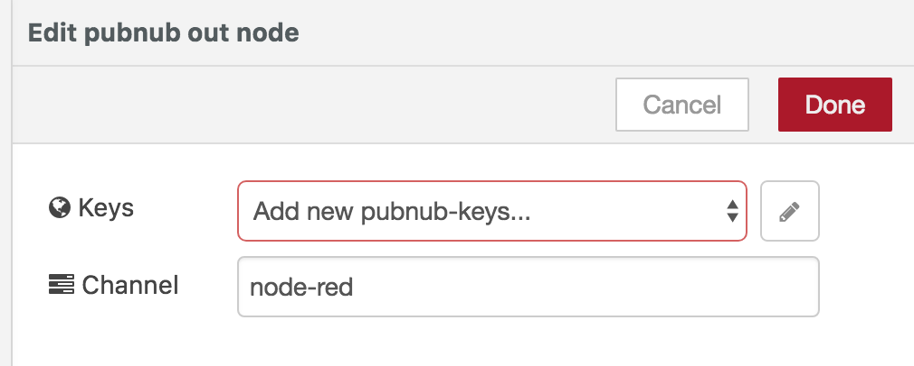
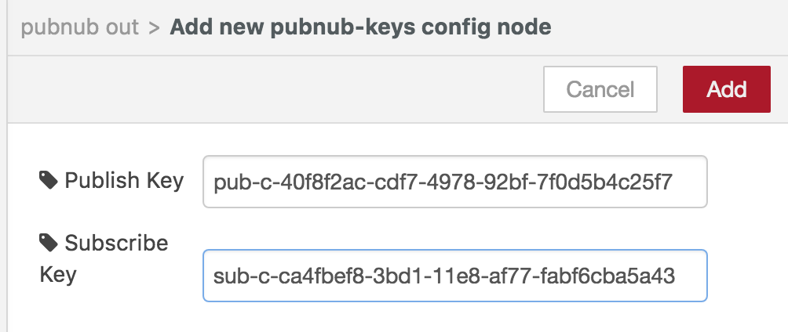
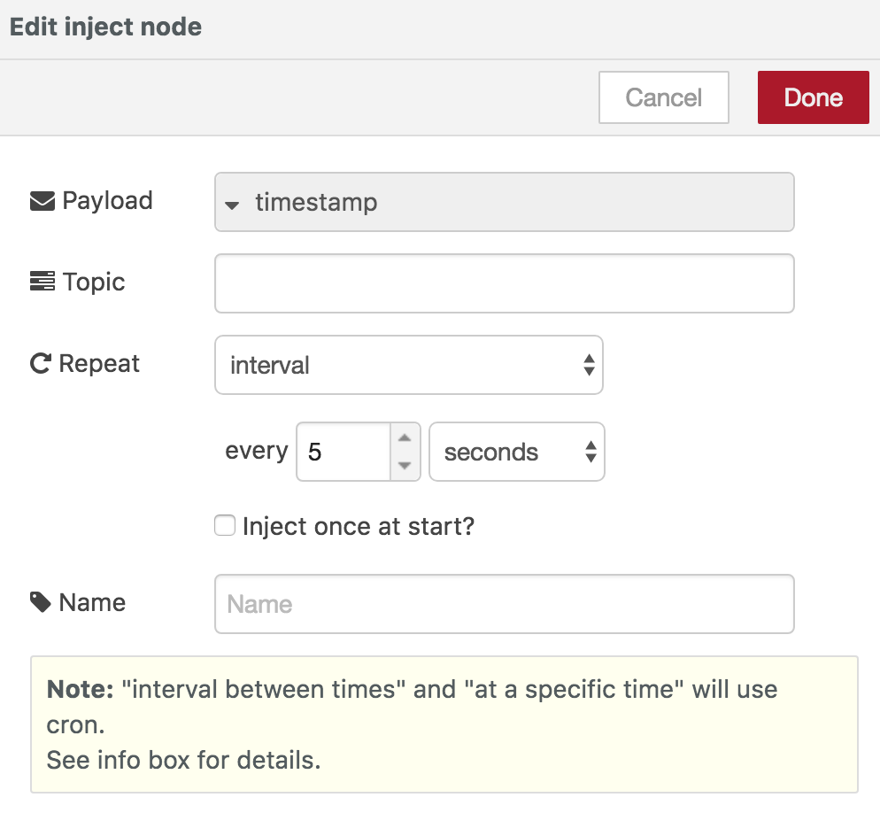

###Create a Flow 

The Pubnub datastore will be used to push data to. 
At your enebular project create a new Flow. 


Click the `Edit Flow` button 


In the flow editor arrange the nodes as follows. 
inject -> function -> pubnub(in) 
pubnub(out) -> debug 


Double click the function node to open the `edit function node` modal. 

Use the following script as the Function.

```javascript
var data = {
	ts:Date.now(),
	category:['A','B','C','D'][Math.floor(Math.random()*4)],
    value: Math.floor(Math.random()*10)
}

msg.payload = data; 
return msg;
```


For the pubnub out node you will need to inseart your 
pubnub keys from your pubnub project app. Click on the pencil icon to edit keys. 



Copy the publish and subscribe key from your pubnub app. 
Then click on update. 




For this example use "test" as the channel to push data to. Click done to continue. 


Set the pubnub in node with the same keys as the out node. 


Click on the pencil icon to enter pubnub keys to update keys. 


Double click the inject/timestamp and set `repeat` to `interval` for every 5 seconds. 
Click done to set the node. 




Now with all nodes ready click Deploy to execute the nodes.

If you can see data being logged in debug then the nodes are executing correctly.


