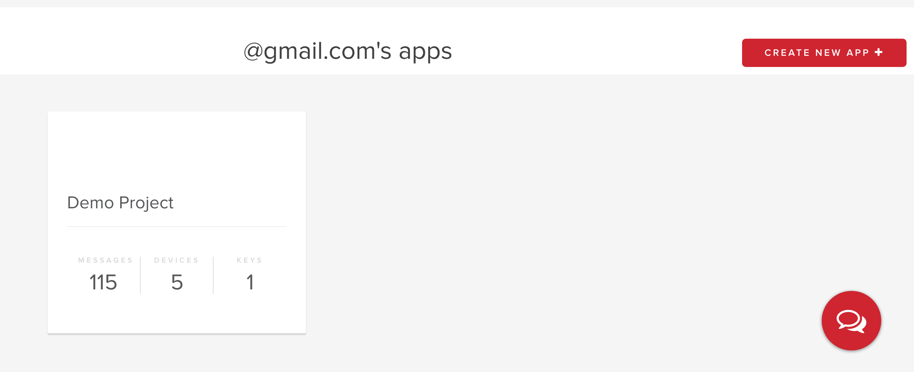
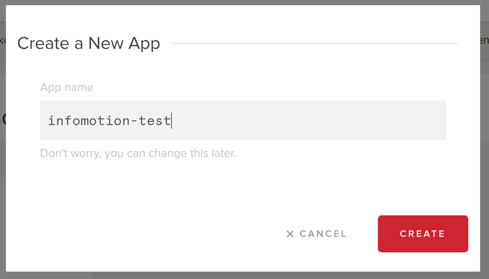
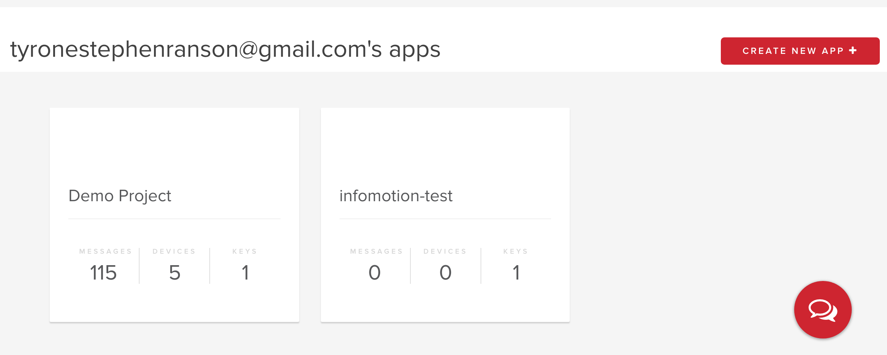
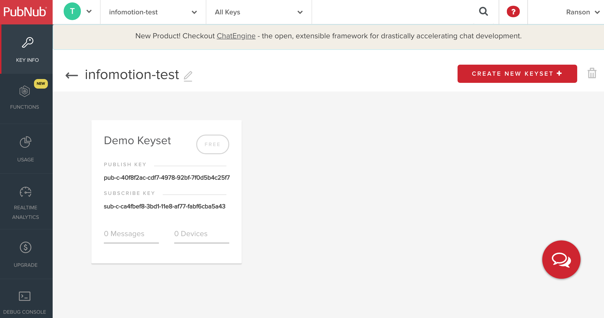
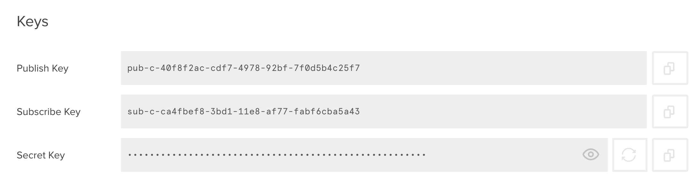
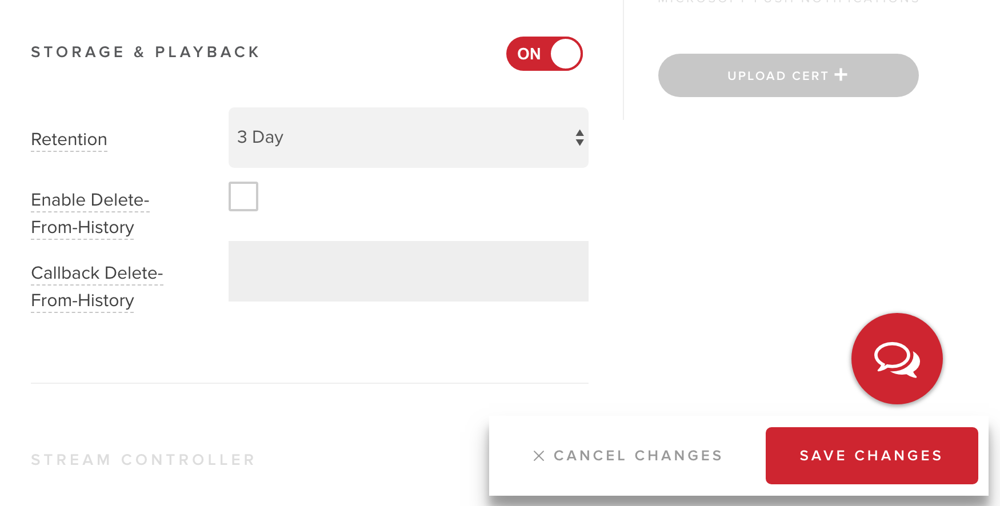

###Set-up {#et-up}

Register at https://www.pubnub.com/.
Once you are registered and logged in at the main dashboard click on create a new app. 

Create the application. 

The new application will be added to the list. 

Click on the new project.

Pubnub offers by default Demo Keyset. 
We will need these keys to push data to a datastore. 
Click on the Demo Keyset to view the keys. 

Data pushed to Pubnub will have to be saved. 
In the Demo Keyset scroll down to storage and playback.  
Turn the switch on and set the Retention to 1 day or more. Make sure you click on save to set this settings.  

