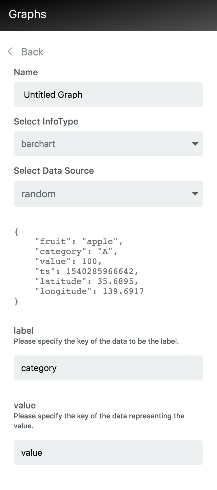

# Random Data Generator {#Random Data Generator }

Random Data Source allows users to test InfoTypes with random data generated on the client side.  
This way users can display infotypes in the dashboard without creating a data source.

## Set-up {#Set-up}

Random adapter requires no set up.  
When creating a graph in the InfoMotion dashboard, random adapter is added by default as a Data Source option under the name random.



## Random Sample Data {#Random Sample Data }

```javascript
{
    "fruit": "apple",
    "category": "A",
    "value": 100,
    "ts": 1540285966642,
    "latitude": 35.6895,
    "longitude": 139.6917
}
```

## Random Data Schema {#Random Data Schema}

```json
{
  "type": "object",
  "title": "The Root Schema",
  "required": ["fruit", "category", "value", "ts", "latitude", "longitude"],
  "properties": {
    "fruit": {
      "$id": "#/properties/fruit",
      "type": "string",
      "title": "The Fruit Schema",
      "examples": ["apple"],
      "pattern": "^(.*)$"
    },
    "category": {
      "$id": "#/properties/category",
      "type": "string",
      "title": "The Category Schema",
      "examples": ["A", "B", "C"],
      "pattern": "^(.*)$"
    },
    "value": {
      "$id": "#/properties/value",
      "type": "integer",
      "title": "The Value Schema",
      "examples": [100]
    },
    "ts": {
      "$id": "#/properties/ts",
      "type": "integer",
      "title": "The ts Schema",
      "examples": [1540285966642]
    },
    "latitude": {
      "$id": "#/properties/latitude",
      "type": "number",
      "title": "The Latitude Schema",
      "examples": [35.6895]
    },
    "longitude": {
      "$id": "#/properties/longitude",
      "type": "number",
      "title": "The Longitude Schema",
      "examples": [139.6917]
    }
  }
}
```
