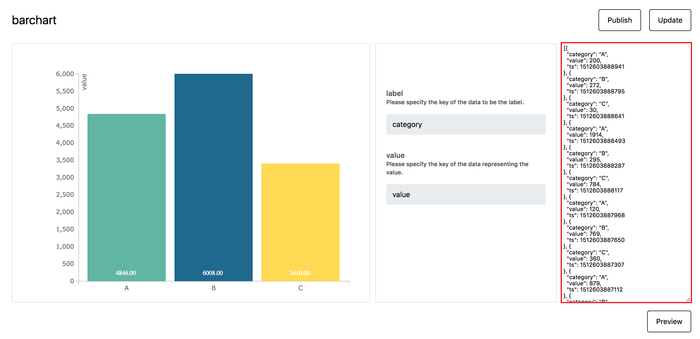

# Data Source Schema

All datasource data must contain a `ts` key with a Unix Timestamp value as shown below.
InfoMotion uses the `ts` for daterange picker, timeline and querying historical data.
This data is also used with in the InfoType (graph/chart).

```javascript
{
  ts: Unix Timestamp milliseconds since Jan 01 1970. (UTC), // timestamp for daterange, timeline and querying.
  // All data in this object is passed to the infotype
}
```

#InfoType sample data

Each InfoType may require specific keys and values.
The type of data required for each InfoType can be seen on the right hand side
in preview of the InfoType.



For an enebular sample barchart the folowing data is required.

## Sample Data

```javascript
{
  ts: Unix Timestamp milliseconds since Jan 01 1970. (UTC),
  category: String,
  value: Number
}
```

## JSON Data Schema

```json
{
  "type": "object",
  "required": ["timestamp", "value"],
  "properties": {
    "timestamp": {
      "$id": "#/properties/timestamp",
      "type": "integer",
      "title": "The Timestamp Schema",
      "examples": [1542352981750]
    },
    "value": {
      "$id": "#/properties/value",
      "type": "object",
      "title": "The Value Schema"
    }
  }
}
```
