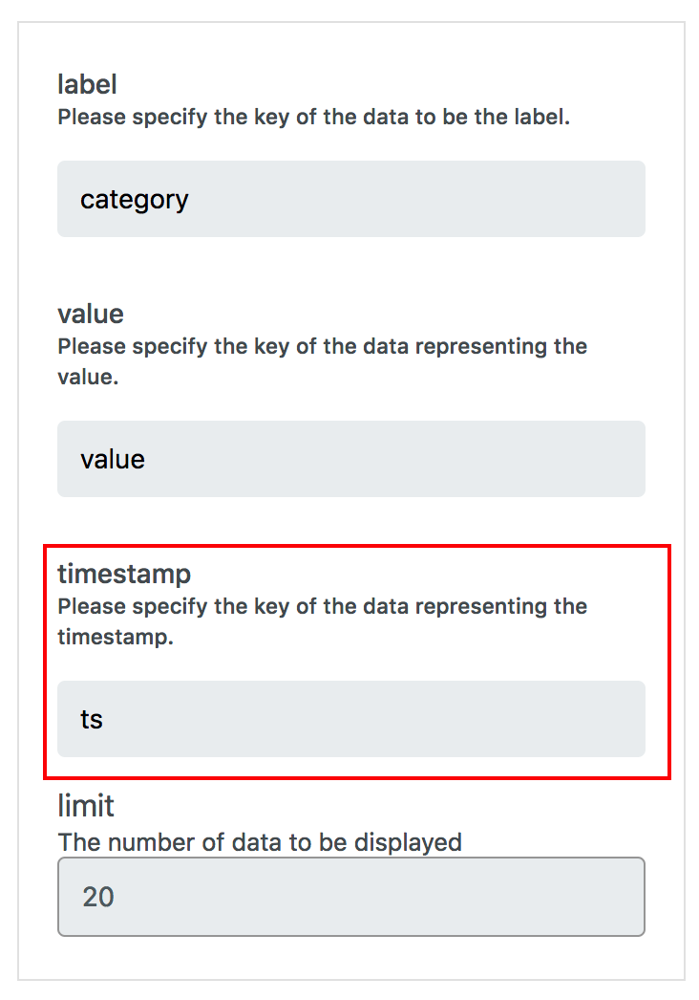

# Data Source Schema {#Data Source Schema}

All datasource data must contain a `ts` key with a Unix Timestamp value as shown below.
InfoMotion uses the `ts` for daterange picker, timeline and querying historical data.
This data is also used with in the InfoType (graph/chart).

```json
{
  "ts": Unix Timestamp milliseconds since Jan 01 1970. (UTC), // timestamp for daterange, timeline and querying.
  // All data in this object is passed to the infotype
}
```

# InfoType sample data {#InfoType sample data}

Each InfoType may require specific keys and values.
The type of data required for each InfoType can be seen on the right hand side
in preview of the InfoType.


For an enebular sample barchart the folowing data is required.

## Sample Data {#Sample Data}

```json
{
  "ts": Unix Timestamp milliseconds since Jan 01 1970. (UTC),
  "category": String,
  "value": Number
}
```

## JSON Data Schema {#JSON Data Schema}

```json
{
  "type": "object",
  "required": ["ts"],
  "properties": {
    "ts": {
      "type": "integer",
      "title": "The ts Schema",
      "examples": [1542352981750]
    }
  }
}
```

# DEPRECATED Data Source Schema {#Deprecated Data Source Schema}

Previous DataSource Schema (code below) has been deprecated since enebular version 2.7.3.

```json
{
  "type": "object",
  "required": ["timestamp", "value"],
  "properties": {
    "created": {
      "type": "integer"
    },
    "value": {
      "type": "object",
      "required": [],
      "properties": {}
    }
  }
}
```

```json
{
  "timestamp": 1549618349819,
  "value": {
    "created": 1549618349819,
    "category": "A",
    "value": 20
  }
}
```

## Using the Dashboard's daterange picker and timeline

Data containing both `ts` and `timstamp` will prioritize the `ts` time key in InfoMotion.

## Using an Official line chart

The Official LineChart as of Feburary 14th 2019 has been updated and implements the new dataschema.

As the old Data Source Schema is deprecated, older InfoTypes of enebular's official line chart has also been deprecated.

Depricated Data Sources Shema with Depricated official line charts can continue as is.

New official line charts work with depricated data source and new data schema.

If using a depricted official line chart and you wish to
use the new data schema please import a new official line chart from `Discover`.

You can check if your line chart is deprecated by checking if the official linechart graph settings contains the timestamp input.

**Updated line chart graph settings**

Has timestamp input.



**Depricated line chart graph settings**

Does not have timestamp input.


**InfoType creator notice**

Published charts or official line charts that are implementing the `created` key should be refactored to use the `ts` key implemented by the new data source schema.
