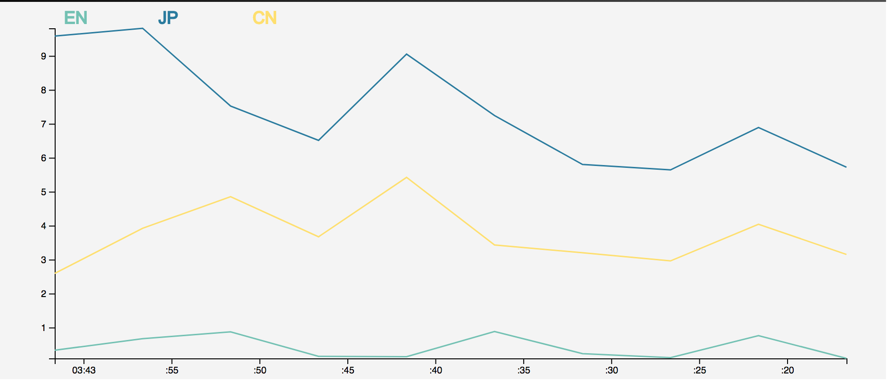
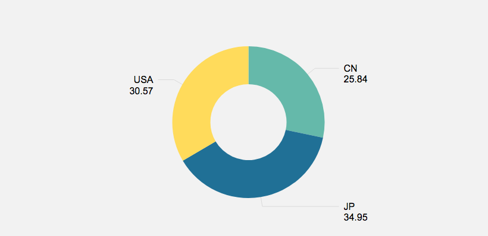
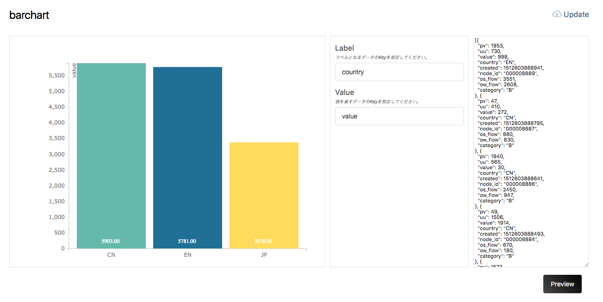
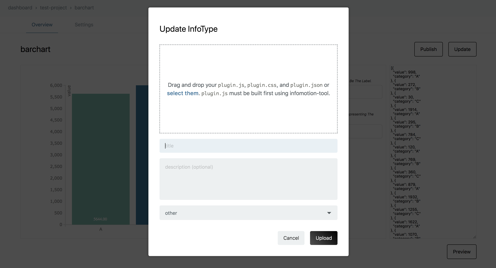

# InfoType

An InfoType represents the graph type which can be used with InfoMotion.

The following are examples of default graphs.

```javascript
// It assumed that there is a number of data points like the following
{
  created: Number,
  category: String,
  value: Number,
}
```

- Bar Chart


- Line Chart



- Pie Chart



- [See here for creating an InfoType](./InfoMotionTool.md)
- [See here for uploading a created InfoType to enebular](./UploadInfoType.md)

InfoTypes that are uploaded can be seen on enebular.


Selecting an InfoType will take you to the InfoType details screen.

## Overview

You can preview the graph here. From the left is the graph, schema settings and then the sample data. If you change the schema and sample data then click "Preview" the graph will update.

 

The InfoType's files can be updated with "Update" at the top right. 

 

## Settings

You can check the name, change the description and delete the InfoType here.


