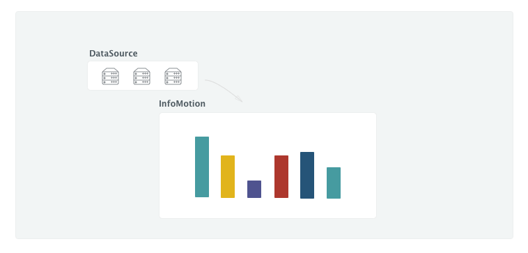
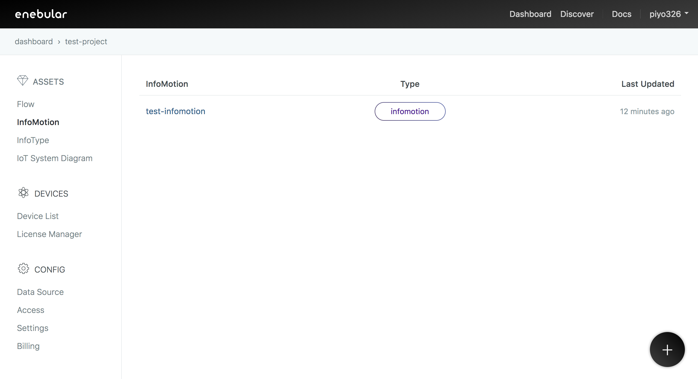
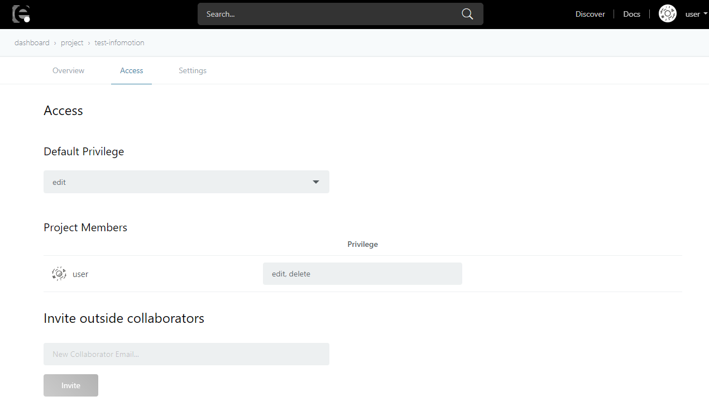

# InfoMotion {#InfoMotion}

An `InfoMotion` visualizes data from a `DataSource`.

In addition to the simple graphs available by default, it's also possible to either purchase or create more complex graphs. See [here](./InfoMotionTool.md) on how to create original graphs.

- See [here](./CreateDataSource.md) on how to create a DataSource
- See [here](./CreateInfoMotion.md) on how to create an InfoMotion

The created InfoMotion can been checked on enebular.

Selecting an InfoMotion will take you to the InfoMotion details screen.

## Overview {#Overview}

The dashboard is displayed here. Please see [Dashboards](./CreateInfoMotion.md) for more details.

## Access {#Access}

You can edit InfoMotion access permissions here.

Please see [Access Control](../Config/Access.md) for more details.

## Settings {#Settings}

You can change the name and description of the InfoMotion and delete the InfoMotion here.

