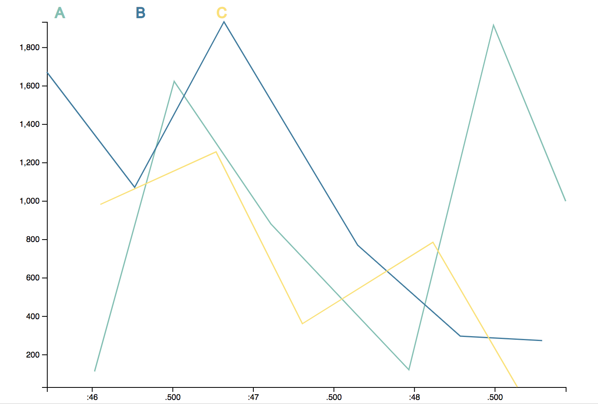
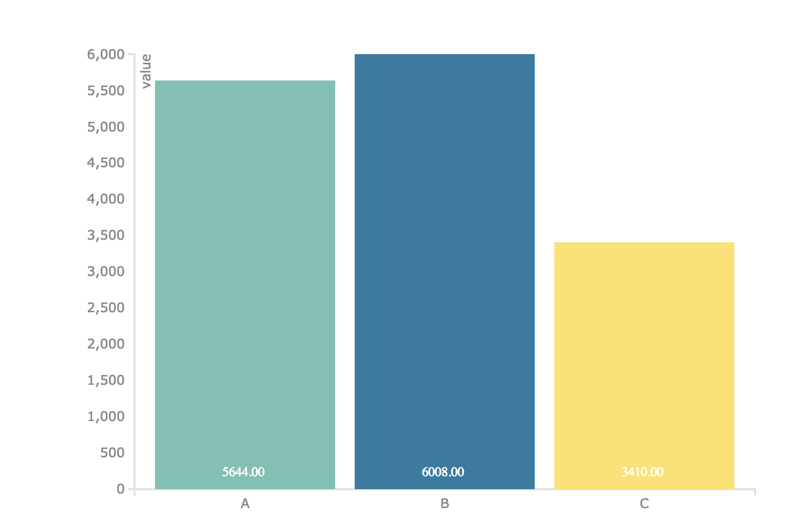
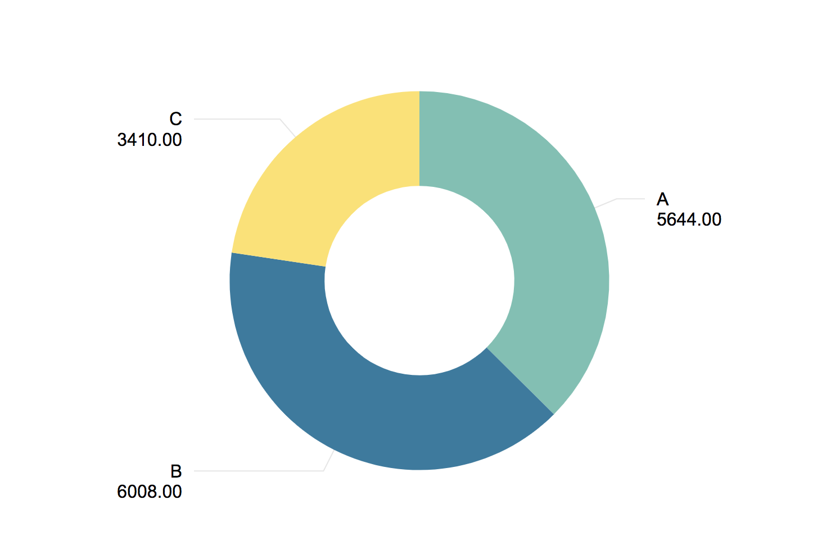

# Sample InfoTypes  {#Sample InfoTypes }

The following InfoTypes are free sample charts/graphs for you to test your data on. 

## Line Chart  {#Line Chart }

<ul> 
  <li><a href="/_asset/sample/linechart.zip" target="_blank">Sample Line Chart  Download (zip)</a></li> 
</ul> 


Discription: 
	A generic line chart with x-axis data points as time and y-axis as given numerical value. 

Data schema:
```json
{
  "id":String,
  "value":Number,
  "ts": UNIX timestamp
}
```

Editable properties: 
- Value to categorize data 
- Value to name legened 
- The amount of data to be viewed 

## Bar Chart  {#Bar Chart }

<ul> 
  <li><a href="/_asset/sample/barchart.zip" target="_blank">Sample Bar Chart Download (zip)</a>
  </li> 
</ul> 



Discription: 
		A generic Bar chart that presents categorical data with with heights or lengths proportional to the given values. 

Data schema: 
```json
{
  "id":String,
  "value":Number,
  "ts": UNIX timestamp
}
```

Editable properties: 
- Label to categorize data 
- Value to be represented from Labeled data 

## Pie Chart  {#Pie Chart }

<ul> 
  <li> 
    <a href="/_asset/sample/piechart.zip" target="_blank">Sample Pie Chart Download (zip)</a></li> 
</ul> 



Discription: 
	A generic pie chart dividing slices of given values into numerical proportions. 
	
Data schema:
```json
{
  "id":String,
  "value":Number,
  "ts": UNIX timestamp
}
```

Editable properties: 
- Label to categorize data 
- Value to be represented from Labeled data 

To upload an InfoType please see [Uploading an InfoType](./UploadInfoType.md) 
