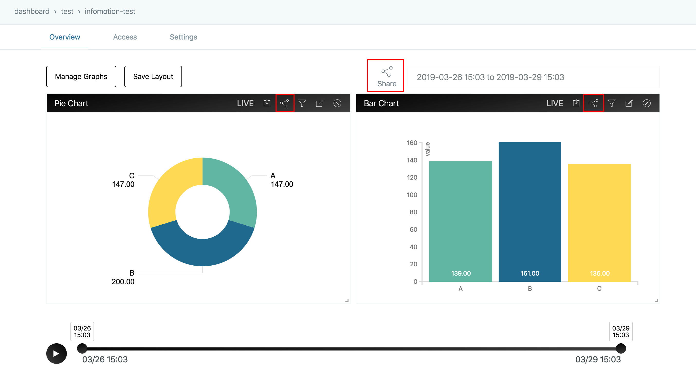

# Share InfoMotion {#Share InfoMotion}

If you want to use InfoMotion's dashboard in another application or view, you can do so by using InfoMotion's sharing capabilities.

The sharing InfoMotion function displays HTML which allows you to embed the dashboard in another application or view. 

A dashboard must first be rendered in order to use the share functionality.

The share icon at the top of the dashboard shares all graphs displayed. The share icon at the top of each graph shares only the single graph.



When the Share icon is clicked, the Share Dashboard dialog is displayed with HTML. Click "Copy to clipboard" to copy the HTML to the clipboard.


## InfoMotion scripts {#InfoMotion scripts}

The InfoMotion source code gives developers a little more freedom in customizing or altering the behaviour of their Dashboards.

infomotion and infomotionUI script tags are needed to use infomotion.

```html
<script src="https://s3-ap-northeast-1.amazonaws.com/enebular-infomotion/1.0.34/infomotion.js"></script>
<script src="https://s3-ap-northeast-1.amazonaws.com/enebular-infomotion/1.0.34/infomotionUI.js"></script>
```

## Settings for graph component {#Settings for graph component}

Settings is composed of three parts.

- cache - default is `blackhole` which does not cache any data
- dateRange - set the initial start and end date
- options - paths of plugins/infomotions

```javascript
var settings = {
   "cache":"blackhole",
   "dateRange":[

   ],
   "options":{
      "pluginPath":"https://enebular.com",
      "iframePath":"https://s3-ap-northeast-1.amazonaws.com/enebular-infomotion/1.0.28/iframe.html",
      "plugins":[
         {
            "title":"piechart",
            "name":"1bb2af23-34eb-4142-8ad6-80b77c3e2816",
            "jsPath":"api/v1/infotype/1bb2af23-34eb-4142-8ad6-80b77c3e2816/download?ext=js",
            "cssPath":"api/v1/infotype/1bb2af23-34eb-4142-8ad6-80b77c3e2816/download?ext=css"
         },
         {
            "title":"barchart",
            "name":"98c21b02-0b3d-4665-a548-b37c1deb43d8",
            "jsPath":"api/v1/infotype/98c21b02-0b3d-4665-a548-b37c1deb43d8/download?ext=js",
            "cssPath":"api/v1/infotype/98c21b02-0b3d-4665-a548-b37c1deb43d8/download?ext=css"
         }
      ],
      "loadingMode":"loadScript"
   }
}
```

## GraphContext {#GraphContext}

A graphContext binds graphs and components.

Before we crate graphs and componets we need to set up a graphContext.

```javascript
var graphContext = infomotion.graphContext(settings)
```

## DatePicker {#DatePicker}

- withRange - start and end date
- make - creates a date picker

```javascript
var datePicker = infomotionUI
  .datePicker(document.querySelector('#enebularDatePicker'))
  .make()
```

## Timeline {#Timeline}

```javascript
var timeline = infomotionUI
  .timeline(
    document.querySelector('#timeline'),
    document.querySelector('#btnControl')
  )
  .make()
```

## LiveButton {#LiveButton}

```javascript
var liveButton = infomotionUI
  .liveButton(document.querySelector('#btnLive'))
  .make()
```

## Binding components to graphContext {#Binding components to graphContext}

When all components are ready they can be bound to graphContext.

```javascript
graphContext
  .useTimeline(timeline)
  .useLiveButton(liveButton)
  .useDatePicker(datePicker)
```

## Graph settings {#Graph settings}

graph settings is made up of 3 components.

- adapter - type of datasource adaptor.
- graph - settings for the InfoMotion.
- options - plugin paths

```javascript
var settingGraph = {
   "adapter":{
      "type":"random",
      "options":{
         "type":"random"
      }
   },
   "graph":{
      "i":"2b2a3243-90e5-478d-8270-ae9f5a4a2bc0",
      "n":"pie",
      "t":"1bb2af23-34eb-4142-8ad6-80b77c3e2816",
      "d":"abdc-1234567",
      "s":{
         "label":"category",
         "value":"value"
      },
      "v":[

      ]
   },
   "options":{
      "pluginPath":"https://enebular.com",
      "iframePath":"https://s3-ap-northeast-1.amazonaws.com/enebular-infomotion/iframe.html",
      "plugins":[
         {
            "title":"piechart",
            "name":"1bb2af23-34eb-4142-8ad6-80b77c3e2816",
            "jsPath":"api/v1/infotype/1bb2af23-34eb-4142-8ad6-80b77c3e2816/download?ext=js",
            "cssPath":"api/v1/infotype/1bb2af23-34eb-4142-8ad6-80b77c3e2816/download?ext=css"
         },
         {
            "title":"barchart",
            "name":"98c21b02-0b3d-4665-a548-b37c1deb43d8",
            "jsPath":"api/v1/infotype/98c21b02-0b3d-4665-a548-b37c1deb43d8/download?ext=js",
            "cssPath":"api/v1/infotype/98c21b02-0b3d-4665-a548-b37c1deb43d8/download?ext=css"
         }
      ],
      "loadingMode":"loadScript"
   }
}
```

## Binding an InfoMotion to a div {#Binding an InfoMotion to a div}

```javascript
var graph1 = infomotionUI.graph(document.querySelector('#graph'), settingGraph)
```

## Adding and displaying graphs to graphContext {#Adding and displaying graphs to graphContext}

```javascript
graphContext.useGraphs(graph1)
```

## Removing graphs from graphContext {#Removing graphs from graphContext}

```javascript
graphContext.removeGraph(graph1)
```

## Setting filters {#Setting filters}

```javascript
graph0.useFilter([
  {
    key: 'category',
    values: ['A', 'B']
  }
])
```

## Example shared html {#Example shared html}

```html

<link rel="stylesheet" href="https://s3-ap-northeast-1.amazonaws.com/enebular-infomotion/1.0.34/infomotion.css">
            
<link rel="stylesheet" href="https://maxcdn.bootstrapcdn.com/font-awesome/4.7.0/css/font-awesome.min.css">
          
<script src="https://s3-ap-northeast-1.amazonaws.com/enebular-infomotion/1.0.34/infomotion.js"></script>
            
<script src="https://s3-ap-northeast-1.amazonaws.com/enebular-infomotion/1.0.34/infomotionUI.js"></script>
            
<style>
            .container {
              padding-right: 15px;
              padding-left: 15px;
              margin-right: auto;
              margin-left: auto;
            }

            .graph-date-picker {
              text-align: right;
            }

            .hover-bg-gradient:hover, .hover-bg-gradient:focus {
              background-color: #313131;
            }

            .hover-bg-gradient {
              background-image: linear-gradient(45deg, rgba(81, 81, 81, 0) 0%, #000 100%);
              background-color: #515151;
            }

            .bg-gradient {
                background: linear-gradient(-10deg, #515151 0%, #000 100%);
            }

            .btn-dashboard-primary {
                color: #ffffff;
                font-weight: 300;
                transition: background-color .2s ease-in;
                transition-property: background-color,color;
            }

            .enebular-datepicker {
                border-radius: 1px;
                border: 1px solid #F2F3F4;
                color: #646e6f;
                font-weight: 300;
                padding: 12px 17px;
                width: 50%;
            }

            .graph-date-picker #datePicker {
                padding: 8px 0 8px 8px;
                width: 100%
            }

            .infomotion-timeline {
                margin-top: 60px;
            }

            .action-control-wrapper {
                width: 70px;
                float: left;
            }

            .timeline-wrapper {
                width: calc(100% - 70px);
                float: left;
                padding-top: 15px;
                padding-right: 15px;
            }

            .control-live {
                float: left;
                width: 60px;
                margin-top: 62px;
            }

            .control-timeline {
                width: calc(100% - 60px);
                float: left;
            }

            .infomotion-graph-0 {
                    transform: translate(10px, 10px);
                    width: 532px;
                    height: 410px;
                    position: absolute;
                }
.infomotion-graph-1 {
                    transform: translate(552px, 10px);
                    width: 532px;
                    height: 410px;
                    position: absolute;
                }

            @media (max-width: 768px) {
              .infomotion-graph {
                width: 100%;
                transform: none;
                position: inherit;
                padding-bottom: 10px;
              }
            }
            @media (min-width: 768px) {
              .container {
                width: 750px;
              }

            }
            @media (min-width: 992px) {
              .container {
                width: 970px;
              }
            }
            @media (min-width: 1200px) {
              .container {
                width: 1170px;
              }
            }

            </style>
            
<div class="container">
                
  <div class="graph-date-picker">
                    
    <input id="enebularDatePicker" class="enebular-datepicker" type="date">
                
  </div>
                
  <div class="enebular-clear-both"></div>
                
  <div class="control-live">
                    
    <button id="btnLive" class="enebular-btn">
                        
      <i class="fa fa-bolt fa-lg"></i>
                    
    </button>
                
  </div>
                
  <div class="control-timeline">
                    
    <div class="infomotion-timeline">
                        
      <div class="action-control-wrapper">
                            
        <button id="btnControl" class="enebular-btn enebular-btn-control bg-gradient hover-bg-gradient">
                                
          <i class="fa fa-play"></i>
                            
        </button>
                        
      </div>
                        
      <div class="timeline-wrapper" id="timeline"></div>
                        
      <div class="enebular-clear-both"></div>
                    
    </div>
                
  </div>
                
  <div class="enebular-clear-both"></div>
                
                
  <div class="infomotion-graph infomotion-graph-0" id="graph0"></div>
            
                
  <div class="infomotion-graph infomotion-graph-1" id="graph1"></div>
            
                
  <div class="enebular-clear-both"></div>
            
</div>
            
<script>
            var settings = {
               "cache":"blackhole",
               "dateRange":[new Date(1554118192026), new Date(1554377392026)],
               "options":{
                  "pluginPath":"https://enebular.com",
                  "iframePath":"https://s3-ap-northeast-1.amazonaws.com/enebular-infomotion/1.0.28/iframe.html",
                  "plugins":[
                     {
                        "title":"piechart",
                        "name":"1bb2af23-34eb-4142-8ad6-80b77c3e2816",
                        "jsPath":"api/v1/infotype/1bb2af23-34eb-4142-8ad6-80b77c3e2816/download?ext=js",
                        "cssPath":"api/v1/infotype/1bb2af23-34eb-4142-8ad6-80b77c3e2816/download?ext=css"
                     },
                     {
                        "title":"barchart",
                        "name":"98c21b02-0b3d-4665-a548-b37c1deb43d8",
                        "jsPath":"api/v1/infotype/98c21b02-0b3d-4665-a548-b37c1deb43d8/download?ext=js",
                        "cssPath":"api/v1/infotype/98c21b02-0b3d-4665-a548-b37c1deb43d8/download?ext=css"
                     }
                  ],
                  "loadingMode":"loadScript"
               }
            }


            var graphContext = infomotion.graphContext(settings);

            var datePicker = infomotionUI.datePicker(document.querySelector('#enebularDatePicker'))
            .make();

            var timeline = infomotionUI.timeline(
                    document.querySelector('#timeline'),
                    document.querySelector('#btnControl')
            ).setTheme('black').make();

            var liveButton = infomotionUI.liveButton(document.querySelector('#btnLive'))
                .make();

            graphContext
                .useTimeline(timeline)
                .useLiveButton(liveButton)
                .useDatePicker(datePicker)
            
            var settingGraph0 = {
                   "adapter":{
                      "type":"random",
                      "options":{
                         "type":"random"
                      }
                   },
                   "graph":{
                      "i":"2b2a3243-90e5-478d-8270-ae9f5a4a2bc0",
                      "n":"pie",
                      "t":"1bb2af23-34eb-4142-8ad6-80b77c3e2816",
                      "d":"abdc-1234567",
                      "s":{
                         "label":"category",
                         "value":"value"
                      },
                      "v":[

                      ]
                   },
                   "options":{
                      "pluginPath":"https://enebular.com",
                      "iframePath":"https://s3-ap-northeast-1.amazonaws.com/enebular-infomotion/iframe.html",
                      "plugins":[
                         {
                            "title":"piechart",
                            "name":"1bb2af23-34eb-4142-8ad6-80b77c3e2816",
                            "jsPath":"api/v1/infotype/1bb2af23-34eb-4142-8ad6-80b77c3e2816/download?ext=js",
                            "cssPath":"api/v1/infotype/1bb2af23-34eb-4142-8ad6-80b77c3e2816/download?ext=css"
                         },
                         {
                            "title":"barchart",
                            "name":"98c21b02-0b3d-4665-a548-b37c1deb43d8",
                            "jsPath":"api/v1/infotype/98c21b02-0b3d-4665-a548-b37c1deb43d8/download?ext=js",
                            "cssPath":"api/v1/infotype/98c21b02-0b3d-4665-a548-b37c1deb43d8/download?ext=css"
                         }
                      ],
                      "loadingMode":"loadScript"
                   }
                }
            
                var settingGraph1 = {
                   "adapter":{
                      "type":"random",
                      "options":{
                         "type":"random"
                      }
                   },
                   "graph":{
                      "i":"a43a6692-b57d-4fde-90af-2e73a35f460e",
                      "n":"bar",
                      "t":"98c21b02-0b3d-4665-a548-b37c1deb43d8",
                      "d":"abdc-1234567",
                      "s":{
                         "label":"category",
                         "value":"value"
                      },
                      "v":[

                      ]
                   },
                   "options":{
                      "pluginPath":"https://enebular.com",
                      "iframePath":"https://s3-ap-northeast-1.amazonaws.com/enebular-infomotion/iframe.html",
                      "plugins":[
                         {
                            "title":"piechart",
                            "name":"1bb2af23-34eb-4142-8ad6-80b77c3e2816",
                            "jsPath":"api/v1/infotype/1bb2af23-34eb-4142-8ad6-80b77c3e2816/download?ext=js",
                            "cssPath":"api/v1/infotype/1bb2af23-34eb-4142-8ad6-80b77c3e2816/download?ext=css"
                         },
                         {
                            "title":"barchart",
                            "name":"98c21b02-0b3d-4665-a548-b37c1deb43d8",
                            "jsPath":"api/v1/infotype/98c21b02-0b3d-4665-a548-b37c1deb43d8/download?ext=js",
                            "cssPath":"api/v1/infotype/98c21b02-0b3d-4665-a548-b37c1deb43d8/download?ext=css"
                         }
                      ],
                      "loadingMode":"loadScript"
                   }
                }
            
            
                var graph0 = infomotionUI.graph(document.querySelector('#graph0'), settingGraph0);
                  
                    graph0.render();
                    graphContext.useGraphs(graph0);
                    graph0.useFilter([])
                var graph1 = infomotionUI.graph(document.querySelector('#graph1'), settingGraph1);
                  
                    graph1.render();
                    graphContext.useGraphs(graph1);
                    graph1.useFilter([])
            </script>

```
