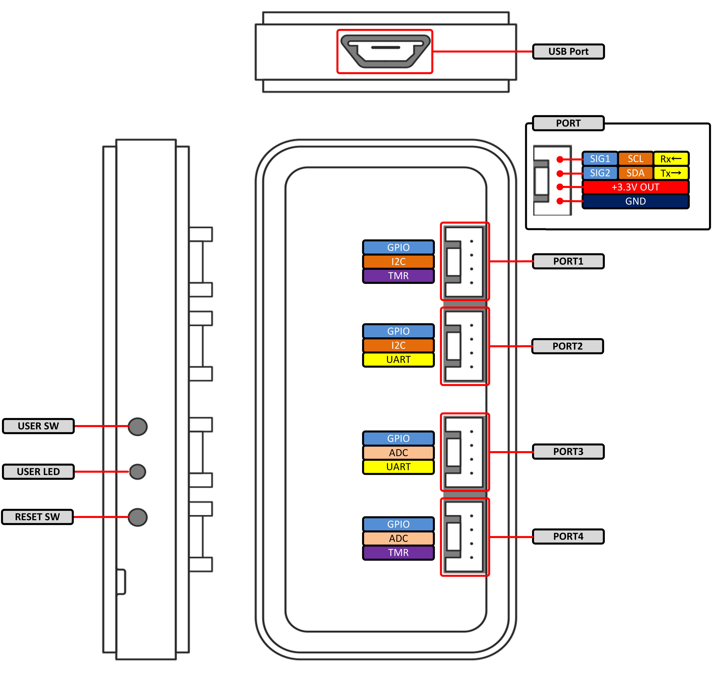

# RAVEN HardWare Specification

Detailed hardware information about RAVEN.

### Table of Contents

- [Features](#Features)
- [General Specifications](#GeneralSpec)
- [Technical Specifications](#TechnicalDocument)

## Features{#Features}
* STM32F767 MCU( Cortex®-M7@216MHz, 2MB Flash, 512KB SRAM )
* 64Mbit SPI Serial Flash
* WLAN module( 802.11 b/g/n )
* User defined LED and Switch
* DAPLink interface
    * Drag-and-drop programming
    * USB Virtual COM Port
    * CMSIS-DAP Debugger
* Four Multi-function I/O Connectors
    * Compatible with 3.3V sensor and actuators
    * Multiple peripheral functions( ADC/UART/I2C/PWM )
    * Each port is capable of supplying up to 50 mA

## General Specifications{#GeneralSpec}

* Dimensions
    * 75mm x 35mm x 12mm( WxDxH )( excluding projections )
* Rating
    * Approx. 5V/2.5W( Power Supply : via micro-USB terminal )
* Weight
    * Approx. 22g

## Technical Specifications{#TechnicalDocument}

Please refer to the charts below for the ratings and the specifications of the unit.

### Absolute maximum ratings{#AbsoluteMaximumRatings}

| Ratings | Symbol | Min | Max | Unit | Comment |
| ---- | ---- | ---- | ---- | ---- | ---- |
|Power supply voltage |VBUS |-0.3 |5.5 |V |- |
|Input voltage(PORT) |VIO |-0.3 |7.0 |V |Excluding "+3.3V OUT" Pin |
|Input voltage(USB) |VUSBIO |-0.5 |3.6 |V |VBUS=0V |
|Operating temperature |Topr |-20 |70 |deg.C |No condensation |

### General operating conditions{#GeneralOperatingConditions}

| Ratings | Symbol | Min | Max | Unit | Comment |
| ---- | ---- | ---- | ---- | ---- | ---- |
|Standard operating voltage |VBUS |3.0 |5.25 |V |- |
|Operating temperature range |Ta |0 |40 |deg.C |No condensation |
|Operating humidity range	 |RH |20 |80 |% |- |

### Electrical characteristics{#ElectricalCharacteristics}

| Ratings | Symbol | Min | Max | Unit | Comment |
| ---- | ---- | ---- | ---- | ---- | ---- |
|  Output voltage(Power pin)  |  VO  | 3.1  |  3.45  |  V  |  TYP=3.3V  |  
|  Output current(Power pin)  |  IO  | -  |  200  |  mA  |  4ports total  |  
|  High-level output voltage(I/O pin)  |  VOH  |  VO-0.4 |  VO  |  V  |  IIO = -8mA  |  
|  Low-level output voltage(I/O pin)  |  VOL  |  0  |  0.4  |  V  |  IIO = 8mA  |
|  High-level input voltage(I/O pin)  |  VIH  |  0.7*VO  |  VO  |  V  |  -  |
|  Low-level input voltage(I/O pin)  |  VIL  |  0  |  0.3*VO  |  V  |  -  |
|  leakage current(I/O pin)  |  Ilkg  |  -  |  3  |  uA  |  5V,Input,Disable PU/PD  |

### Notes on the Ports{#NotesOnThePorts}
* I/O connectors can be configured to assign different functions by flow settings, and therefore these are defined as "Ports" in this documentation.  
* The Ports operate at 3.3V. Sensors/actuators which are specifically designed for 5V operation are not compatible with this unit.
* The Ports are not designed to be disconnected while in operation(they do not support "hot swapping"). Please remember to turn the power off before connecting to or disconnecting sensors/actuators from the Ports.
* The maximum current for each Port is rated at 50mA(the total current of 4 Ports at 200mA). Please pay attention not to exceed these limitations.  
* Do not feed power into the power terminals of the Ports. Such an action can cause damages on the unit.
* The power supply of sensors/actuators cannot be controlled from Flows (RAVEN constantly supplies power to these Ports).
* Signal pins(SIG1/2) on the Ports 1-4 are connected through the protective registers (33ohms).
  When a Port is active, its function, I/O and its pull up/down state are defined within the flow.
  At the power-on state(before flows are read into internal firmware), all Ports are disabled.
    * PORT3/4
        * When these ports are disabled, they are configured as input ports and are pulled-down by MCU approximatelly at 40 kilo-ohms.
    * PORT1/2
        * When these ports are disabled, they are configured as input ports and are pulled-up by MCU approximatelly at 4.7 kilo-ohms.
        * When these ports operate as I2C or SDL/SDA lines are pulled-up at 4.7 kilo-ohms.

* There are limitations to the functions each Port can be configured to.

Please refer to the diagram for the details.  
NOTE: The diagram mentions PWM(TMR) and UART, however these features have yet been implemented.

### Notes on the Internal function block{#NotesOnTheInternalFunctionBlock}
* SPIFlash, WLAN module, MbedI/F(DAPLink), the Ports, the user switch, and the user LED are connected around main MCU(STM32F767).
* The SPIFlash is reserved by the system and currently cannot be accessed from flows.

### Notes on the Internal Power block{#NotesOnTheInternalPowerBlock}
* The input voltage which is fed through the microUSB connector is conveted into 3.3V by the Buck-Boost regulator, then supplied to internal circuitry and Ports.
* The internal power block is protected by a Poly Switch directly next to the USB line and the built-in protection of the Buck-Boost regulator.

