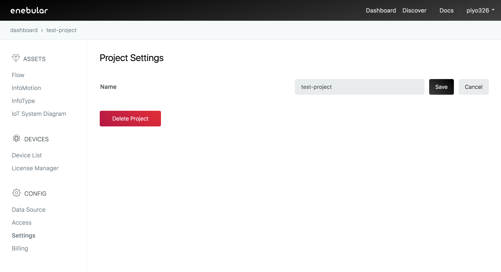

# Project Settings {#Project Settings}

In settings you can change the project name and delete the project.

The project name can be edited by pushing the pencil icon next to it.

The project can be deleted with "Delete Project".

Once the project name has been entered the project will be deleted and you'll be taken back to the project list screen.
