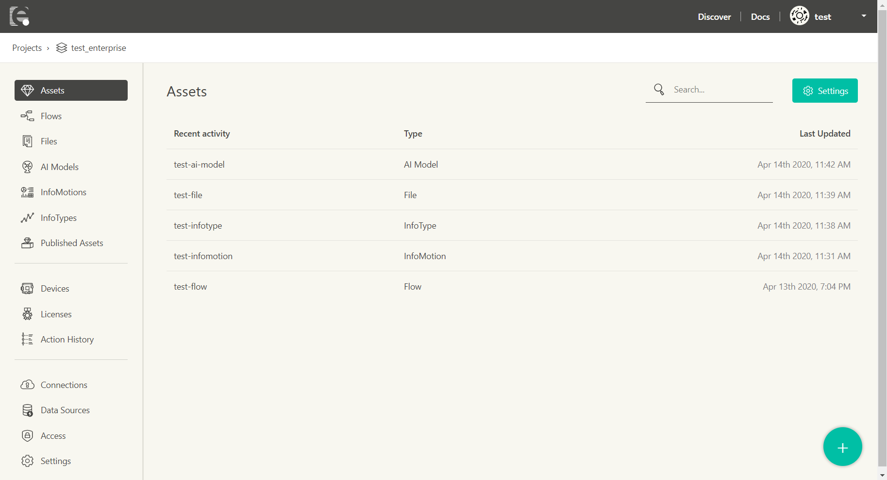

# Projects

A **Project** is, as the name suggests, the unit for organizing a set of work as a single project.

As mentioned in the [Introduction](../INDEX.md), you can manage assets and devices in a project (in the image, devices are not included within the project as their actual deploy location is in a third party service environment).

The list of projects can be seen on the screen after signing in. Projects can be created with **Create Project**.

Selecting a project will take you to the project management screen.

The project management screen includes the following pages.

## Assets

The content managed within the project.

- [Flow](../Flow/Introduction.md): Data flows created with Node-RED
- [InfoMotion](../InfoMotion/Introduction.md): Data visualization graphs dashboard
- [InfoType](../InfoMotion/InfoTypeIntroduction.md): Graph types used with InfoMotion

### Assets Searching

You can serch the Assets associated with your account by using the searching box the top of the page.
The result will be listed on the project management screen.

It's able to search by the Assets name or Projects name. 
In case of using the Project name, it'll be listed the Assets are contained in the Projects.

## Devices

The devices managed within the project. The devices here are those to which assets have been deployed.

- [Device List](../Device/Introduction.md): The list of devices
- Licence Manager: License management for using paid functionality

## Config

Project related configuration.

- [Data Source](../InfoMotion/CreateDataSource.md): Registration of data sources for use with graphs
- [Access](../Access/index.md): Project access control management
- [Settings](../Project/Settings.md): Project settings
- [Billing](../Project/Billing.md):  Billing information management
