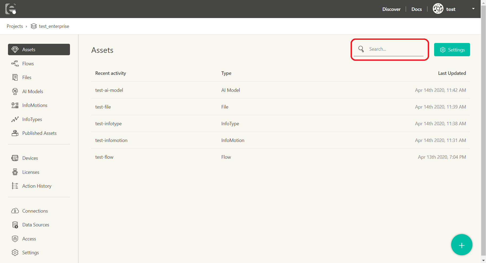

# Projects {#Projects}

A **Project** is, as the name suggests, the unit for organizing a set of work as a single project.

As mentioned in the [Introduction](../INDEX.md), you can manage assets and devices in a project (in the image, devices are not included within the project as their actual deploy location is in a third party service environment).

The list of projects can be seen on the screen after signing in.
Projects can be created with **Create Project**.

| Item            | Description                                                          |
| :-------------- | :------------------------------------------------------------------- |
| Project         | the project title                                                    |
| Owner           | the username of the project owner (Note 1)                           |
| Type            | the project plan (Note 2)                                            |
| IP Restrictions | displays if the ip restrictions are enabled for the project (Note 3) |
| Last Updated    | the date and time of the last project editing                        |

- Note 1: for more details, view [Access Privileges](../Config/Access.md).
- Note 2: for more details, view [enebular Price / Plan](https://www.enebular.com/en/plan/).
- Note 3: for more details, view [IP Access Control](../Project/IPAccessControl.md).

Selecting a project will take you to the project management screen.

The project management screen includes the following pages.

## Assets {#Assets}

The content managed within the project.

- [Flow](../Flows/Introduction.md): Data flows created with Node-RED
- [Files](../Files/Introduction.md): Files registered as assets
- [AI Models](../AIModels/Introduction.md): Machine learning/Deep learning models
- [InfoMotion](../InfoMotion/Introduction.md): Data visualization graphs dashboard
- [InfoType](../InfoMotion/InfoTypeIntroduction.md): Graph types used with InfoMotion
- [Published Assets](../Discover/UnpublishAssets.md): List of published assets

### Assets Searching {#Assets Searching}

You can search the Assets associated with your account by using the search box at the the top of the page.
The results will be listed on the project management screen.

You are able to search by Asset name.

## Devices {#Devices}

The devices managed within the project. The devices here are those to which assets have been deployed.

- [Devices](../Device/DeviceList.md): The list of devices
- [Licenses](../Device/LicenseManager.md): License management for using paid functionality
- [Action History](../Device/ActionHistory.md): The history of the performed Actions

## Config {#Config}

Project related configuration.

- [Connections](../Config/Connections.md): Management of connections to external services
- [Data Source](../InfoMotion/CreateDataSource.md): Registration of data sources for use with graphs
- [Access](../Config/Access.md): Project access control management
- [Settings](../Project/Settings.md): Project settings