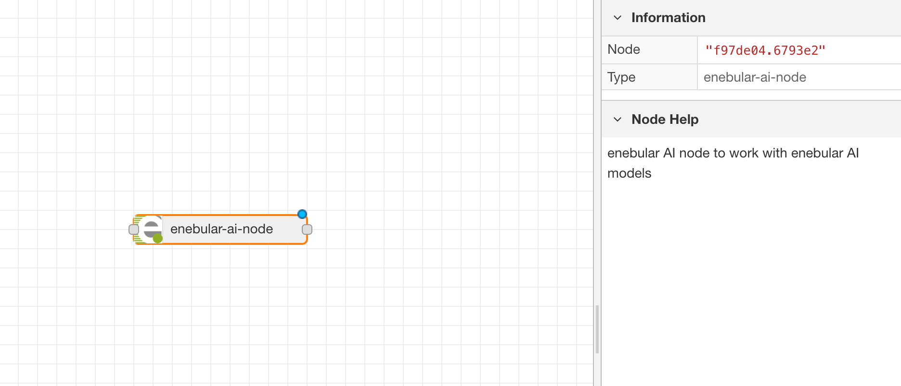
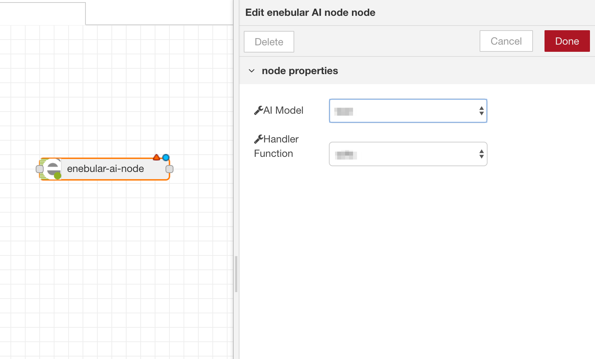
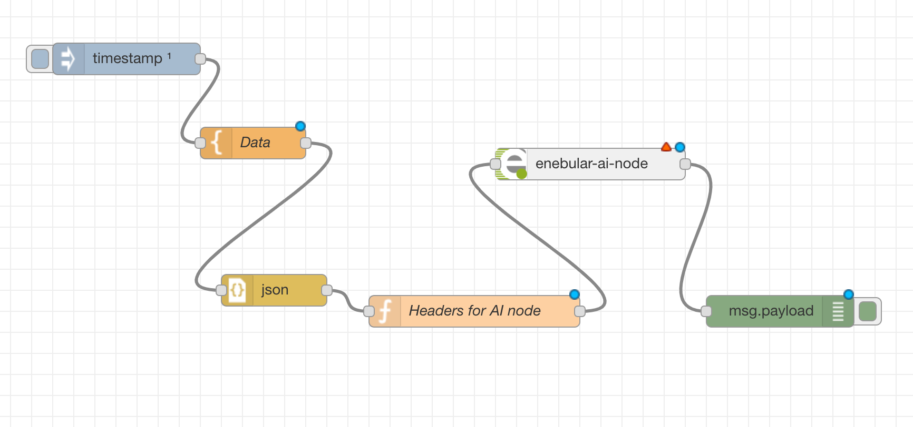
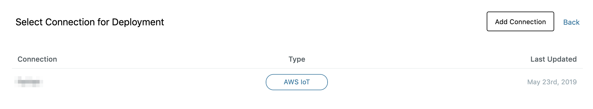

# Accessing model From Flows {#Accessing model From Flows}

デバイスにデプロイされた AI Model は同じデバイスで実行されている Node-RED フローからアクセスすることができます。

# enebular AI node {#enebular AI node}

enebular のフローエディタにある パレット > Functions から **enebular-ai-node** が選択可能です。
このノードはデバイスにデプロイされた AI Model と通信するためのノードです。

**enebular-ai-node** と AI Model 間の通信は `HTTP Protocol` で行われます。



AI Model が 1 つ以上、プロジェクトにアップロードされている場合、**enebular-ai-node** の設定項目から、アップロードされた AI Model が選択可能となります。ノードをクリックすると、下記のようなノードのプロパティを表示することができます。



AI Model の設定画面では **AI Model** と **Handler function** を選択する必要があります。

AI Model を選択してから該当する Handler function を選択して `Done` をクリックします。

# Flow with enebular AI node {#Flow with enebular AI node}

enebular は、AI Model の推論に利用するデータタイプについて、次の 2 つをサポートしています。
1 つは image data type、もう 1 つは json data type です。
データタイプによって Node-RED フローの作りが変わります。

## Flow for image data type {#Flow for image data type}

image data type の一般的なフローは下記となります。


画像データを取得するノードと enebular-ai-node の間に、次の 2 つの処理を行うノードを配置する必要があります。

1. Base64 ノード: 画像データを Base64 形式にエンコードするノード。
2. Function ノード: enebular-ai-node のために HTTP Header を設定するノード。

Function ノードには以下の文字列を設定してください。

```js
msg.headers = {}
msg.headers['content-type'] = 'image/jpeg'
return msg
```

上記 2 つのノードを設定してから、enebular-ai-node を選択し、AI-Model と Handler function を設定してください。

## Flow for json data type {#Flow for json data type}

json data type の一般的なフローは下記となります。



image data type のフローと同じように enebular-ai-node の設定をする前に以下のノードを設定する必要があります。

1. JSON ノード: データを JSON 形式に変換するノード。
2. Function ノード: enebular-ai-node のために HTTP Header を設定するノード。

Function ノードには以下の文字列を設定してください。

```js
msg.headers = {}
msg.headers['content-type'] = 'application/json'
return msg
```

上記 2 つのノードを設定してから、enebular-ai-node を選択し、AI-Model と Handler function を設定してください。

# Deploying flow with enebular AI node {#Deploying flow with enebular AI node}

enebular-ai-node を含んだフローのデプロイは通常のフローのデプロイと同じです。

`Deploy` ボタンをクリックする。


フローをデプロイするデバイスを指定するため、コネクションを選択します。


フローをデプロイするデバイスを選択してください。AI Model はフローをデプロイする前に、予めデプロイされている必要があります。モデルのステータスは Devices > Device > Manage Model から確認できます。


`Deploy`をクリックすると、フローのデプロイが開始されます。

デプロイが成功すると、デバイスリストの **Deploy Status** 欄に **Deployed** と表示されます。
