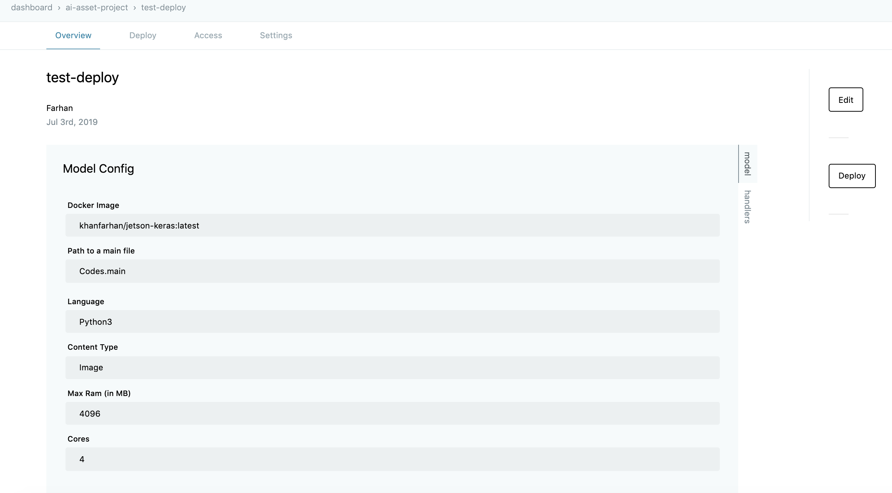
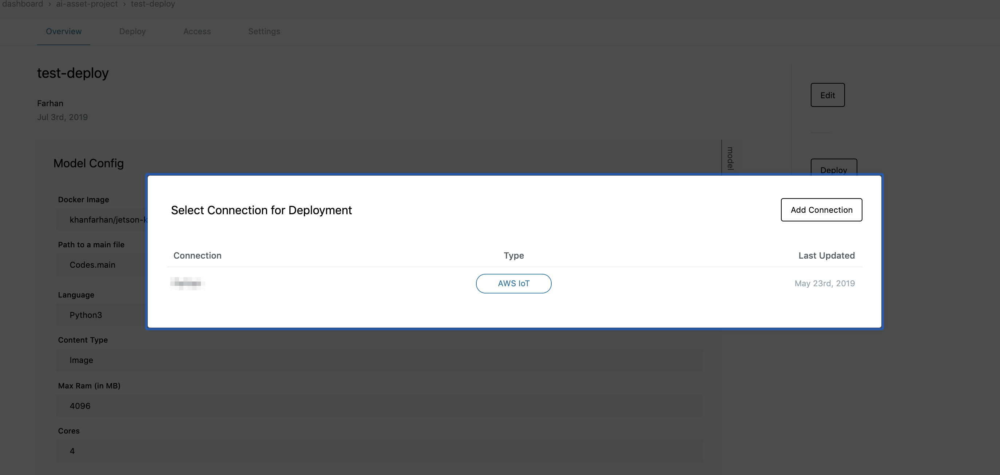
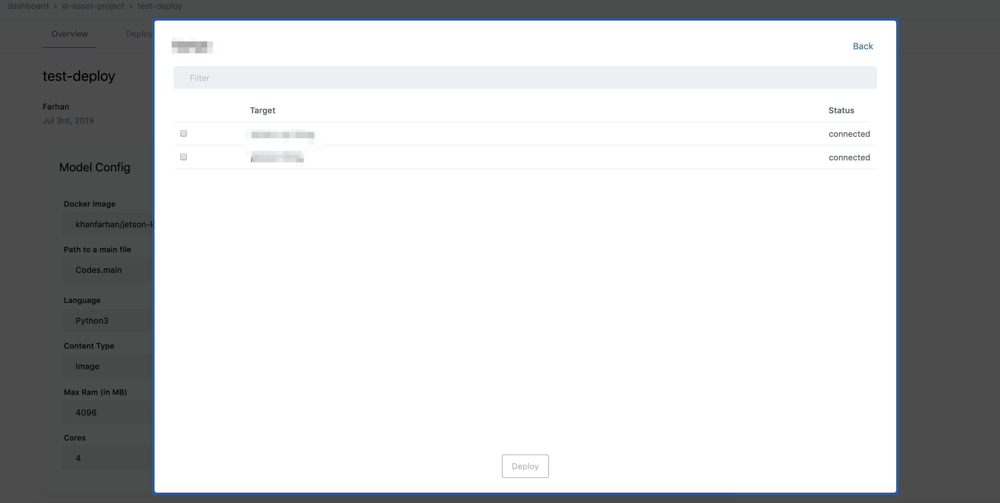
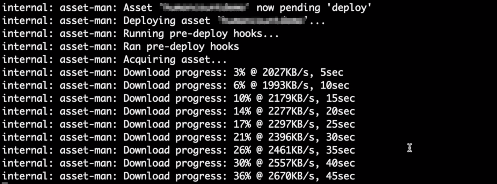
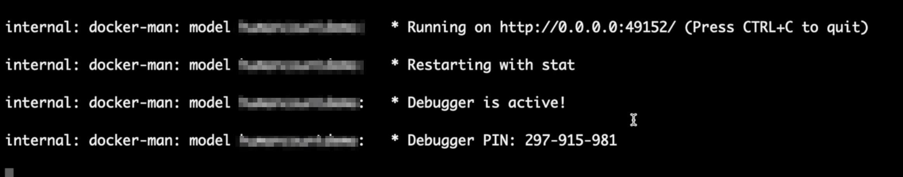

# Deploying AI models {#Deploying AI models}

enebular に登録された AI Model は有料ライセンスが付与されたデバイスにのみデプロイ可能です。

デプロイするためには、まず **AI Models** メニューをナビゲーションから選択します。

その後、デプロイしたい AI Model を選択すると **Overview** 画面に遷移します。

**Overview** 画面から **Deploy** ボタンを選択することで、コネクション選択画面が表示されます。もし、コネクションを作成していない場合は、[デプロイについて](../Deploy/index.md) の説明を参照してください。

AI Model のデプロイ先を選択し、`Deploy` ボタンをクリックします。

Deploy ボタンを押すと、自動的に **Deployment History** 画面に遷移します。
デプロイ先のコンソールログには以下のようなログが表示されます。

デプロイ先で AI Model のダウンロードが完了すると、下記のログが表示されます。

上記の画面が表示されれば、デプロイが完了しています。

デプロイが成功であれば、デバイスリストの **Deploy Status** 欄に **Deployed** と表示されます。
