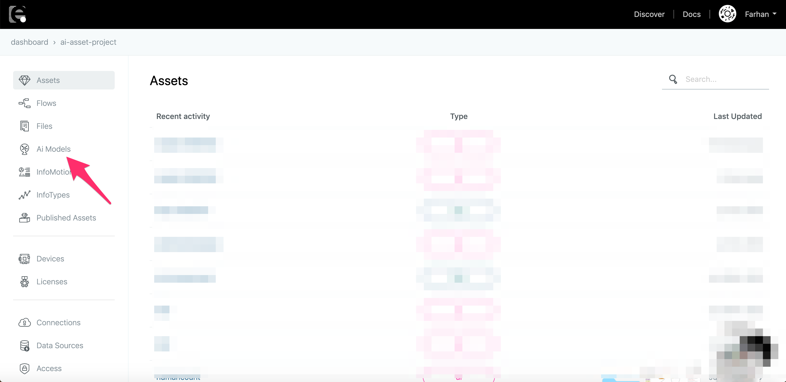
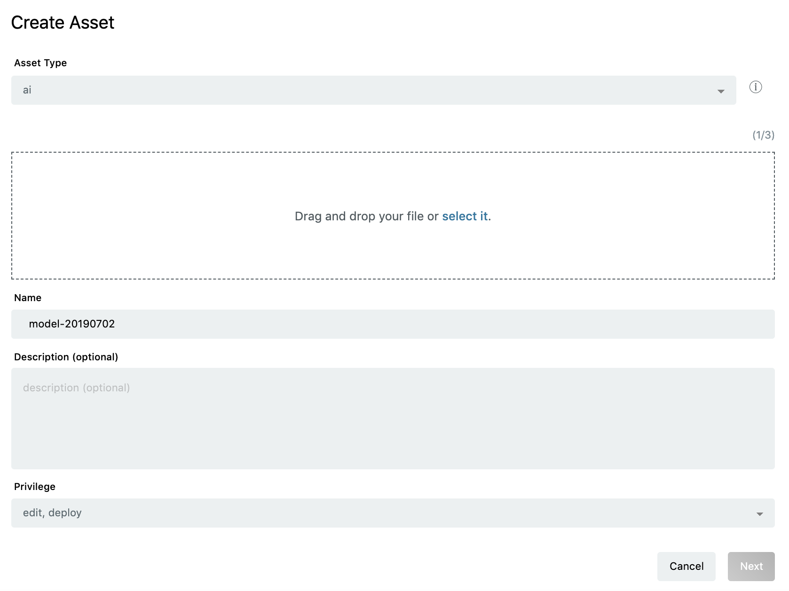
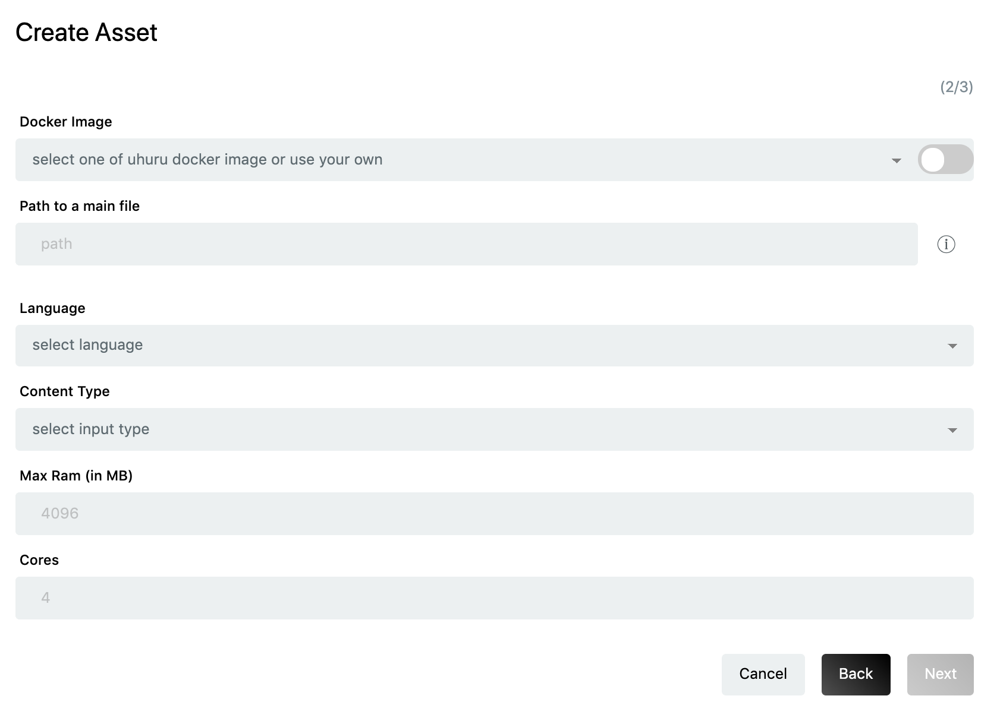
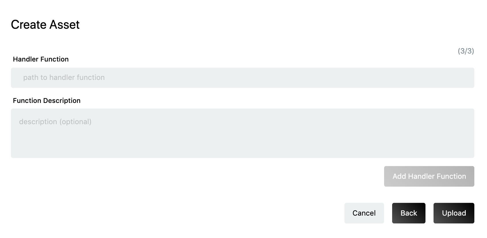
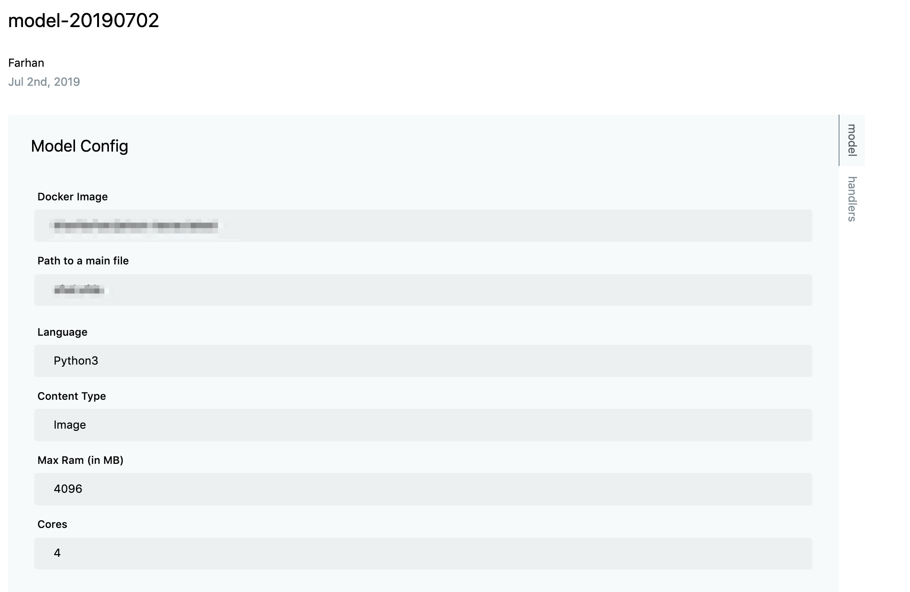
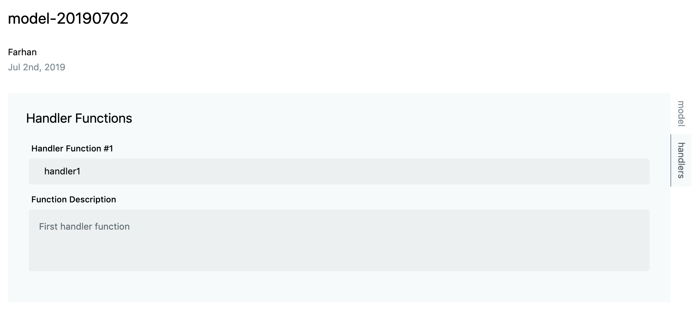
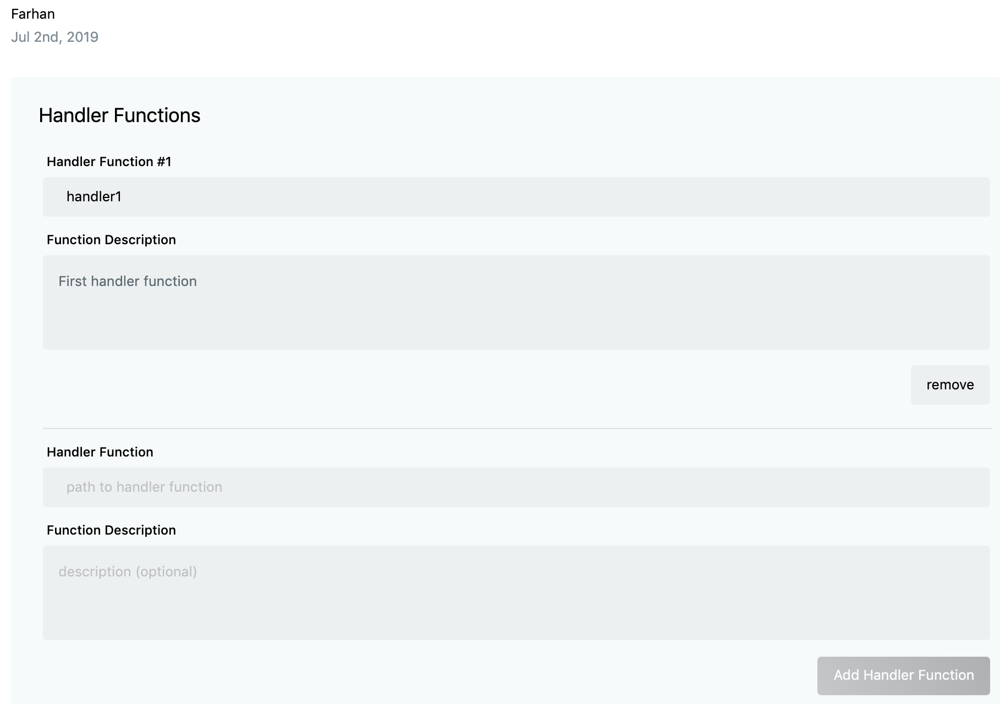

# Registering AI models {#Registering AI models}

デバイスに機械学習・ディープラーニングのモデルをデプロイするためにはまず **AI Model** をアップロードする必要があります。下記にアップロード手順を記載します。

操作しているプロジェクトが有料プランである場合、アセットメニューに **AI Models** メニューが表示されます。



新規 AI Model を作成する場合、右下にある **+** ボタンをクリックします。



決められたフォーマットに沿った AI project ファイル（.zip）をアップロードできます。最大 3GB までアップロード可能です。ファイルの名称と説明を入力して、Next ボタンをクリックします。



実行環境の設定画面に必要な事項を入力します。以下に各項目の説明を記載します。

1. Docker イメージ:
   AI Model が使用するフレームワーク名
   例: Tensorflow, Keras, Mxnet etc.

   enebular では、予め利用可能な Docker イメージを提供しています。もし、自身で作成したカスタムイメージを使いたい場合は下記の依存パッケージ（Python Library）を含んでいる必要があります。

   ```text
   Flask==1.0.3
   Pillow==6.1.0
   scipy==0.17.0
   ```

   依存パッケージは下記のコマンドでインストール可能です。

   ```sh
   pip install Flask==1.0.3, Pillow==6.1.0, scipy==0.17.0
   ```

2. Path to main file:
   AI Model が呼ばれるスクリプトのパスを指定します。パスは AI Model のプロジェクトにあります。
   例： FaceRecognition.Codes.recognize_svm
   FaceRecognition は AI project directory で、recognize_svm が AI Model を呼び出して推論するためのスクリプトを指します。

3. Language:
   AI Model の記述しているプログラミング言語
   例： Python3, Python2

4. Input Type:
   AI Model が推論に使用する入力データの種類（データタイプ）
   例： image, json

5. Max RAM(in MB):
   AI Model が使用できる RAM の上限値。

6. Cores:
   AI Model が使用する CPU Cores の数。

入力が完了し、Next をクリックすると下記の画面が表示されます。



ここでは、先ほど指定した main script の中で実装された Handler function 関数の名前の入力を行います。一般的な Handler function は下記の通りです。

```python
def handler(img):
        (lStart, lEnd) = face_utils.FACIAL_LANDMARKS_IDXS["left_eye"]
        (rStart, rEnd) = face_utils.FACIAL_LANDMARKS_IDXS["right_eye"]
        img_rgb = cv2.cvtColor(img, cv2.COLOR_BGR2RGB)
        gray = cv2.cvtColor(img, cv2.COLOR_BGR2GRAY)
        subjects = detector(gray, 0)
        predicted = []

        for subject in subjects:
            shape = predictor(gray, subject)
            shape = face_utils.shape_to_np(shape)  # converting to NumPy Array
            leftEye = shape[lStart:lEnd]
            rightEye = shape[rStart:rEnd]
            leftEyeHull = cv2.convexHull(leftEye)
            rightEyeHull = cv2.convexHull(rightEye)
            cv2.drawContours(img, [leftEyeHull], -1, (0, 255, 0), 1)
            cv2.drawContours(img, [rightEyeHull], -1, (0, 255, 0), 1)
            predicted.append(extract_face_info(img, img_rgb))

        return predicted
```

Handler function の説明を合わせて入力可能です。ここで入力した説明は AI Model をアップロード後、フローエディタ上で AI ノードが自動生成される際に表示されます。

必要な項目の入力後、`Add Handler Function` をクリックします。もし main script に複数の Handler function が定義されている場合は、複数の Handler function を指定することが可能です。

Upload ボタンをクリックすると、AI Model がアップロードされます。


アップロードが完了すると、AI Model の **Overview** ページに遷移し、AI Model の設定等を閲覧することが可能となります。





複数の Handlers が存在する場合、下記のように表示されます。



`Edit` ボタンで、設定値の編集が可能です。

`Deploy` ボタンから AI Model をデバイスにデプロイできます。詳細は[Deploying AI models](DeployAiModel.md)を参照してください。
