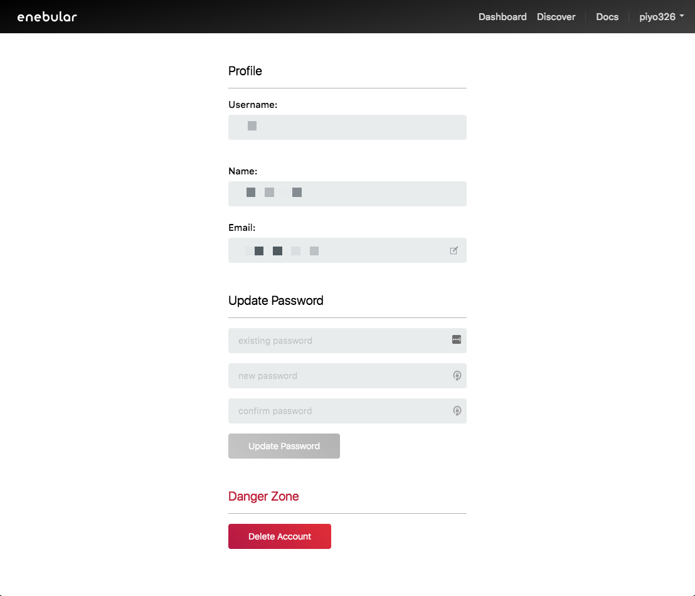
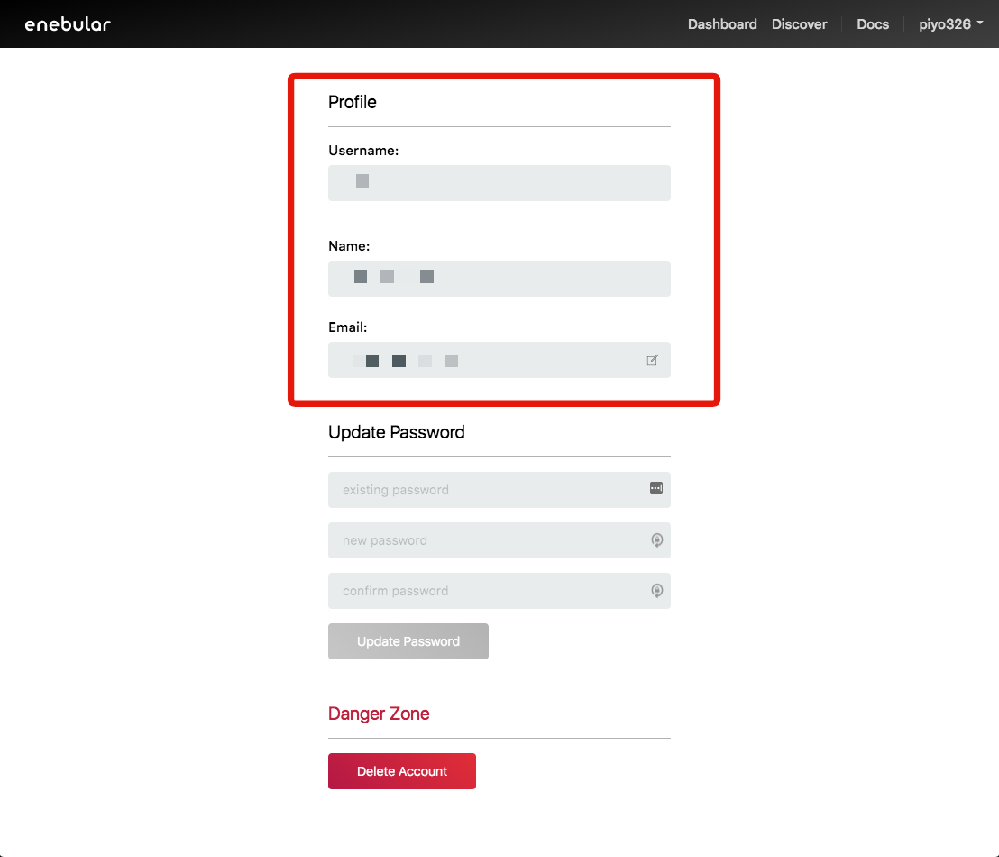
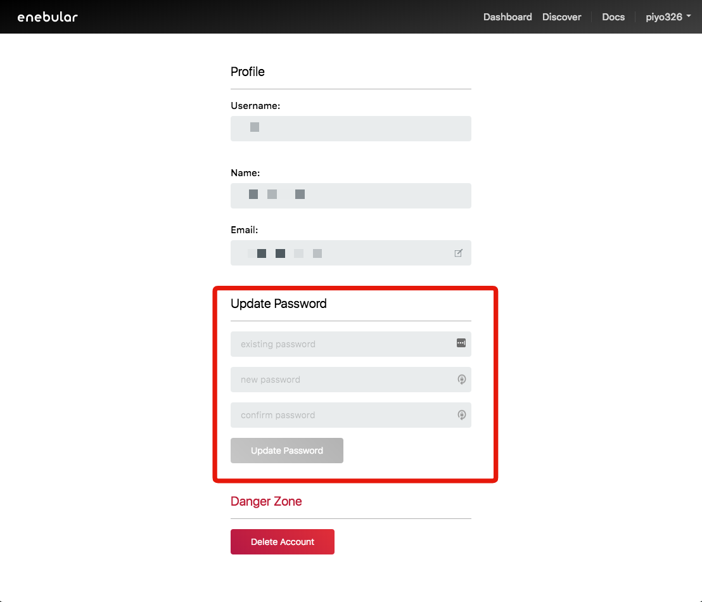
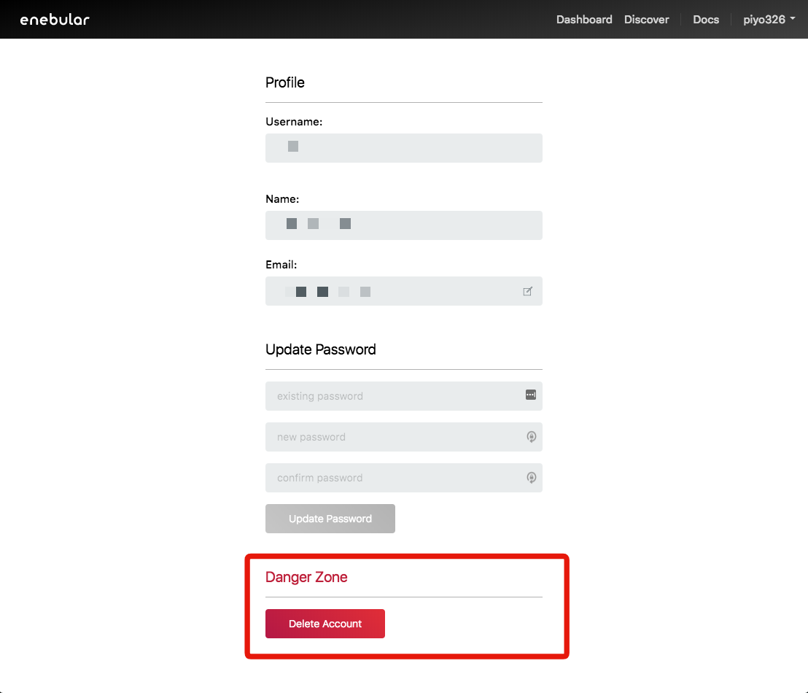

# Account Settings {#Account Settings}

Account Settings では自分のアカウントの情報を閲覧・編集できます。

## Profile {#Profile}

自分のプロフィール情報を編集できます。

- Username: Discover に表示されるニックネームです
- Name: 個人情報としてのフルネームです
- Email: 認証に利用するメールアドレスです

## Update Password {#Update Password}

パスワードを変更できます。パスワードは8文字以上の英数字を利用ください。

## Danger Zone {#Danger Zone}

アカウントを削除できます。

