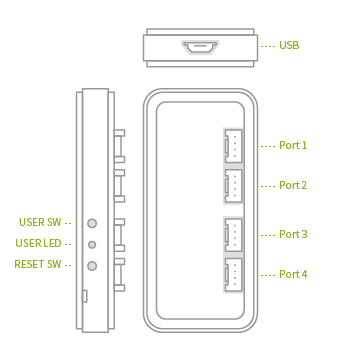

# RAVEN

enebular Reference Board "RAVEN"は、IoTオーケストレーションサービスenebularのエッジデバイス向け評価ボードです。 

小型ボディに無線機能及び4つのI/Oコネクタを搭載し、簡単にenebularに接続することが可能です。

enebular-edge-agentのソフトウェアでフローの実行などの諸機能を使用できます。詳しくは[Introduction](./../EnebularEdgeAgent/Introduction.md)をご参照ください。

### Table of Contents
1. [内容物](#contents)
1. [各部説明](#parts)
1. [使用前の準備](#preparation)
1. [初期設定](#initialsetting)
1. [免責事項](#disclaimer)

## 内容物{#contents}
以下のものが内容物です。

* RAVEN本体
* USBケーブル
* クイックスタートガイド
* 本体貼り付け用ステッカー

## 各部説明{#parts}

* USB … 電源供給及びPC本体と接続する為の端子(USB microB)です。
* USER SW … フロー経由で状態を読み取れるスイッチです。無線LAN設定時にも使用します。
* USER LED … フロー経由で点灯状態を設定出来るLEDです。
* RESET SW … リセットスイッチです。本体に異常が起きた際に使用します。
* PORT1-4 … フロー経由で機能を設定出来るI/Oコネクタです。

ハードウェアについて詳細な情報が知りたい方は[TechnicalDetail](./../Other/TechDetail-RAVEN.md)をご参照ください。

## 使用前の準備{#preparation}

RAVENをお使い頂くには、以下の準備が必要です。
* 1ポート以上のUSB-A端子を持つPC、またはACアダプタ
    * 5V/0.5A以上を供給出来る機器を使用して下さい。
* インターネット(enebularサーバー)にアクセス出来る無線機器
    * RAVENは、ネットワークへの接続に2.4GHz帯(5GHz帯は非サポート)を使用します。
    * IEEE 802.11 b/g/nに対応したアクセスポイントをご準備下さい。
* Portに接続したいセンサ/アクチュエーター
    * RAVENは、市販のセンサ及びアクチュエーターを使用する事が出来ます。  
    * 3.3V動作、ADC/UART/I2C/PWM/GPIO インターフェース、消費電流200mA ( 4ポート合計 ) 迄に対応します。  
    * 使用可能なセンサは[こちら](http://wiki.seeedstudio.com/Grove_System/)を参照して下さい。  
    * 利用可能なインターフェースの組み合わせには制限が有ります。  

## 初期設定{#initialsetting}

ネットワーク設定の手順を説明します。

* RAVENを`SettingMode`で起動します。
    1. RAVENに`USBケーブル`を接続します。
    1. `USER SW`を押したままの状態で`RESET SW`を押して直ぐに離します。
    1. `USER LED`が赤く点灯するまで`USER SW`を押し続けます。( 5秒前後 )
    1. `USER SW`を離して下さい。離した後も`USER LED`が赤く点灯したままになる事を確認して下さい。
    1. RAVENが`SettingMode`で起動しています。
* [Configration](./../EnebularEdgeAgent/Configuration.md)を参照してSSID、及びパスワードの設定を行います。
* 設定完了後`RESET SW`を押して直ぐに離します。RAVENが`Default Mode`で起動します。

## 免責事項{#disclaimer}

本製品は、お客様にご利用いただき、評価をしていただく目的で開発されております。従いまして、本製品をご利用いただいた場合の、お客様のアプリケーションについての動作、不具合の不発生その他の事項に対しては、明示又は黙示を問わず、一切の保証を致しません。
本書は、製品の保証に関するものではありません。この製品の保証については、お買い上げの販売店にお問い合わせ下さい。

### 使用上の注意

- 直射日光の当たる場所、水気や湿気の有る場所では保管及び使用を行わないで下さい。故障、火災や感電の原因となる恐れが有ります。
- 強い衝撃や圧力(落下、重量物を乗せる等)を掛けないで下さい。誤動作や故障の原因となる恐れが有ります。
- 乳幼児の手の届く場所では使用しないで下さい。誤飲や怪我の恐れが有ります。
- 不安定な場所で使用しないで下さい。製品の落下により、けがや破損の原因となる恐れが有ります。
- 無線機器の使用を制限されている場所(医療機関、航空機内等)では使用しないで下さい。計器誤動作の原因となる恐れが有ります。
- 紙、布、布団等で覆った状態で放置しないで下さい。発火や発煙の原因となる恐れが有ります。
- 端子や筐体に異物を入れないで下さい。誤動作や故障の原因となる恐れが有ります。
- 濡れた手で製品に触らないで下さい。感電の原因となる恐れが有ります。
- 動作中にセンサコネクタの挿抜を行わないで下さい。誤動作や故障の原因となる恐れが有ります。
- 本製品に付された表示を消去、除去又は汚損しないでください。
- その他、本書に記載のない事項については、本製品に適用される利用規約の定めに従うものとします。