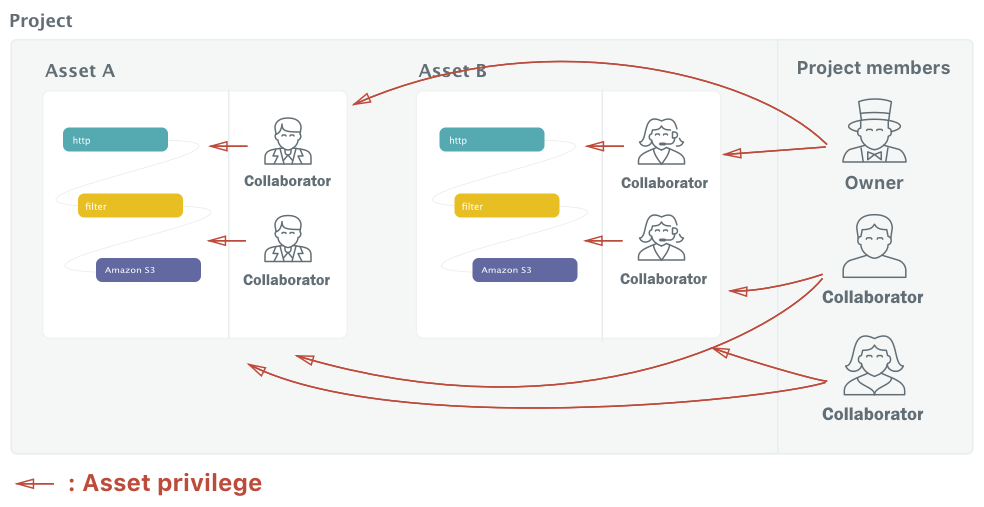
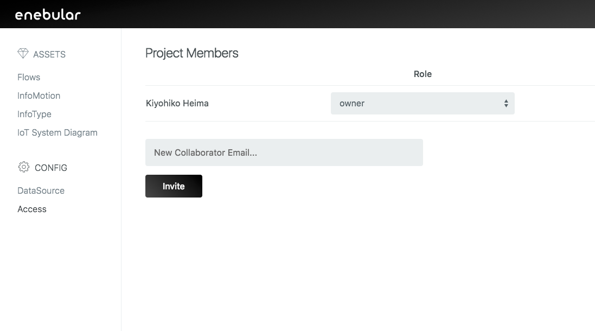
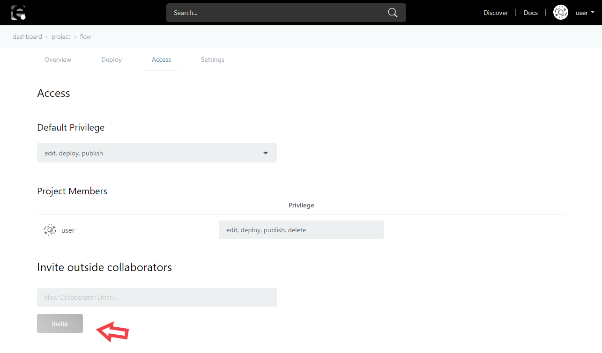
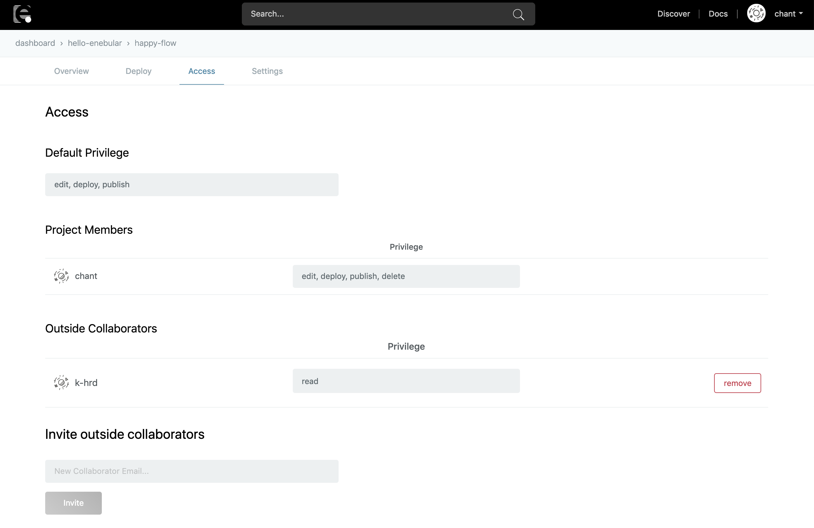

# アクセス権の編集 {#アクセス権の編集}

enebular の Project や Asset のアクセス権についてのドキュメントです。

## ユーザーの種類 {#ユーザーの種類}

まずはユーザーの種類について把握しましょう。以下の 3 種類のユーザーがいます。

- Project Owner
- Project Admin
- Project Collaborator
- Outside Collaborator

**Project Owner** は、Project の管理者です。Project のメンバーの編集、その Project に属するすべての Asset のアクセス管理ができます。

**Project Admin** は、Project に他のメンバーを招待することができます。Project Admin になると、自動的に Project に属するすべての Asset の admin になります。

**Project Collaborator** は、Project のメンバーです。その Project に属するすべての Asset にアクセスができます。

**Outside Collaborator** は、ひとつの Asset に紐付いたメンバーです。ひとつの Asset に対してアクセスできます。

Project Owner は Project の作成者が自動的に Project Owner になります。

Project Collaborator は Project のサイドバーの Access から行くことができる Access ページで Invite できます（Invite できるのは、enebular に登録したメールアカウントのみです）。

Outside Collaborator は Flow の詳細画面の Access タブから行くことができる Access ページで Invite できます（Invite できるのは、enebular に登録したメールアカウントのみです）。

## Asset privilege について {#Asset privilege について}

アセットは基本４つの privilege があります: `read`, `edit`, `deploy`, `publish`.

|            | read | edit | deploy | publish |
| :--------- | :--- | :--- | :----- | :------ |
| flow       | o    | o    | o      | o       |
| file       | o    | o    | o      | -       |
| infomotion | o    | o    | -      | -       |
| infotype   | o    | o    | -      | o       |

Project Owner、 Project Admin、 そして Asset を作成した Project Collaborators は上記の権限を含め `delete`の権限もあります。

| 権限    | 説明                                                                              |
| :------ | :-------------------------------------------------------------------------------- |
| read    | ユーザーは Asset の閲覧が可能                                                     |
| edit    | ユーザーは Asset の編集が可能                                                     |
| deploy  | ユーザーは Asset のデプロイが可能                                                 |
| publish | ユーザーは Asset を [Discover](https://enebular.com/discover)に公開することが可能 |
| delete  | ユーザーは Asset の削除が可能                                                     |

(`edit`, `deploy`, `publish` の権限を持つユーザは `read` の権限が与えられます。)

Asset privilege は Flow の詳細画面の Access タブから行くことができる Access ページで設定できます。

default privilege は Project Collaborator を Invite した際に、そのメンバーに自動的に与えられる権限です。

なお Outside Collaborator は、default privilege に関わらずデフォルトで `read` 権限が与えられます。
