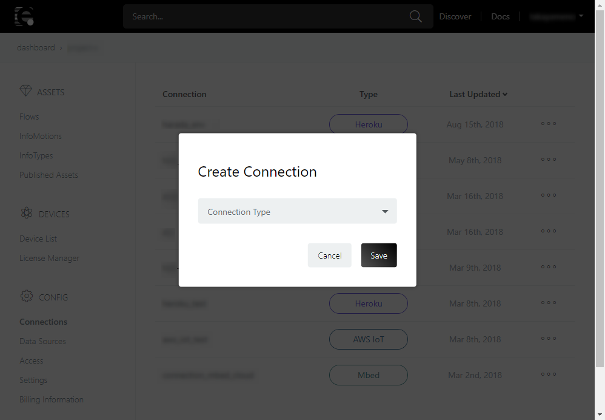
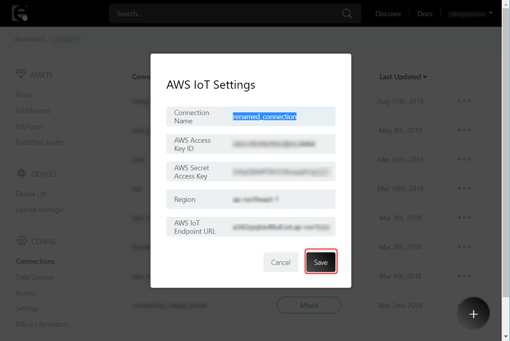
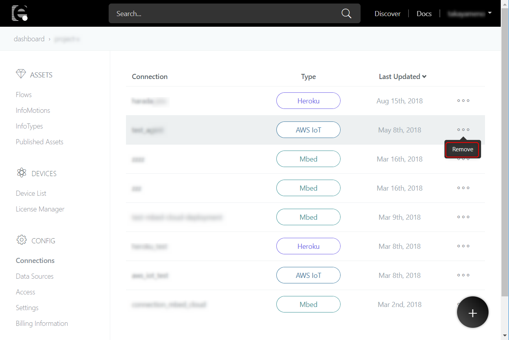

# Connections

Connections では外部サービスとの連携先（コネクション）を管理することが出来ます。コネクションは一覧、追加、編集、削除をすることが出来ます。

コネクションはアセットのデプロイ先として使用することが出来ます。アセットのデプロイについての詳細は [Deploy](../Deploy/index.md) を参照してください。

## List

登録済みのコネクションを一覧することが出来ます。各項目の説明を後述します。

| No. | 項目名 | 説明 |
| --- | --- | --- |
| 1 | Connection | コネクション名が表示されます。 |
| 2 | Type | どの外部サービスとのコネクションかが表示されます。 |
| 3 | Last Updated | コネクションが最後に編集された日付が表示されます。 |
| 4 | Remove | 登録済みのコネクションの削除を行うことが出来ます。 |

## Add

コネクションを新しく登録することが出来ます。

＋ボタンをクリックします。

ポップアップが表示されます。Connection Type の中から、連携したい外部サービスを選択します。

選択した Connection Type によって設定項目が異なります。詳細は [Deploy](../Deploy/index.md) を参照してください。

## Edit

登録済みのコネクションを編集することが出来ます。

編集したいコネクションをクリックします。

ポップアップが表示されるので、項目を編集し Save ボタンを押して変更を保存します。

## Remove

登録済みのコネクションを削除することが出来ます。

画像の Remove を押下します。

コネクションを削除してよいかを確認するポップアップが表示されるので、Delete ボタンを押下します。