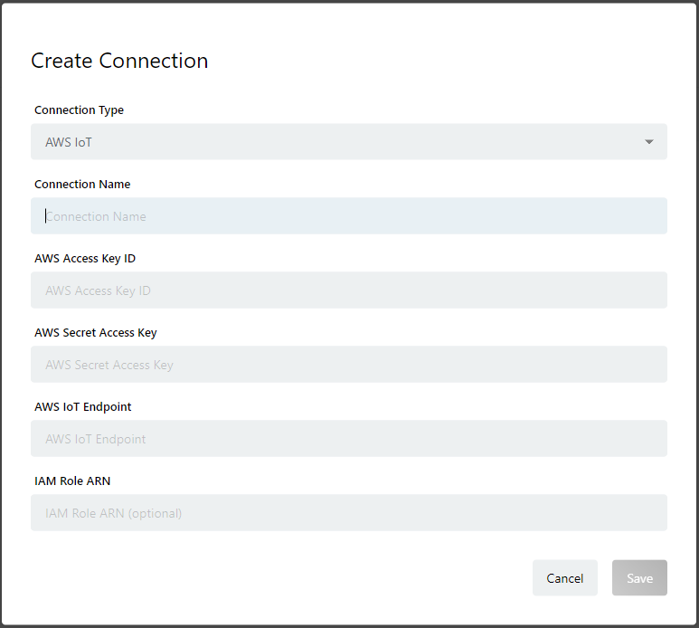

# AWS IoTのConnection作成 {#MakeAWSIoTConnection}

## 概要 {#InTheBiginning}

enebularは、ユーザーが利用しているAWS IoTに接続されたデバイスに対してフローやファイルをデプロイしたり、デバイスの接続状況を確認したりする機能を提供します。この機能を利用するには、enebularにAWS IoTのConnectionを作成する必要があります。AWS IoTのConnectionを作成するには、以下を設定してください。

* Connection Type: AWS IoTを利用する場合は、`AWS IoT`を設定してください
* Connection Name: 任意の名前を入力してください
* AWS Access Key ID: enebularがAWSに対して設定を施す際に利用するユーザのAccess Key ID (注1)
* AWS Secret Access Key: enebularがAWSに対して設定を施す際に利用するユーザのSecret Access Key (注1)
* AWS IoT Endpoint: enebularがAWS IoTにアクセスするためのエンドポイント
* IAM Role ARN: AWS IoTにて、ルールを実行する際に必要となるRoleのARN

注1: AWS Access Key IDとAWS Secret Access Keyは[enebular-agentのインストール](../../../EnebularAgent/Installation.md)の説明でも出てきますが、ここで説明するものとは必要となる権限が異なりますのでご注意ください。enebular-agentのインストール向けとAWS IoTのConnection作成向けに異なるAWSユーザを作成して利用することを推奨します。

## 注意事項

AWS IoTのConnectionは、AWSアカウントにつき一つのみ作成するようにしてください。  
一つのAWSアカウントにつき、複数のConnectionを作成すると一つのデバイスが各Connectionで表示され複数存在するように見えます。これは、誤動作の原因になることがあります。

また、enebularはConnectionを作成すると自動的に以下のAWS IoTのルールと、Amazon SNSのTopicを作成しますが、これらを編集・削除しないでください。

* AWS IoT - `enebular_shadow_update`
* AWS IoT - `enebular_status_push_rule`
* AWS IoT - `enebular_devicestate_push_rule`
* Amazon SNS - `enebular_status_push_sns`
* Amazon SNS - `enebular_devicestate_push_sns`

## AWSから取得するConnectionの設定情報の準備 {#PrepareConnectionInformation}

ここでは、以下の4項目の設定情報を用意する方法について説明します。

* AWS Access Key ID
* AWS Secret Access Key
* AWS IoT Endpoint
* IAM Role ARN

enebularが提供する機能を利用するには、AWS IoTだけではなく、Amazon SNSの利用も必要です。
enebularは、ユーザーのAWS IoTとAmazon SNSに対してenebularと連携するための設定を自動的に行います。自動設定のために、ユーザーから`AWSユーザ`のAccess Key ID、Secret Access KeyをConnectionの設定情報として入力します。
設定が完了すると、デバイスでの状態変化を検出するためのAWS IoTのルールと、その状態変化をenebularに伝えるSNS Topicが作成されます。このAWS IoTのルールを実行するには、その権限をAWS IoTに渡す必要があり、その権限を`IAM Role ARN`としてConnectionに設定する必要があります。

以下、`AWSユーザ`と`IAM Role ARN`の準備の仕方と、`AWS Endpoint`の参照方法について以下に説明します。

### IAM Role ARNの作成 {#MakeIAMRoleARN}

まず最初に`IAM Role ARN`を作成します。

1. AWSマネジメントコンソールにサインインし、上部の[サービス]→[IAM]→[ロール]→[ロールの作成]をクリックします

1. `このロールを使用するサービスを選択`欄でIoTを選択後、ユースケースの選択でIoTを選択し、[次のステップ:アクセス権限]ボタンを押下します

1. アクセス権限ポリシーはデフォルトのままで、[次のステップ:タグ]ボタンを押下します

1. タグの追加もデフォルトのままで、[次のステップ:確認]ボタンを押下します

1. 任意の`ロール名`と、必要に応じ`ロールの説明`を指定し、[ロールの作成]ボタンを押下します。後の説明のためにここではロール名を`enebular_status_push_role`とします

1. 次に、ロール名の一覧から今作成したロール名をクリックします

1. この状態では、以下のポリシーがアタッチされているかと思います

    * AWSIoTThingsRegistration
    * AWSIoTLogging
    * AWSIoTRuleActions

    上記のポリシーは全て不要であるため右の[×]ボタンを押下してデタッチを行います。

1. [ポリシーをアタッチします]ボタンを押下し以下のポリシーをアタッチします

    * AmazonSNSFullAccess
    * AWSIoTDataAccess

以上でIAM Roleの作成は完了です。画面に表示されている`ロール ARN`が、enebularのConnection情報として入力が必要となる`IAM Role ARN`となりますので、これをコピーしておきます(**Connection情報①**)。

### AWSユーザの作成 {#MakeAWSUser}

#### PassRoleポリシーの作成 {#MakePassRolePolicy}

AWSのユーザを作成する前に、PassRoleポリシーを作成します。PassRoleポリシーは、AWSユーザに設定するポリシーであり、IAM Role ARNに必要なポリシーが登録されていることをチェックできるようにすることと、AWS IoTのサービスにIAM Role ARNで指定したRoleを渡すことができるようにします。

1. AWSマネジメントコンソールにサインインし、上部の[サービス]→[IAM]→[ポリシー]→[ポリシーの作成]をクリックします

1. [サービスの選択]をクリックし`IAM`と入力し、表示された候補(`IAM`)をクリックします

1. [アクション]をクリックし、フィルタアクション入力欄に`PassRole`と入力し、表示された候補をチェックします

1. 次に上記と同じ入力欄に、`GetRole`と入力し、表示された候補をチェックします

1. 次に上記と同じ入力欄に、`ListAttachedRolePolicies`と入力し、表示された候補をチェックします

1. [ARNの追加]をクリックし、表示されたダイアログの`Account`に現在利用されているAWSアカウント(数字列)を入力し、`Role name with path`に、IAM Role ARNのロール名である`enebular_status_push_role`を入力した上で[追加]ボタンを押下します

1. [ポリシーの確認]ボタンを押下します

1. `名前`欄と任意のポリシー名を入力します。説明のために、ここでは`EnebularPassRole`という名前にします。`説明`については必要に応じ入力してください

1. [ポリシーの作成]ボタンを押下するとPassRolePolicyの作成は完了です

#### ユーザの作成 {#Makeuser}

AWSマネジメントコンソールにサインインし、上部の[サービス]→[IAM]→[ユーザー]→[ユーザーを追加]をクリックします

1. `ユーザ名`欄に、任意のユーザ名を入力します。今後の説明のためにここでは`enebular-conn-user`とします

1. `アクセス種類`の`プログラムによるアクセス`にチェックを入れて、[次のステップ:アクセス権限]ボタンを押下します

1. [既存のポリシーを直接アタッチ]ボタンを押下し、ポリシーのフィルタを使って以下の3つのポリシーを選択し、[次のステップ:タグ]ボタンを押下します

    * AWSIoTFullAccess
    * AmazonSNSFullAccess
    * EnebularPassRole(`PassRolePolicyの作成`で説明した手順で作成したRole)

1. 必要に応じ`タグ`を入力し、[次のステップ:確認]ボタンを押下します

1. 選択した3つのポリシーが設定されていることを確認し、[ユーザの作成]ボタンを押下します

1. `ユーザー`、`アクセスキーID`、`シークレットアクセスキー`が閲覧できますので、これらの値をコピーしておきます(**Connection情報②**)

#### AWS IoT Endpointの参照 {#ReferenceOfAWSIoTEndpoint}

AWSマネジメントコンソールにサインインし、上部の[サービス]→[IoT Core]→[設定]をクリックします。
念のため、AWS Console画面の上部に表示されたRegionが、デバイスの接続先のRegionであることを確認してください。正しくない場合は、プルダウンメニューから正しいRegionを設定してください。
カスタムエンドポイントに、エンドポイントの文字列が表示されますのでこちらをコピーしておきます(**Connection情報③**)。

## enebularでのConnectionの作成 {#MakeConnectionOnEnebular}

enebularでProjectを選択した画面の左側のサイドメニューに`Connections`がありますので、これをクリックします。
右下の[+]ボタンを押下すると下記のダイアログが表示されます。

以下のように設定し、[Save]ボタンを押下します。

* Connection Type: `AWS IoT`を指定してください
* Connection Name: 任意の名前を入力してください
* AWS Access Key ID: **Connection情報②**のアクセスキーID
* AWS Secret Access Key: **Connection情報②**のシークレットアクセスキー
* AWS IoT Endpoint: **Connection情報③**のエンドポイント
* IAM Role ARN: **Connection情報①**のロールARN

これでenebularへのConnection追加は完了です。
Deploy先として今回作成したConnectionを選択する際は、この`Connection Name`を選択するようにしてください。

一度作成したConnectionは、Connection Name以外変更できなくなります。Connection Name以外を修正したい場合は、Connectionを削除した上で新規に作成するようにしてください(同じAWSアカウントを参照する別のConnectionを登録している状態では、新しいConnectionの作成はできません)。

## enebular 2.9.0以前に作成したAWS IoT Connectionに対する対応 {#CorrespondenceOfEnebular2.9.0AWSIoTConnection}

enebular 2.9.0以前のバージョンで、AWS IoTのConnectionを作成している場合、デバイスにライセンスを割当てていてもConnected / Disconnectedのステータスを閲覧することができなくなります。

ステータスを閲覧できるようにするために以下の対応をしてください。

1. IAM Role ARNの追加
  上記の[IAM Role ARNの作成](#MakeIAMRoleARN)に従って`IAM Role ARN`を作成してください。
  enebularにて、Connectionを編集し、作成した`IAM Role ARN`を入力してください。

1. AWS Access Key ID / AWS Secret Access Keyに対応するユーザのポリシー追加
  enebular 2.9.0以前では、AWSIoTFullAccessのポリシーのみ必要でしたが、これに加えて以下二つのポリシーの追加が必要となります。
    * AmazonSNSFullAccess
    * EnebularPassRole([PassRolePolicyの作成](#MakePassRolePolicy)で説明した手順で作成したRole)

もし、新しいAWSユーザを作成して良い場合は、上記の[AWSユーザの作成](#MakeAWSUser)に従って、新規にユーザを作成し、Connectionに設定済みのAWS Access Key ID / AWS Secret Access Keyを新規ユーザのものに入れ替えてください。
