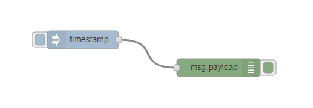
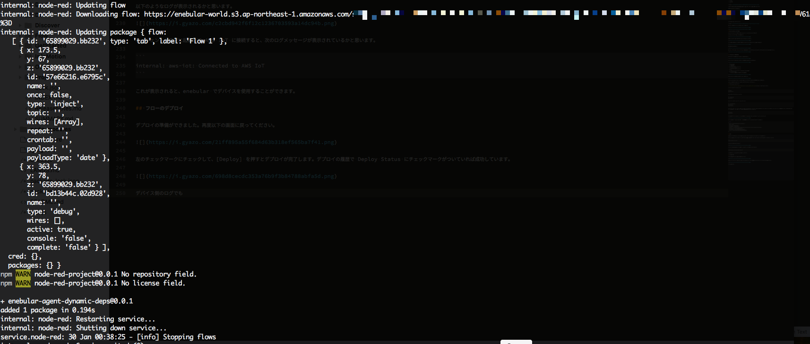
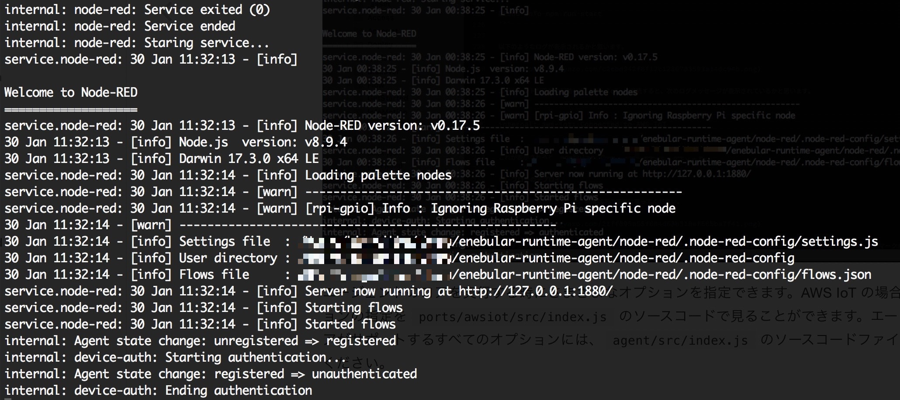

# AWS IoTへのデプロイ {#DeployToAWSIoT}

enebular では作成した Flow を AWS IoT を経由してデバイスにデプロイすることができます。

デプロイするには、以下の前提を満たす必要があります。

* ユーザーがAWSアカウントを作成済みであること
* デプロイ先のデバイスに`enebular-agent`がインストールされていること
* AWS IoTにデプロイ先のデバイスが`モノ`として登録されていること
* enebularでAWS IoTの`Connection`が作成されていること

`enebular-agent`のインストール方法とAWS IoTへの`モノ`の登録については、[こちら](../../../EnebularAgent/Installation.md)をご参照ください。

`Connection`の作成方法については、[AWS IoTのConnection作成](MakeAWSIoTConnection.md)をご参照ください。

## Flow の作成 {#MakeFlow}

今回はデプロイする対象として以下のようなサンプルのFlowを作成します。

Flowを作成したら、`Deploy`ボタンを押下することにより保存します。

## Flowのデプロイ {#DeployFlow}

作成したFlowを、AWS IoTに接続されたデバイスにデプロイします。

Deployタブの[Deploy]ボタンを押します。

`Select Connection for Deployment`ダイアログに作成済みのConnectionのリストが表示されるので、デプロイ先のデバイスが接続されたConnectionを選択します。

選択したConnectionに接続されたデバイスの一覧が表示されます。

デプロイしたいデバイスをチェックし、[Deploy]ボタンを押すとデプロイが開始します。デプロイの履歴のリストで Deploy Status にチェックマークがついていれば成功です。

また、デバイス側のログで更新されているのが確認できるかと思います。

ログに`unauthenticated`と出ますが、これはライセンスを未購入であることを表します。ライセンスがなくてもFlowは動作しますが、ライセンスを購入することでステータスやログの監視ができるようになります。

