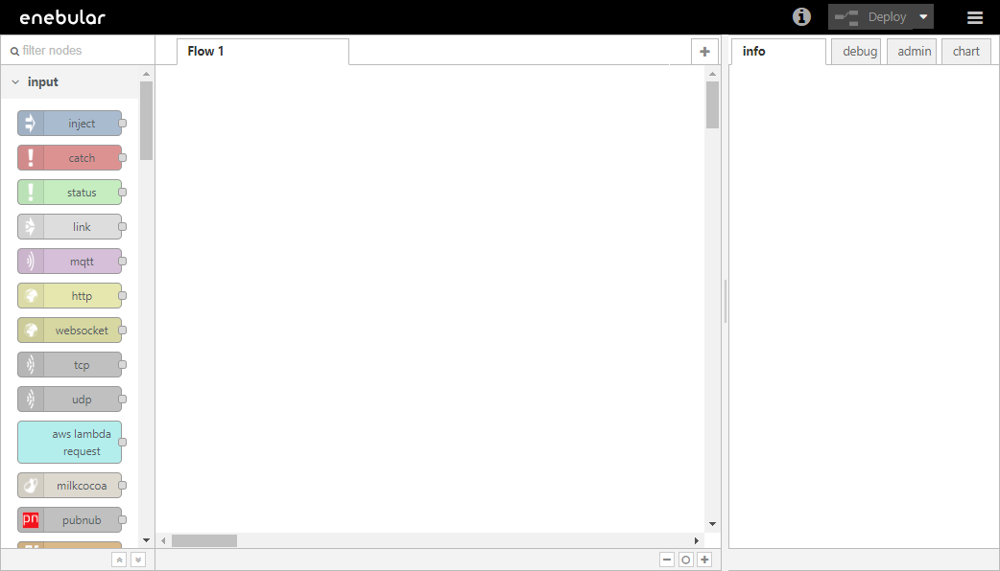
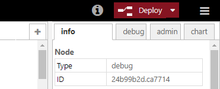

# Pelion Device Managementへのデプロイ {#DeployToPelionDeviceManagement}

Pelion Device Management Deploy は enebular で Pelion Device Management を経由し、登録されているデバイスへフローをデプロイする機能です。

対応デバイスについては  [Supported Environments](../../../Other/Support.md) をご覧ください。

このページでは、Pelion Device Managementを経由してデバイスにFlowをデプロイする手順を説明します。

## 注意事項

PelionのConnectionは、Pelionのサブテナント毎に一つのみ作成するようにしてください。  
一つのサブテナントにつき、複数のConnectionを作成すると各Connectionで同じデバイスが表示されるためデバイスの管理が困難になることや、誤動作の原因になることがあります。

## 新規フローの作成 {#MakeNewFlow}

まずデバイスへデプロイするフローを作成します。（Project は作成済みとします）

フローを作成し [Edit Flow] を押すと、Node-RED の編集画面が立ち上がります。

この編集画面でデータフローを編集してFlowを作成します。

## データフローの編集 {#EditDataFlow}

### Raspberry Pi へのデプロイの場合 {#InCaseOfDeployToRaspberryPi}

Raspberry Pi の Node-RED を起動し、スタンバイの状態にします。

Raspberry Pi へデプロイするフローを編集します。以下のようなフローを作成します。

右上の赤色の [Deploy] を押して保存します。

### enebular-edge-agent へのデプロイの場合 {#InCaseOfDeployToEdgeAgent}

あらかじめ、デプロイに使用するデバイスの電源を入れます。

enebular-edge-agent へのデプロイは下記フローを使います。まずは下記の JSONデータをコピーします。

    [{"id":"165c03e8.b6cbdc","type":"inject","z":"ebd56ac3.b5f1d8","name":"","topic":"","payload":"","payloadType":"date","repeat":"5","crontab":"","once":false,"x":110,"y":100,"wires":[["c82f1f55.78329"]]},{"id":"c82f1f55.78329","type":"switch","z":"ebd56ac3.b5f1d8","name":"","property":"led","propertyType":"flow","rules":[{"t":"eq","v":"1","vt":"num"},{"t":"else"}],"checkall":"true","outputs":2,"x":170,"y":180,"wires":[["31c8aef7.fda952"],["cf93bcf1.04a5"]]},{"id":"31c8aef7.fda952","type":"digitalout","z":"ebd56ac3.b5f1d8","pinName":"LED2","value":"true","signalInversion":true,"name":"","x":340,"y":140,"wires":[["6d2afea9.fd836"]]},{"id":"cf93bcf1.04a5","type":"digitalout","z":"ebd56ac3.b5f1d8","pinName":"LED2","value":"false","signalInversion":true,"name":"","x":340,"y":240,"wires":[["f8f4c712.0302c8"]]},{"id":"6d2afea9.fd836","type":"change","z":"ebd56ac3.b5f1d8","name":"","rules":[{"p":"led","t":"set","pt":"flow","to":"0","tot":"num"}],"action":"","property":"","from":"","to":"","reg":false,"x":530,"y":140,"wires":[[]]},{"id":"f8f4c712.0302c8","type":"change","z":"ebd56ac3.b5f1d8","name":"","rules":[{"p":"led","t":"set","pt":"flow","to":"1","tot":"num"}],"action":"","property":"","from":"","to":"","reg":false,"x":530,"y":240,"wires":[[]]}]

右上のメニューボタンより [Import] → [Clipboard] を選択します。

先ほどのフローをペーストし、[Import] を押します。

以下のようなフローが反映されます。

右上の赤色の [Deploy]を 押して保存します。

## デプロイ {#Deploy}

[Deploy] の右にある下矢印から [Export to Other Services] を選択します。

新しくウインドウが開いてenebularに登録済みのConnectionのリストが表示されます。
Deploy先のConnectionが作成済みであれば、そのConnectionを選択し、表示されるデバイス一覧からデプロイ先のデバイスを選択してデプロイを行うことができます。

今回は、まだConnectionが存在しない場合を想定して説明します。
新規にConnectionを作成するには、上部の[Add Connection]ボタンを押下します。

Create Connection画面が開きますので、Connection Typeに`Pelion`を選択します。

-   Connection Name
    -   任意の分かりやすい名前を入力してください。
-   Pelion API Key
    -   Pelion Device Management Portalで確認してください。

必要な Pelion API Key は [Pelion Device Management Portal](https://portal.mbedcloud.com/) より取得できます。

Pelion Device Management Portal の Access management の APIキーページの [新しいAPIキーの作成] を選択します。

制約に従って API Key 名を入力、またグループを選択してください。ここでの設定項目は後で変更が可能です。

[APIキーの作成] を選択し、ログイン時のパスワード入力します。そして、 [Enter] を選択してください。

API Key が表示されます。一度しか確認できないので注意してください。

Create Connection の画面に Pelion API Key の入力ができたら、[Save]ボタンを押すことで保存します。
一度作成したConnectionは、Connection Name以外は編集できなくなりますので、Pelion API Keyを変更したい場合は、そのConnectionを削除した上で、新しくConnectionを作成してください。

Connectionを保存すると、そのConnectionをDeploy先として選択できるようになっているので選択してください。

登録されているデバイスのリストが表示されますのでデプロイしたいデバイスを選択し、[Deploy]ボタンを押すことでデプロイします。

## 確認 {#Check}

### Raspberry Pi へのデプロイの場合 {#HowToCheckInCaseOfDeployToRaspberryPi}

ログでフローが更新されているのが確認してください。

### enebular-edge-agent へのデプロイの場合 {#HowToCheckInCaseOfDeployToEdgeAgent}

K64F の LED が緑色で点滅することを確認してください。
