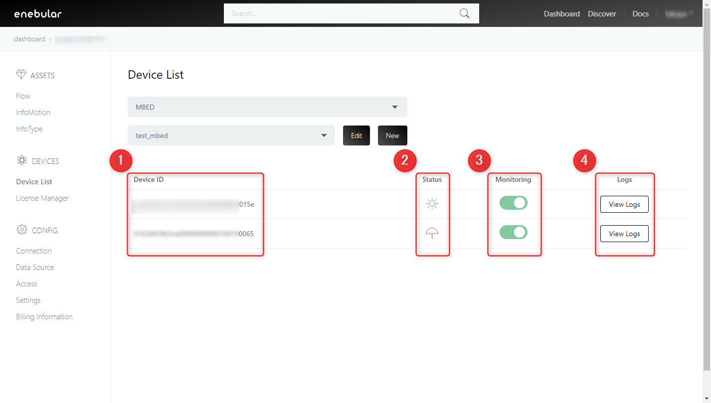

# Device List

Device Listでは[License Manager](./LicenseManager.md)でライセンスを割り当てたデバイスの **ステータス** と **ログ** を確認することが出来ます。この機能は現在エンタープライズプランでのみのサポートです。さらに情報が必要な方は **support@enebular.com** に連絡してください。

## Select Connection Type

閲覧したいデバイスが含まれるコネクションを AWS IoT または MBED から選択します。

## Select Connection

登録済みのコネクションを選択します。

コネクションが登録済みでない場合、 New を押下してコネクションを作成してください。
コネクションの作成方法については、作成したいコネクションにあわせて [Example: AWS IoT](../Deploy/DeployFlow/AWSIoT/index.md) または [Example: mbed Cloud](../Deploy/DeployFlow/mbed/index.md) を参照してください。

## Devis List

コネクションを選択すると、コネクションに紐づいたデバイスが一覧表示されます。  
1～4の各項目について下記で説明します。

**1. Device ID**

ライセンスを割り当てたデバイスが一覧表示されます。

**2. Status**

デバイスの **ステータス** がアイコンで表示されます。
表示されるアイコンと説明は下記のとおりです。

| アイコン | ステータス | 説明 |
| :-: |:-: | :-: |
|   | **connected** | デバイスがenebularに接続している状態 |
|  | **disconnected** | デバイスがenebularに接続できていない状態 |

**3. Monitoring**

トグルをオン(緑色)にすることモニタリングが有効になり、デバイスの **ステータス** と **ログ** を見ることが出来ます。
トグルがオフ(灰色)になっている場合、モニタリングが無効になります。 **ステータス** は **disconnected** になり、デバイスからの新しい **ログ** が見れなくなります。既に送られたログは見ることが出来ます。

**4. Logs**

デバイスのログを見ることが出来ます。詳細については[Logs](./Logs.md)を参照してください。