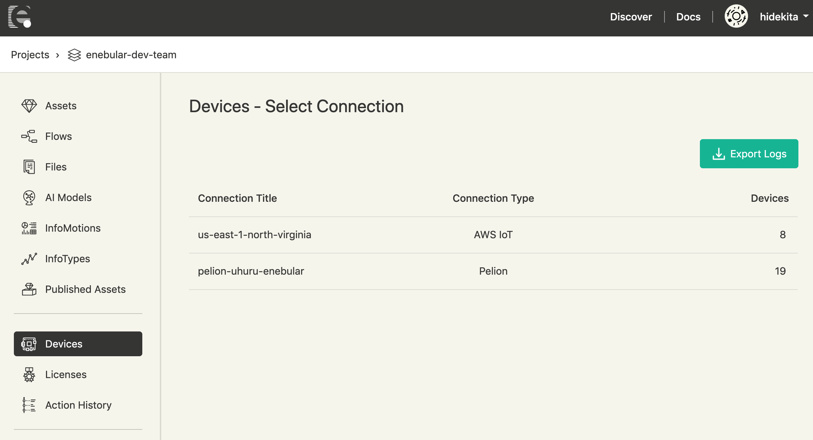
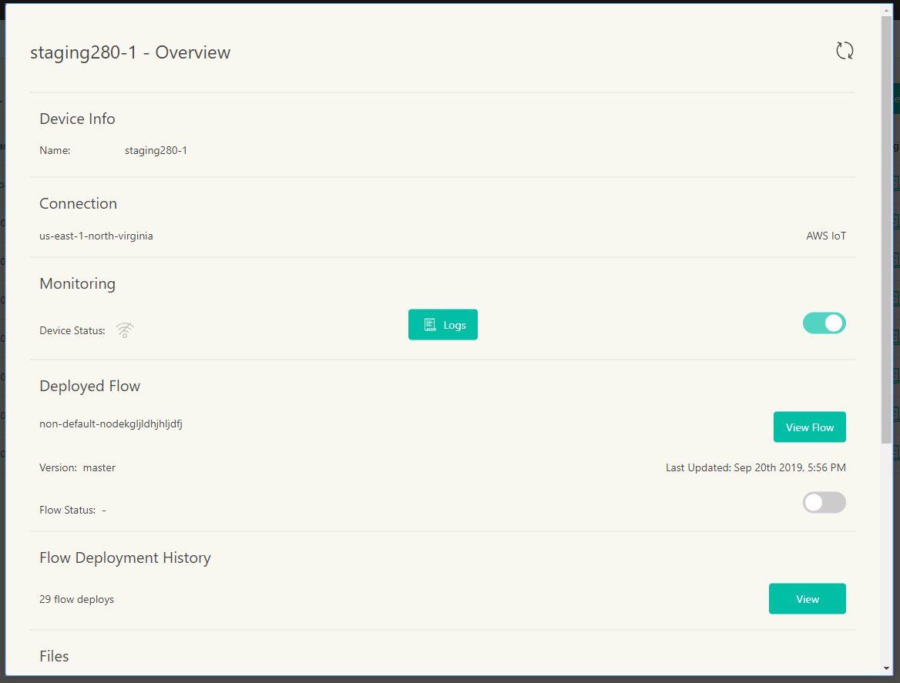

# Devices {#Devices}

## Overview

Device List では[License Manager](./LicenseManager.md)でライセンスを割り当てたデバイスの**ステータス**と**ログ**を確認することが出来ます。この機能は現在エンタープライズプランでのみサポートされます。  
さらに情報が必要な方は**support@enebular.com**までご連絡下さい。

## デバイス一覧画面 {#DeviceList}

**Devices**を選択すると、ライセンスが _registered_ となっているデバイスが属するコネクションが表示されます。確認したいデバイスが属するコネクションを選択してください。

コネクションを選択すると、そのコネクションに属するライセンスが _registered_ のデバイスのリストを表示します。

各列の説明を以下に示します。

| 項目名                  | 説明                                                                                                 |
| ----------------------- | ---------------------------------------------------------------------------------------------------- |
| Device Name             | Deviceの名前を表示します。クリックするとデバイスの詳細情報を確認できます                             |
| Device Status           | `接続ステータス` を表示します。デバイスがenebularと接続できているか確認可能です                      |
| Flow                    | デバイスにデプロイされたFlow名を表示します(注1)                                                      |
| Flow Version            | デバイスにデプロイされたFlowのバージョンを表示します(注1)                                                  |
| Flow Status             | デバイスにデプロイされたFlowの状態(実行中、停止中)を表示します                                       |
| Last Flow Deploy Result | 最後に実施したFlowのデプロイ結果を表示します。デバイスへFlowが正常にデプロイできているか確認可能です |
| Agent Version           | デバイスにインストールされたエージェントのバージョンを表示します                                     |
| Logs                    | デバイスのログを参照可能です。詳細については[Logs](./Logs.md)をご覧ください                          |
| Tags                    | デバイスに付与したタグを表示します                                                                   |

- 注1: v2.12.0以前のenebular-agentに対して、enebular editorのリモートモードでフローをデプロイした場合、Flow及びFlow Versionには反映されません

## デバイス詳細画面 {#DeviceDetail}

Device Nameを選択すると、Device Info、Connection、Monitoring、Deployed Flow、Flow Deployment History、Files、AI Models、Remote Maintenanceを確認できます。

コネクションの種類が、`AWS IoT`又は`Pelion`のデバイスを表示したとき、右上に[Sync]ボタンが表示されます。
通信の状態等により実際のデバイスのStatusと表示上のStatusに差異が発生したときに、[Sync]ボタンを押すと`AWS IoT`又は`Pelion`で管理しているStatusを取得し直すことができます。

### Device Info {#DeviceInfo}

デバイスの名前を表示します。

### Connection {#Connection}

デバイスが属するコネクションの名前と種類を表示します。

### Monitoring {#Monitoring}

Device Status(接続ステータス)と、Logsを表示するボタンとモニタリングのON/OFFを切り替えるスイッチを表示します。

#### Device Status {#DeviceStatus}

Device Statusとして表示されるアイコンと説明は下記のとおりです。

|                                アイコン                                |    ステータス    | 説明                                                |
| :--------------------------------------------------------------------: | :--------------: | :-------------------------------------------------- |
|        |  **connected**   | デバイスが enebular に接続している状態              |
|  | **disconnected** | デバイスが enebular に接続できていない状態          |
|            |   **unknown**    | デバイスのステータスを取得できない状態 （注1) (注2) |

- 注1: Connectionの設定が不正な場合にデバイスのステータスが取得できなくなります。
- 注2: enebular v2.10.0以前にAWS IoT接続のConnectionを作成しており、その後にIAM Role ARNの設定を行なっていない場合や、１つのAWS Accoutに複数のConnectionを設定している場合にも発生します。

#### Logs {#Logs}

`Logs`ボタンをクリックするとデバイスのログを閲覧する画面に遷移します。

#### Monitoring切り換え {#MonitoringSW}

トグルをオン(緑色)にすることでモニタリングが有効になり、デバイスの**ステータス**と**ログ**を見ることが出来ます。
トグルがオフ(灰色)になっている場合、モニタリングが無効になります。**ステータス**は**disconnected**になり、デバイスからの新しい**ログ**が見れなくなります。既に送られたログは見ることが出来ます。

### Deployed Flow {#DeployedFlow}

Flow名、Version、Flow Status、Last Updatedを表示します。
Flow名はデバイスにデプロイされたFlowの名前であり、VersionはそのFlowのバージョンを表します。
Flow名の横の`View Flow`ボタンを押下すると、FlowのOverview画面に遷移します。
Flow StatusはFlowが実行中か停止中かを表し、その横に表示したトグルスイッチを操作することにより状態を切り替えることができます。
Last UpdatedはFlowのデプロイが成功した時刻です。

**注意** enebular agentのVersionが2.5.0未満の場合はDeployed Flowの各項目を閲覧することはできません

### Flow Deployment History  {#FlowDeploymentHistory}

Flowのデプロイ回数とその履歴を確認できます。
`View`ボタンを押下するとFlowのデプロイ履歴の一覧表が表示され、以下の情報を確認できます。

| 項目名              | 説明                                     |
| ------------------- | ---------------------------------------- |
| Flow                | デプロイしたFlowの名前です。             |
| Version             | デプロイしたFlowの状態です。             |
| Deploy Status       | デプロイ状態(結果)を表示します。         |
| Status Last Updated | デプロイ状態の最終更新時刻を表示します。 |

表示できるデプロイ履歴の件数は最新から20件までです。

### Files {#Files}

デプロイしたFileの確認と削除ができます。
デバイス詳細画面ではデプロイしたFile数とサイズを確認できます。
`Manage Files`ボタンを押下すると、デプロイ済みのFileの一覧が表示されます。
各Fileの情報としてAsset名、Filename、Version、Size、State(デプロイ結果)、Fileを削除する際に利用する`×`ボタンも一緒に表示します。
`×`ボタンを押下すると該当するFileをデバイスから削除します。

### AI Models {#AIModels}

デプロイしたAI Modelsの確認と削除ができます。
デバイス詳細画面ではデプロイしたAI Models数を確認できます。
`Manage AI Models`ボタンを押下すると、デプロイ済みのAI Modelsの一覧が表示されます。
各AI Modelsの情報としてAsset名、handler名、Version、State(デプロイ結果)、Status(実行中/停止中)、Fileを削除する際に利用する`ゴミ箱`ボタンも一緒に表示します。
`ゴミ箱`ボタンを押下すると該当するAI Modelsをデバイスから削除します。

### Remote Maintenance {#RemoteMaintenance}

デバイスに対してSSHログインできるようにする機能です。詳しくは、[Remote Maintenance](./RemoteMaintenance.md)をご参照ください。

## Selecting Devices {#SelectingDevices}

**Device Name**の左側にあるチェックボックスを選択することで複数のデバイスを選択可能です。

チェックボックスを選択することで、選択したデバイスに対して次の操作を行うことができます:

- タグの付与
- デプロイ
- Actionのスケジューリング

### Tag Devices {#TagDevices}

選択した複数デバイスに対して同時にタグを付与することができます。

### Deploy {#Deploy}

選択したデバイスに対して**Flow**、**File**、**AI Model**をデプロイすることができます。

### Schedule Action {#ScheduleAction}

デバイスで実行する Action をスケジュールすることが可能です。

現在、以下の Action Type がサポートされています。

- Flow Deploy
- File Deploy
- AI-Model Deploy
- Flow Start
- Flow Stop

Scheduled Action でスケジュール可能な時間は、現在時刻の5分後から30日後までの範囲で5分間隔で指定できます。例えば、現在時刻が 2:54 の場合、スケジュール可能な直近時刻は 3:00、現在時刻が 2:56 の場合、3:05 を指定できます。

**注意** スケジュールされた Action に応じて、必要な enebular-agent の最小バージョンは異なります。これは Scheduled Action 固有の事項であることに注意してください。（スケジュールしない、通常の操作に関してはこの限りではありません）

| Scheduled Action | Minimum Required enebular agent version |
| ---------------- | --------------------------------------- |
| Flow Deploy      | 2.5                                     |
| File Deploy      | 2.3                                     |
| AI-Model Deploy  | 2.7                                     |
| Flow Start       | 2.8                                     |
| Flow Stop        | 2.8                                     |

1. Schedule Actionをクリックします
2. Action Typeを選択し、`Next`ボタンをクリックします
3. Assetのデプロイ関連のAction Typeの場合は、対象とするAssetを選択し、`Next: Select version`ボタンをクリックします
4. Assetのデプロイ関連のAction Typeの場合は、対象とするAsset Versionを選択し、`Next: Schedule`ボタンをクリックします
5. 実行時刻を指定し、`Next: Confirm`ボタンをクリックします
6. 実行詳細を確認し、`Confirm Scheduled Actions`ボタンをクリックします

Scheduled Actionsページにリダイレクトされます。

デプロイされる予定のAssetをスケジュール実行前に削除した場合、そのScheduled Actionはエラー(Asset was deleted)になります。  
Scheduled Actionのエラーは、Action Historyページ及びAction History詳細ページで確認できます。

**注意** スケジュールされたActionが実行される時刻は設定した実行時刻よりも最大1分程度遅延することがあります。
