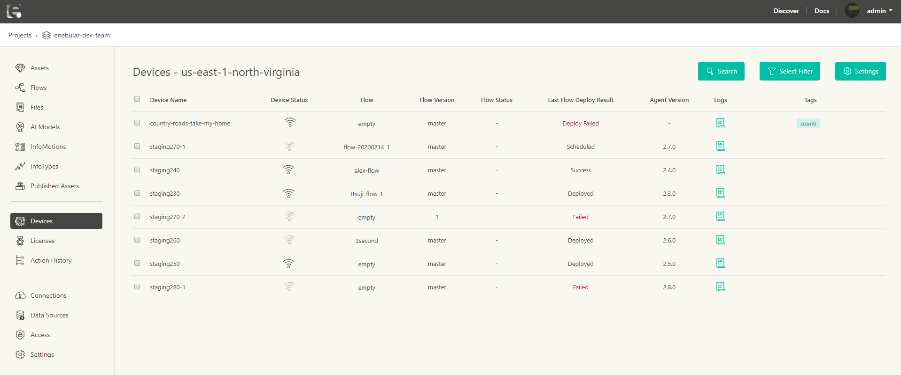

# Device List {#Device List}

Device Listでは[License Manager](./LicenseManager.md)でライセンスを割り当てたデバイスの **ステータス** と **ログ** を確認することが出来ます。この機能は現在エンタープライズプランでのみのサポートです。さらに情報が必要な方は **support@enebular.com** に連絡してください。

コネクションに紐づいたデバイスが一覧表示されます。  
1～6の各項目について下記で説明します。

| No. | 項目名 | 説明 |
| --- | --- | --- |
| 1 | Device ID | ライセンスを割り当てたデバイスが一覧表示します。またクリックするとデバイスの情報を確認できます |
| 2 | Connection | 紐づいている Connection を表示します |
| 3 | Connection Type | 紐づいている Connection の系統を表示します |
| 4 | Status | デバイスの **ステータス** をアイコンで表示します。凡例については以下をご覧下さい |
| 5 | Logs | デバイスのログを見ることが出来ます。詳細については[Logs](./Logs.md)を参照してください |
| 6 | Monitoring | モニタリングのオンオフを設定できます。詳細は以下をご覧ください |

**Deviceの情報**

Device IDを選択すると、Connection,Monitoring,Asset,Filesの情報を確認できます。

**Statusの凡例**

表示されるアイコンと説明は下記のとおりです。

| アイコン | ステータス | 説明 |
| :-: |:-: | :-: |
|   | **connected** | デバイスがenebularに接続している状態 |
|  | **disconnected** | デバイスがenebularに接続できていない状態 |

**Monitoring**

トグルをオン(緑色)にすることモニタリングが有効になり、デバイスの **ステータス** と **ログ** を見ることが出来ます。
トグルがオフ(灰色)になっている場合、モニタリングが無効になります。 **ステータス** は **disconnected** になり、デバイスからの新しい **ログ** が見れなくなります。既に送られたログは見ることが出来ます。