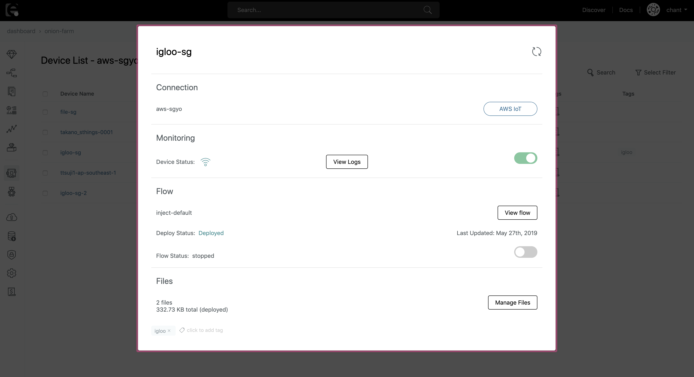

# Flow Status {#Flow Status}

デバイスにデプロイされている**フロー**の実行状態（ステータス）を確認できます。

## 動作要件

フローステータスの監視機能を利用するためには、以下のエージェントバージョンが必要です。

- enebular-agent version >= 2.6.0
- enebular-edge-agent version >= 1.4.0

## フローステータスの種類

フローステータスには、以下の3つの状態があります。

| 名前    | 説明                   |
| ------- | ---------------------- |
| running | フローが実行されている |
| stopped | フローが停止している   |
| -       | 検知不可               |

フローがデプロイされる時、フローステータスは自動的に `running` の状態に変更されます。

## フローの実行・停止

フローステータスは以下の手順で変更可能です。

1. `デバイス`がオンラインになっていることを確認します

1. `デバイス`を選択し、`詳細画面` を開きます

1. フローのセクションにある`スイッチ`でフローステータスの変更が可能です

