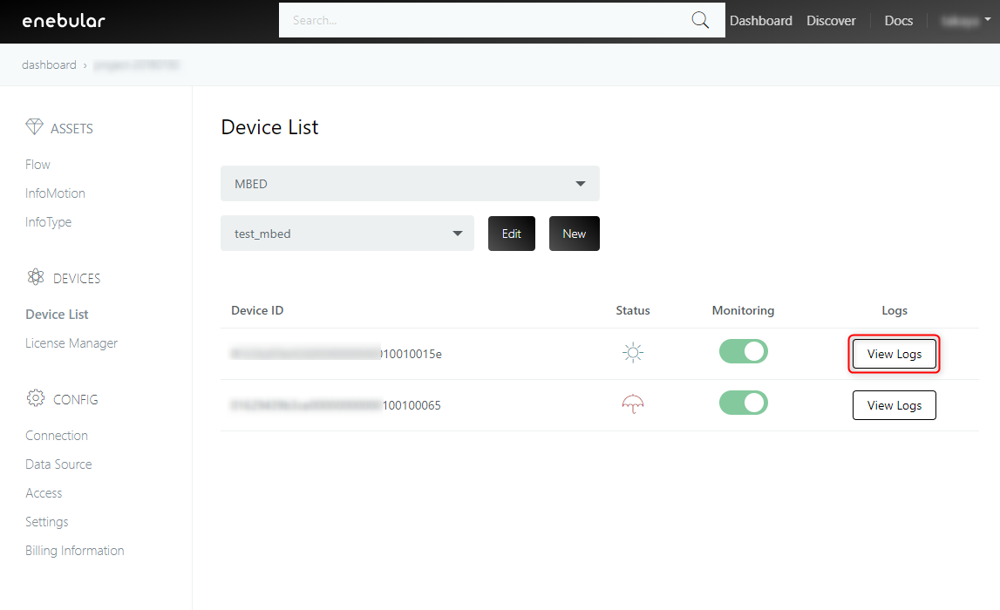
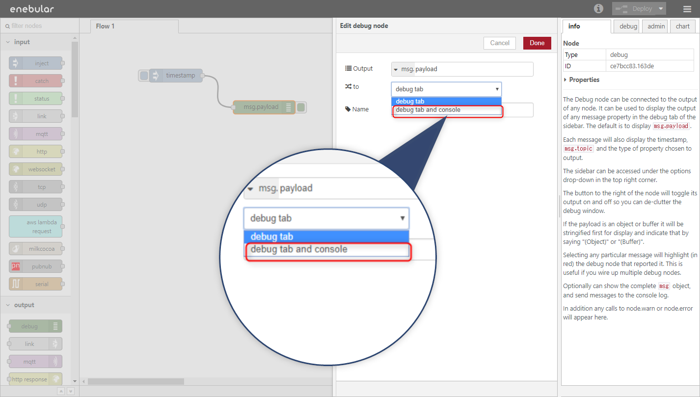
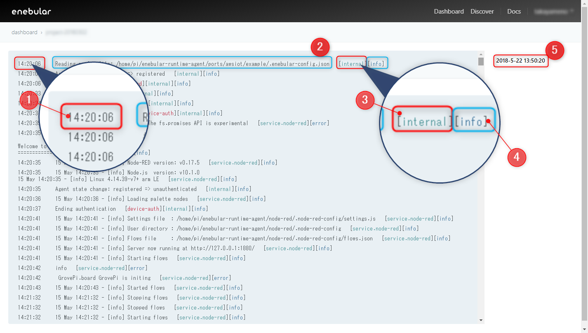
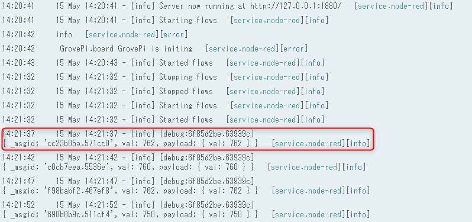
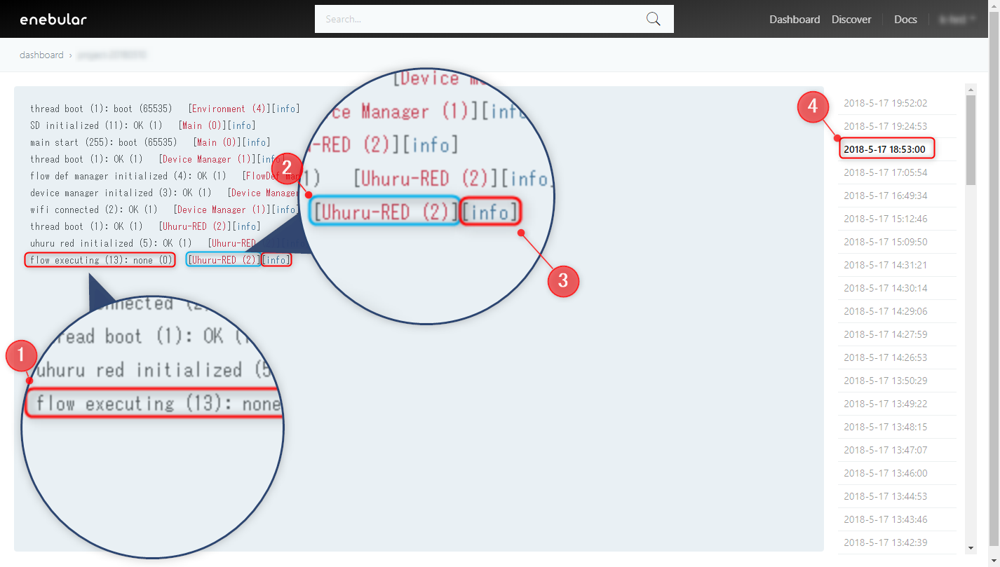

# Logs {#Logs}

enebularでは、有料デバイスのログを確認することができます。
ログを閲覧したいデバイスのモニタリング設定をONにしてください。
※モニタリング設定については、[Device List](./DeviceList.md)のページを参照してください。

enebular-agentとenebular-edge-agentで出力されるログの仕様が異なります。

ログを閲覧するにはDevice Listよりログを見たい対象デバイスの右部にある[View Logs]を押してください。

## enebular-agentのログ {#enebular-agentのログ}

enebular-agentはコンソール(stdout/stderr)に出力したログをenebularに送信します。
デフォルトで`info`レベルのログのみの出力となっています。環境変数DEBUGにより出力設定を`debug`レベルへ変更することができます。

また、enebuar agentはNode-REDがコンソールに出力するログ全てをキャプチャ―します。Node-REDからキャプチャーしたログ内容は全て`info`のログレベルとしてロギングします。

起動後、フローデプロイ後の3分間は30秒毎にログを送信し、他の場合は5分毎にログを送信します。
また、システム終了時にログの送信を行います。

### Node-REDのログ {#Node-REDのログ}

Node-REDが出力するログはNode-REDの設定やノードの設定に依存します。
詳しくは[Node-REDのドキュメント](https://nodered.org/)をご覧ください。

もし、Debugノードのログ出力をしたい場合は、Debugノードを`debug tab and console`の設定にすることで、コンソールへの出力が有効になります。

### ログ画面の見方 {#ログ画面の見方}

enebular-agentのログ画面の例です。

1. ログを出力したタイムスタンプ
1. ログ
1. ログを出力したサービス
   ※ internalはenebular-agentを指します
1. ログレベル
1. enebularがログを受信したタイムスタンプ
   ※ タイムスタンプをクリックすることによって、閲覧するログの時刻を選択できます

また、Debugノードから出力されるログは以下のように表示されます。

## enebular-edge-agentのログ {#enebular-edge-agentのログ}

enebular-edge-agentは動作ログ及びエラーログをenebularに送信します。

デバイスの起動後30秒でログを送信し、以降5分毎にログを送信します。

### ログ画面の見方 {#ログ画面の見方}

enebular-edge-agentのログ画面の例です。

1. ログ
1. ログを出力した機能名
1. ログレベル
1. enebularがログを受信したタイムスタンプ
   ※ タイムスタンプをクリックすることによって、閲覧するログの時刻を選択できます

### enebular-edge-agentログリスト {#enebular-edge-agentログリスト}

enebular-edge-agentの動作ログ及びエラーログです。
さらに情報が必要な方は **support@enebular.com** に連絡してください。

#### 動作ログ

| ログ                         | 説明                                     |
| :--------------------------- | :--------------------------------------- |
| main start                   | enebular-edge-agentの起動               |
| thread boot                  | スレッド生成                             |
| wifi connected               | Wi-Fi接続の確立                         |
| device manager initalized    | デバイス管理機能の初期化                 |
| flow def manager initialized | フロー管理機能の初期化                   |
| uhuru red initialized        | フロー実行機能の初期化                   |
| SD initialized               | SDカードの初期化                        |
| flow deployed                | フローのデプロイ                         |
| flow executing               | フロー実行中                             |
| flow executed                | フロー実行終了                           |
| flash updated: device bandle | デバイスバンドルのフラッシュアップデート |
| flash updated: flow define   | フロー定義のフラッシュアップデート       |
| storage initialized          | ストレージの初期化                       |

#### エラーログ

| ログ                                         | 説明                                    |
| :------------------------------------------- | :-------------------------------------- |
| flow URL connect timeout                     | フローのダウンロード中のタイムアウト    |
| flow download failed                         | フローのダウンロード失敗                |
| flow data error                              | フローの整合性エラー                    |
| flow size over                               | フローのサイズオーバー                  |
| writing flow failed                          | SDカードへのフロー書き込み失敗         |
| reading flow failed                          | SDカードからのフロー読み込み失敗       |
| flow URL size over                           | フローダウンロードURLのサイズオーバー |
| mbed cloud factory configurator client error | Pelion Device Managementとの接続エラー |
| flow runtime not found                       | フロー実行コードが見つからない          |
| flow file not found                          | フロー定義が見つからない                |
| js interpreter error                         | javascript実行ライブラリのエラー       |
| js flow json parse error                     | フロー定義のパースエラー                |
| js node initialize error                     | ノード初期化エラー                      |
| js flow stopped error                        | フローの停止                            |
| js flow execute error                        | フロー実行エラー                        |
| js waiting list overflow                     | フロー実行待ちタスクオーバーフロー      |
| device auth none license                     | ライセンスが存在しない                  |
| device auth https error                      | ライセンス認証接続エラー                |
| device auth invalid                          | ライセンスが無効                        |
| token https error                            | トークン取得エラー                      |
| activate device https error                  | アクティベート接続エラー                |
| log https error                              | ログ送信エラー                          |

## ログExport {#LogExport}

enebularに蓄積されたデバイスのログを自分のPCにダウンロードすることができます。

Export対象のログは以下の二つを指定することにより特定します。

- Project(有料Projectのみが対象です)
- 期間(ログが送信された日付で指定します。タイムゾーンはUTCです)

上記を指定すると、指定したProjectに属するライセンスが付与されたデバイスが、指定した期間の間に送信したログをExportできます。

### ログExportの手順 {#LogExportProcedure}

ログのExportの手順を以下に示します。

1. Projectを選択する画面にて、ログをExportしたいデバイスが所属するProjectを選択します
1. 左のメニューからDevicesをクリックします
1. 右上に表示される`Export Logs`ボタンをクリックします
1. カレンダーが表示されるので、ログをExportしたい期間を選択し、`Export`ボタンをクリックします

上記を実施するとログのExportが始まり、完了したらメールにて通知します。
ログの量によっては最大24時間程度かかることがあります。

完了の通知メールには、ログを圧縮したZIPファイルをダウンロードするためのリンクが含まれますので、そのリンクをクリックしてダウンロードしてください。
ダウンロードのリンクは24時間有効です。

### ダウンロードされるZIPファイル {#ExportedZIPFile}

圧縮対象のログファイル数が多い場合は分割して複数のZIPファイルを生成します。分割のルールは以下です。

- デバイスが出力したログファイル数を加算していき、1万ファイルを超えない範囲で一つのZIPファイルに圧縮します
- 1台のデバイスが生成したログファイルが1万を超える場合にはそれらを一つのZIPファイルに圧縮します

ダウンロードするログを圧縮したZIPファイルの名称は`<Project名>.zip`です。
分割した場合は`<Project名>_<N>.zip`です(Nは1から始まる整数)。

ZIPファイルを展開すると以下の構成のディレクトリ/ファイルが生成されます

- `<Project名>`フォルダ
  - `<Connection名>`フォルダ(同名のConnection名のフォルダが既に存在している場合はフォルダ名の後に`_<M>`(Mは1から始まる整数)を付与します)
    - `<DeviceId>`フォルダ(Pelionの場合はフォルダ名にPelion Device Nameを利用します)
      - `<UTCミリ秒>.json`ファイル(例: 1560506700000.json)

### ログExportの制約事項 {#LogExportConstraints}

- 一度にExportできるログファイル数は120万ファイルです(Deviceは通常5分に1回ログを送信するため、Deviceが200台あった場合およそ20日分のログファイルが出力できます)
- 一度にExportできるログファイルの期間は30日分となります
- ログをExport中のProjectに対して同時にログをExportすることはできません
- システムがBusy状態の場合、システム負荷が低下するまでログExportを受け付けられないことがあります。数時間後に再度、実行してください
