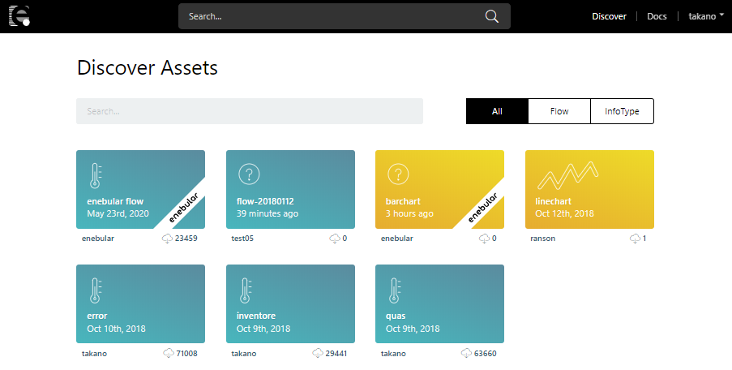
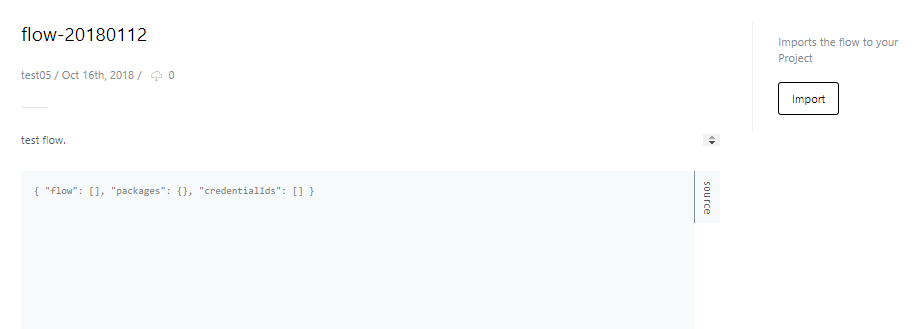
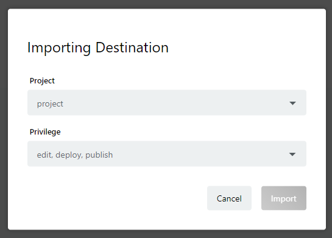

# 他のユーザーのアセットを検索する {#他のユーザーのアセットを検索する}

Asset は enebular.com 上に公開することで、他のユーザーに使ってもらうことができます。

Discover では、他のユーザーが公開した Asset を自分のプロジェクトに取り込むことができます。

お好きな Asset を選択して、Import を押すと自分のプロジェクトに取り込みます。

取り込みたいプロジェクトとデフォルト権限を選択して Import を押すと取り込みが完了します。

