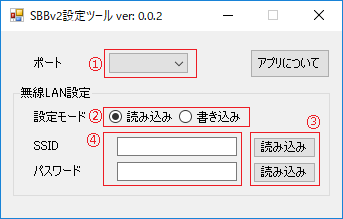

# Configuration

enebular-edge-agent は **enebular Reference Board Configuration Tool**(以下:eRB Config. Tool) を使用して無線LAN設定を行います。

1. [インストール](#install)
1. [起動する前に](#before)
1. [使用方法](#usage)
1. [トラブルシューティング](#troubleShooting)

## インストール {#install}

1. [こちらxxxxxxxxx)からインストーラをダウンロードします。
1. 「setup.exe」を実行し画面の表示に従い、インストールを行います。

## 使用方法 {#usage}

（画像は読み込みモードのものです。）

1. デバイスとPCをデバイスモードでつなぎ、デバイスを設定モードで起動します。（設定モードについては各デバイスのページを参照してください。）
1. 「ポート」①からデバイスが接続されているシリアルポートを選択します。
1. ラジオボタン②から設定モードを選択します。
    - 読み込み・・・「読み込み」③を設定内容がテキストエリア④に表示されます。
    - 書き込み・・・テキストエリア④に各設定値を入力し、「書き込み」③を押すと、設定できます。

※ 一度シリアルポートを選択すると設定が保存されるため、次回起動時設定する必要はありません。（シリアルポート名が変わる場合除く）
２

## トラブルシューティング {##troubleShooting}

### ポートがわからない

1. 「コントロールパネル」 > 「デバイスマネージャー」 > 「ポート」 を開きます。
1.  任意のポートの「プロパティ」 > 「詳細」 > 「バスによって報告されるデバイスの説明」を選びます。
1. 「値」が`mbed Serial Port`であるものが接続されているリファレンスボードです。

### エラーメッセージが出た

エラーメッセージの一覧です。下記を参考に対処して下さい。

| エラーメッセージ | 参考 |
| --------- | ----------  |
| PCに使用できるシリアルポートが見つかりませんでした | PCにシリアルポートが存在しない場合発生します。USB接続を確認してください。|
| ポート設定に誤りがあります | 選択されたシリアルポートに誤りがあります。接続またはポート設定を再度確認してください。
| シリアルポートエラー| 選択されたシリアルポートが間違っている可能性があります。シリアルポートを確認してください。直らない場合は再起動してください。|
| エラーコマンド受信| デバイスが設定モードに入っているかどうかを確認してください。|
| 受信コマンドフォーマットエラー| 受信電文が通信プロコルと異なっています。|
| シリアルポートタイムアウト | デバイスが設定モードに入っているかどうかを確認してください。選択されたシリアルポートが間違っている可能性があります。|
| 入力エラー |ユーザー入力エラーです。パラメーターを確認してください。|
| SSIDは32文字以下で設定してください。| 入力を確認してください。 |
| パスワードは64文字以下で設定してください。| 入力を確認してください。 |

### アンインストールしたい

1. 「setup.exe」を実行後「eRB Config. Tool の削除」を選択し、画面の表示に従い「eRB Config. Tool」のアンインストールを行います。

※「プログラムの追加と削除」からもアンインストールすることができます。