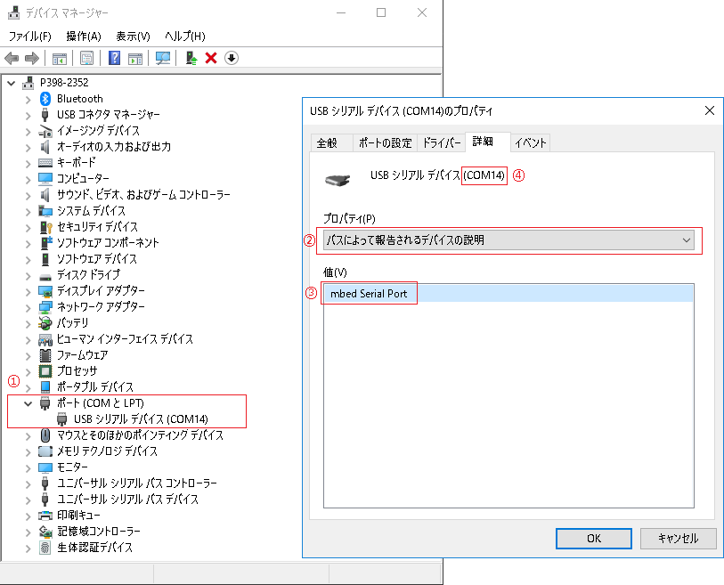

# Configuration

enebular-edge-agent は **enebular Reference Board Configuration Tool**(以下:eRB Config. Tool) を使用して無線LAN設定を行います。

1. [Install](#install)
1. [Before Starting](#before)
1. [Usage](#usage)
1. [Errors]{#errors}

## Install {#install}

1. [こちら](xxxxxxxxx)からインストーラをダウンロードします。
1. `setup.exe`を実行し、画面の表示に従い「設定ツール」のインストールを行います。

### Uninstall

1. 「setup.exe」を実行後「SBBv2SettingTool の削除」を選択し、画面の表示に従い「設定ツール」のアンインストールを行います。

※「プログラムの追加と削除」からもアンインストールすることができます。

## Before Starting {#before}

本ソフトウェアを使用する前にデバイスが接続されているシリアルポートを確認する必要があります。

以下の手順で確認することが出来ます。

1. デバイスをPCに接続する前に「コントロールパネル」>「デバイスマネージャー」を開きます。
1. ①で示されている「ポート」のをダブルクリックしぶら下がっているポートを確認します。（最初から「ポート」がない場合はポート欄も表示されません）
1. デバイスをPCに接続し、追加されたポートを確認します。
1. 追加されたポートを右クリックし「プロパティ」の「詳細」タブをクリックします。
1. ②で示されている「プロパティ」プルダウンメニューから「バスによって報告されるデバイスの説明」を選びます。
1. ③で示されている「値」が`mbed Serial Port`であることを確認します。
1. ④で示されている`COMXX`がデバイスが接続されているシリアルポートです。（画像だと`COM14`が接続されているシリアルポートです）

## Usage {#usage}

（画像は読み込みモードのものです。）

1. デバイスとPCをデバイスモードでつなぎ、デバイスを設定モードで起動します。（設定モードについては各デバイスのページを参照してください。）
1. ①で示されている「ポート」からデバイスが接続されているシリアルポートを選択します。
1. ②で示されているラジオボタンから設定モードを選択します。
    - 読み込み・・・③で示されている「読み込み」を設定内容が④で示されているテキストエリアに表示されます。
    - 書き込み・・・④で示されているテキストエリアに各設定値を入力し、③で示されている「書き込み」を押すと、設定できます。

※ 一度シリアルポートを選択すると設定が保存されるため、次回起動時設定する必要はありません。（シリアルポート名が変わる場合除く）

## Errors {#errors}

エラーメッセージの一覧です。

| 番号 | エラー内容 | 参考 |
| ------ | --------- | ----------  |
|   1    | PCに使用できるシリアルポートが見つかりませんでした | PCにシリアルポートが存在しない場合発生します。USB接続を確認してください。|
|   2    | ポート設定に誤りがあります | 選択されたシリアルポートに誤りがあります。接続またはポート設定を再度確認してください。
|   3    | シリアルポートエラー| 選択されたシリアルポートが間違っている可能性があります。シリアルポートを確認してください。直らない場合は再起動してください。|
|   4    | エラーコマンド受信| デバイスが設定モードに入っているかどうかを確認してください。|
|   5    | 受信コマンドフォーマットエラー| 受信電文が通信プロコルと異なっています。|
|   6    | シリアルポートタイムアウト | デバイスが設定モードに入っているかどうかを確認してください。選択されたシリアルポートが間違っている可能性があります。|
|   7    | 入力エラー |ユーザー入力エラーです。パラメーターを確認してください。|
|   8    | SSIDは32文字以下で設定してください。| 入力を確認してください。 |
|   9    | パスワードは64文字以下で設定してください。| 入力を確認してください。 |
