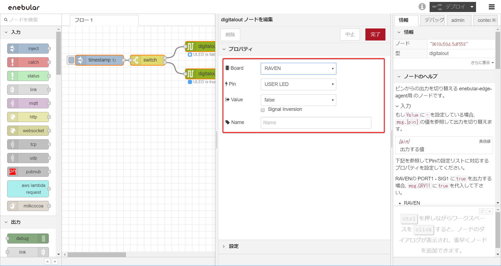

# Getting Started

enebular-edge-agentでは、enebularのeditorを使い、フローを作成しデプロイできます。

このチュートリアルでは、「LED点滅のフローをenebular edge agentにデプロイし、enebularからログを確認する」ということを実施します。（所要時間30分）

あらかじめ、enebularでアカウントとプロジェクトを作成してください。（GettingStarted > [Introduction](./../GetStarted/Introduction.md) にこの流れについて詳しく記載されています)

**※現在ネットワークの設定はWindowsOSからのみしか行うことができません。**

### Table of Contents

1. [ネットワークの設定](#network)
1. [フローのインポート](#import)
1. [フローのデプロイ](#deployFlow)
1. [実行ログの確認](#logs)


## ネットワークの設定{#network}

1. デバイスとPCをUSBケーブルで接続してください。
1. **enebular Reference Board Configuration Tool**（以下: **eRB Config. Tool**）を[こちら](https://download.enebular.com/eRB-Config-Tool/eRBConfigTool.msi)からダウンロードし、インストールします。
1. デバイスを `Setting Mode` で起動します。
    - RAVENの場合･･･起動時にUSER SWを押したままの状態にする。（RESET SWを押した直後にUSER SWを押したままにするとUSER LEDが赤く点灯し、`Setting Mode`で起動します。）
1. **eRB Config. Tool** でSSIDとPasswordを設定します。（詳しくは[Configuration](./Configuration.md)のページを参照してください。）
1. 設定が完了したら、デバイスを再起動してください。

### フローのインポート{#import}

フローのJSONデータを使って、フローのインポートができます。

※フローのインポートをせず、0からフローの作成をしたい場合はページ下部のAppendixの[フローの作成](#createFlow)を参照してください。

下記よりJSONデータをコピーして、クリップボードに保存してください。

```json
[{"id":"5c08cdab.fe76c4","type":"inject","z":"90d9de00.d40e1","name":"","topic":"","payload":"","payloadType":"date","repeat":"3","crontab":"","once":false,"onceDelay":0.1,"x":110,"y":100,"wires":[["4c620395.fa935c"]]},{"id":"4c620395.fa935c","type":"switch","z":"90d9de00.d40e1","name":"","property":"led","propertyType":"flow","rules":[{"t":"true"},{"t":"else"}],"checkall":"true","repair":false,"outputs":2,"x":250,"y":100,"wires":[["9610c50d.5df558"],["36f9ebd9.df86c4"]]},{"id":"9610c50d.5df558","type":"digitalout","z":"90d9de00.d40e1","board":"RAVEN","pin":"ULED","value":"false","si":false,"name":"","x":420,"y":60,"wires":[["730feba8.5a1a24"]]},{"id":"36f9ebd9.df86c4","type":"digitalout","z":"90d9de00.d40e1","board":"RAVEN","pin":"ULED","value":"true","si":false,"name":"","x":420,"y":140,"wires":[["39806cf9.b31c54"]]},{"id":"730feba8.5a1a24","type":"change","z":"90d9de00.d40e1","name":"","rules":[{"t":"set","p":"led","pt":"flow","to":"false","tot":"bool"}],"action":"","property":"","from":"","to":"","reg":false,"x":590,"y":60,"wires":[[]]},{"id":"39806cf9.b31c54","type":"change","z":"90d9de00.d40e1","name":"","rules":[{"t":"set","p":"led","pt":"flow","to":"true","tot":"bool"}],"action":"","property":"","from":"","to":"","reg":false,"x":590,"y":140,"wires":[[]]}]
```

作成済みのプロジェクトの画面から、新規アセットを`type:flow`で作成します。


[Edit Flow] を押してフローエディタを開きます。


右上の「Ξ」からメニューを開き、「読み込み」>「クリップボード」を選択します。


フローを張り付けるテキストボックスが表示されます。先ほどのJSONデータをペーストしてください。「読み込み」ボタンを押します。


フローが読み込まれるので、任意の位置でクリックして、フローを配置してください。右上のデプロイを押します。


editorでは、LEDの点滅を確認できないので、フローはダミーの動きをしています。

※ページ下部のAppendixに[フローの解説](#explainFlow)を書いています。興味のある方はご一読ください。

## フローのデプロイ{#deployFlow}

このステップを実行する前に、デバイスの電源をあらかじめ、onにしてください。

デプロイするフローの画面を開き、「DeployFlow」を押します。（previewが表示されていない場合は、ページをリロードしてください。）


すでに作成されている`Type:Pelion`のConnectionが存在するので、選択します。


Statusが「Connected」になっているデバイスが手元にあるデバイスです。チェックボックスにマークを付けてください。

※connectedのデバイスが複数ある場合は、[デバイスIDの確認方法](#deviceID)から、デバイスIDを確認してください。


下までスクロールし、「Deploy」を押します。


デプロイが完了し、デバイスのUSER LEDの点滅が始まります。


### デバイスIDの確認方法{#deviceID}

デバイスIDはarm Pelionポータルから確認することができます。

1. デバイスに貼ってあるシールのシリアル番号を見ます。9桁目以降を確認してください
1. arm Pelionにログインします
1. デバイスディレクトリを表示します
1. エンドポイントネームがデバイスIDです。対応するデバイスIDを逆引きしてください

## 実行ログの確認{#logs}

※ ログ、ステータスを確認するには、ライセンスが登録されている必要があります。詳しくは、[LicenseManager](./../Device/LicenseManager.md)を参照してください。

enebular-edge-agentは実行ログをenebular.comから確認することができます。
ログは、デバイスの起動後30秒で最初に送信し、以降5分毎に送信します。

Projectの画面から「Device List」を選択します。


Device Listが表示されます。ログを見たいデバイスの「View Logs」を押します。


実行ログが表示されます。


詳しくは、[Logs](./../Device/Logs.md#enebular-edge-agent)を参照してください。


## Well Done!

LED点滅のフローをenebular-edge-agentにデプロイし、enebularからログを確認することができました。

enebular edge agentと市販のセンサーを組み合わせることで簡単なIoTデバイスをだれでも作ることができます。
使用できるノードに制限があるので、[Nodes](./Nodes.md)のページを参考にして、フローを作成してみてください。

## Appendix

### デプロイしたフローの解説{#explainFlow}


このフローは5秒周期で起動します。

digitaloutノードでは、設定されている先のUSER LEDが現在点いているか、そうでいないのか判断できません。
ここでchangeノードで設定のできる、Flow Contextを使用しています。
Flow Contextはノード間でやりとりされる msg とは異なり、フローの処理が終了しても値が残り続けます。

よって、digitaloutノードで、LEDを点灯及び消灯させたのち、後続のchangeノードで現在処理したLEDの状態を保存ということをフロー一度の起動で行っています。
次に起動したときに、前回のLEDの状態がFlow Contextに代入されているので、前回と逆の処理をするようフローが実行されます。

### フローの作成{#createFlow}

すでにenebularにプロジェクトが作成されていることとします。

※このチュートリアルはインポートで使用したフローの作成手順を紹介しています。

1. 新規アセットを`type:flow`で作成します。


1. [Edit Flow] を押してフローエディタを開きます。


1. 下記画像を参考にしてノードを配置してください。

下記のノードを使用しています。digitaloutノードはEEAカテゴリーの中にあります。
    - inject
    - switch
    - digitalout 2つ
    - change 2つ

1. injectノード①は「繰り返し」を`指定した時間間隔`にし、「時間間隔」を`3秒`としてください。「完了」を押します。


1. switchノード②は「プロパティ」を`flow.led`とし、条件1を`is true`にします。


1. 左下の  を押して、条件を追加します。条件2を`その他`としてください。「完了」を押します。


1. digitaloutノード③は「Board」を`RAVEN`にし、「Pin」を`USER LED`、「Value」を`false`としてください。「完了」を押します。


1. changeノード④は`flow.led`に「真偽」> `false`を代入という設定にしてください。「完了」を押します。


1. digitaloutノード⑤は「Board」を`RAVEN`にし、「Pin」を`USER LED`、「Value」を`true`としてください。「完了」を押します。


1. changeノード⑥は`flow.led`に「真偽」> `false`を代入という設定にしてください。「完了」を押します。


1. switchノード②の右側に口が一つ追加されているので、digitaloutノード⑤のつなぎ先をそちらに変更し、右上のデプロイを押します。


enebular-edge-agentにデプロイするフローが作成できました。[フローのデプロイ](#deployFlow)からチュートリアルを続けてください。
editorでは、LEDの点滅を確認できないので、フローはダミーの動きをしています。