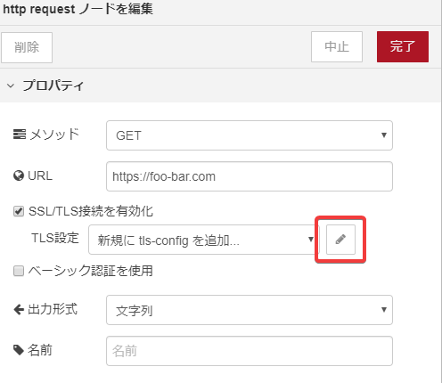
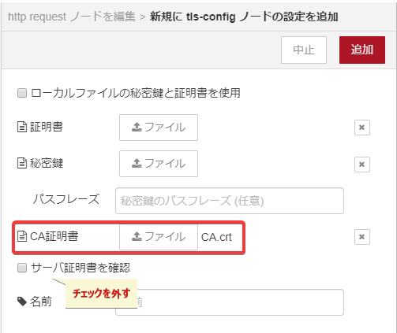
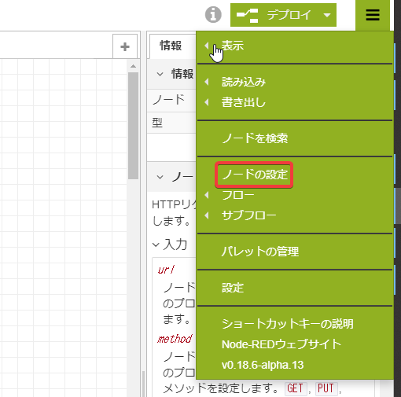
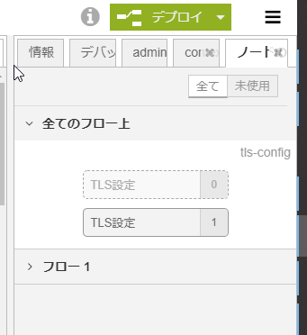
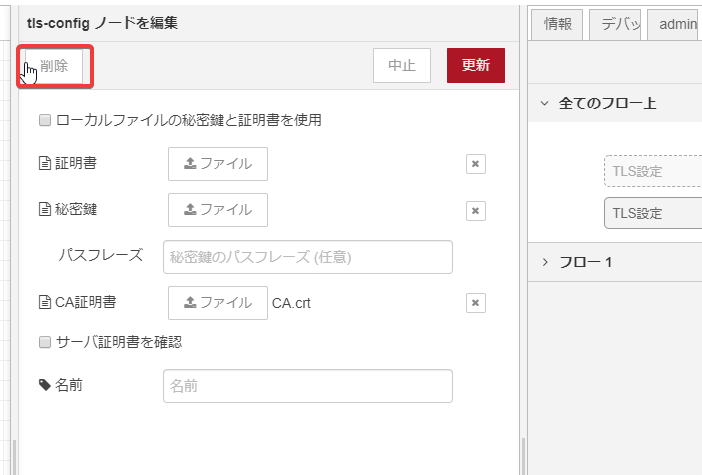

# Nodes

enebular-edge-agent は enebular で作成したフローを実行できます。
利用できるノードには制限があります。

### Table of Contents

-   [ノードリスト](#nodeList)
    -   [EEA カテゴリーのノード](#EEACategory)
    -   [ノードの説明](#Details)
    -   [制限事項](#Restrictions)
    -   [http requestノードでTLS設定をする](#howToTLS)

## ノードリスト{#nodeList}

以下が enebular-edge-agent で動作するノードです。
enebular-edge-agent のためのノードとして、`EEA`というカテゴリーのノードがあります。

-   入力
    -   inject
-   出力
    -   debug
-   機能
    -   http request
    -   switch
    -   change
    -   range
-   EEA
    -   TSL2561
    -   BME280
    -   digitalout
    -   analogin
    -   interruptin

※ enebular-edge-agent で使用できるノードは上記のノードのみです。comment ノード等も使用できません。上記以外のノードが含まれるフローをデプロイした場合、フローの実行が行われません。

### EEA カテゴリーのノード{#EEACategory}

EEA カテゴリーのノードは enebular-edge-agent 用に作成されたノードで、エディタ上ではダミーの値を出力します。
enebular-edge-agent にデプロイすることで、エッジデバイス固有の動作をします。詳しくは各ノードのヘルプ参照してください。

※各ポートの設定でSIG1,SIG2の記載がありますが、接続するモジュールによって、設定値が異なります。コネクタはSIG1,SIG2,VCC,GNDとなっているので、使用するモジュールのコネクタに印字されている文字を見て設定してください。

### ノードの説明{#Details}

Flow editorでノードを使用する際に表示されるヘルプテキストも参照してください。

| 分類  | ノード          | 概要                                  | 備考                            |
| --- | ------------ | ----------------------------------- | ----------------------------- |
| 入力  | inject       | 一定周期でフローを起動する                       | 制限があります ※1                    |
| 出力  | debug        | デバッグメッセージを出力する                      | コンソールに出力できません                 |
| 機能  | http request | http requestをする                     | 制限があります ※2                    |
| 機能  | change       | msgプロパティの変換や削除などを行う                 | -                             |
| 機能  | switch       | 条件分岐を設定する                           | `is of type` のルールが使用できません     |
| 機能  | range        | `msg.payload`の値を設定によって変換する          | -                             |
| EEA | TSL2561      | TSL2561またはTSL2581から照度の値を取得する        | spectrumの設定を行えません。            |
| EEA | BME280       | BME280から温度、湿度、気圧の値を取得する             | -                             |
| EEA | digitalout   | デジタル出力をする                           | LEDなどのモジュールで使用します             |
| EEA | analogin     | A/Dコンバータからの入力値を取得する                 | 水分センサやボリュームバーなどで使用します         |
| EEA | interruptin  | デジタル入力の立ち上がり、または立ち下がりを検出して割り込み入力を行う | スイッチ系のモジュールで使用します。同時使用上限は5個です |

#### 制限事項{#Restrictions}

共通の制限として以下があります。注意してください。

-   Globalコンテキストの使用ができない
-   JSONata や mustache など npmモジュール に依存する記法が使用できない
-   Sequence rules の使用ができない
-   type:バッファ が使用できない

※1 **inject node**には以下の制限があります。

-   repeat 設定のみ可能
-   msg.payloadには常にtimestamp情報が代入される

※2 **http request node**には以下の制限があります。

-   同時に使用できる http request nodeは5つまで
-   `GET` ,`POST` のメソッドのみに対応
-   256byteがレスポンスの上限。（超えると `size over` が `msg.payload` に代入されますが、Requestしないでください）
-   ベーシック認証に非対応

また **http request node** は以下の制限のもとTLS通信に対応しています。tls-configダイアログの設定項目において以下の制限に反する場合フローの初期化時にエラーになります(enebularのログで`js node initialize error`として確認できます)。

-   CA証明書のファイル添付のみに対応（証明書、秘密鍵は添付しないこと）
-   同一フローの中でTLS設定は1つまで（1つの設定を複数のhttp requestノードで使用することができます）
    -   一度設定をするとフローの中に設定が残ってしまいます。フロー編集画面右上の **Ξ** より「ノードの設定」を選択し未使用な設定を削除してください
-   ローカルファイルの使用に未対応（チェックボックスにチェックをいれないこと）
-   CA証明書の最大サイズは **2KB** 
-   秘密鍵のパスフレーズに非対応（文字列を入力しないこと）
-   サーバ証明書を確認に非対応（チェックボックスにチェックをいれないこと）

##### http requestノードでTLS設定をする{#howToTLS}

上記の条件のもとでのTLS設定例及び、一度設定してしまったTLS設定の削除方法に関して記載します。

**設定例**

http requestノードの設定ダイアログで「SSL/TLS接続を有効化」にチェックを入れることで、TLS設定の追加ができます。表示された鉛筆マークをクリックしてください。

tls-configノードの設定画面に遷移します。CA証明書のみを添付し、「サーバ証明書を確認」に入っているチェックを外してください。

TLS設定が完了したので、フローを完成させてデプロイしてください。

※フローをコピー＆ペーストした際はTLS設定がリセットされることがあるので、再度添付してください。

**不要なTLS設定の削除方法**

フロー編集画面右上の **Ξ** をクリックし、メニューを開きます。「ノードの設定」をクリックしてください。

フローの中で表示されていないノードの設定一覧が表示されます。半透明になっているものはフローの中で使用されていないものです。半透明のものをクリックしてください。

tls-configノードの設定画面に遷移するので、左上の削除ボタンを押してください。

不要なTLS設定の削除が完了しました。
