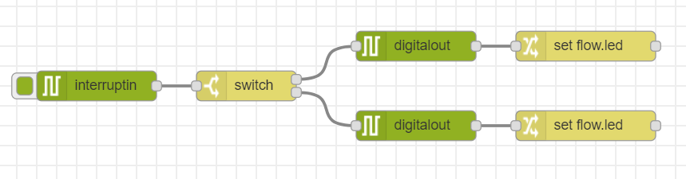
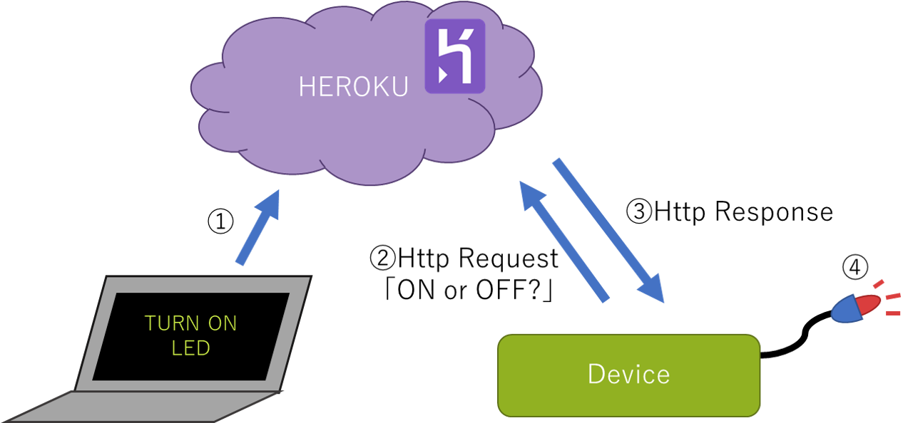
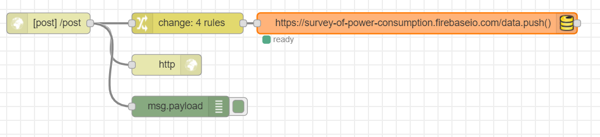
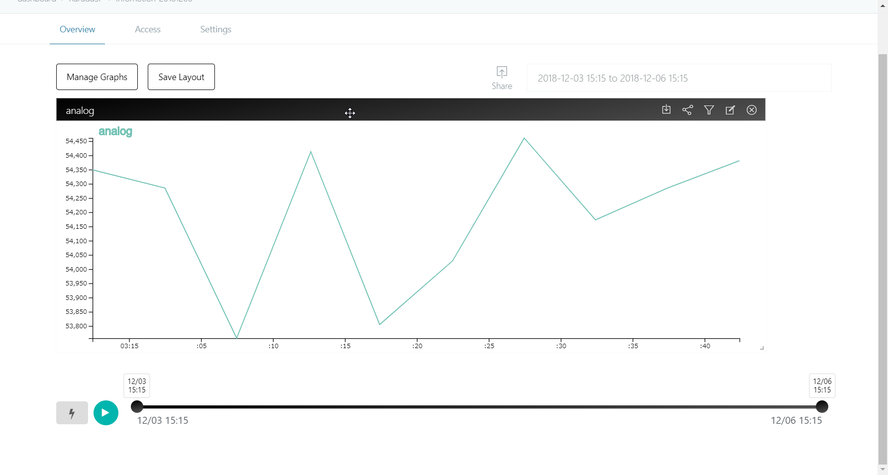

# Sample Flows
enebular-edge-agentを使用したSample Flowです。市販のセンサやアクチュエータを使用したフローも含まれます。

herokuへのフローデプロイなどもあるので、enebularのGettingStaredを一通り終えた方に向けとなっています。

### Table of Contents
- [スイッチを使用してLEDが明滅するフロー](#switchLchika)
- [ブラウザから遠隔でLEDを操作するフロー](#cloudLchika)
    - herokuを使用します。
- [センサーデータをクラウドストレージに入れるフロー](#sensorData)
    - herokuを使用します。
    - Firebaseを使用します。

## スイッチを使用してLEDが明滅するフロー{#switchLchika}

USER SWを押すことによってUSER LEDが点灯し、もう一度押すと消灯します。



```json
[{"id":"35aa62d8.b7976e","type":"digitalout","z":"90d9de00.d40e1","board":"RAVEN","pin":"ULED","value":"false","si":false,"name":"","x":440,"y":60,"wires":[["fd60c779.49cf98"]]},{"id":"74691d65.fe28d4","type":"digitalout","z":"90d9de00.d40e1","board":"RAVEN","pin":"ULED","value":"true","si":false,"name":"","x":440,"y":140,"wires":[["3dd5ff6a.7aed9"]]},{"id":"fd60c779.49cf98","type":"change","z":"90d9de00.d40e1","name":"","rules":[{"t":"set","p":"led","pt":"flow","to":"false","tot":"bool"}],"action":"","property":"","from":"","to":"","reg":false,"x":610,"y":60,"wires":[[]]},{"id":"3dd5ff6a.7aed9","type":"change","z":"90d9de00.d40e1","name":"","rules":[{"t":"set","p":"led","pt":"flow","to":"true","tot":"bool"}],"action":"","property":"","from":"","to":"","reg":false,"x":610,"y":140,"wires":[[]]},{"id":"4cd3cf19.805ae","type":"interruptin","z":"90d9de00.d40e1","board":"RAVEN","pin":"USWITCH","mode":3,"trigger":"rise","name":"","x":120,"y":100,"wires":[["917d7fc1.6570c"]]},{"id":"917d7fc1.6570c","type":"switch","z":"90d9de00.d40e1","name":"","property":"led","propertyType":"flow","rules":[{"t":"true"},{"t":"else"}],"checkall":"true","repair":false,"outputs":2,"x":270,"y":100,"wires":[["35aa62d8.b7976e"],["74691d65.fe28d4"]]}]
```
<!-- 
[こちら]()からimportできます。
-->

### Plus One

市販のセンサやアクチュエータを使って、inputやoutputを容易に変更できます。
詳しくはボード毎のページを参照してください。

* スイッチ系のモジュールをinputとして使用をする場合は、interruptInノードのPortを該当する値に変更してください。
* LEDモジュールなどをoutputとして使用する場合は、digitalOutノードのPortを該当する値に変更してください。


※画像はinterruptInノードのものです。

<!--あとで例示イラストを追加する-->


## ブラウザから遠隔でLEDを操作するフロー{#cloudLchika}


<!--あとで差し替え-->

herokuにLEDをONにするかOFFにするかのパラメータを持たせ、デバイスがそれを確認するフローです。
heroku用、デバイス用の二つのフローを使用します。

herokuのパラメータは、任意のブラウザから変更できます。

### heroku

heroku上に、デバイスが接続するappを用意します。


```json
[{"id":"66eb935a.f88e7c","type":"http in","z":"1fd4c161.fd62af","name":"","url":"/set_value","method":"get","upload":false,"swaggerDoc":"","x":120,"y":120,"wires":[["8034fd7c.f4426"]]},{"id":"2a5cadf0.9d0fb2","type":"http response","z":"1fd4c161.fd62af","name":"","statusCode":"","headers":{},"x":650,"y":120,"wires":[]},{"id":"ae07f97e.2de818","type":"http in","z":"1fd4c161.fd62af","name":"","url":"/get_value","method":"get","upload":false,"swaggerDoc":"","x":120,"y":260,"wires":[["b7ce1491.6abf18"]]},{"id":"b7ce1491.6abf18","type":"change","z":"1fd4c161.fd62af","name":"","rules":[{"t":"set","p":"payload","pt":"msg","to":"value","tot":"flow"}],"action":"","property":"","from":"","to":"","reg":false,"x":340,"y":260,"wires":[["9ebfe90a.806638"]]},{"id":"9ebfe90a.806638","type":"http response","z":"1fd4c161.fd62af","name":"","statusCode":"","headers":{},"x":510,"y":260,"wires":[]},{"id":"8034fd7c.f4426","type":"change","z":"1fd4c161.fd62af","name":"","rules":[{"t":"set","p":"value","pt":"flow","to":"payload.v","tot":"msg"},{"t":"set","p":"value","pt":"msg","to":"value","tot":"flow"}],"action":"","property":"","from":"","to":"","reg":false,"x":340,"y":120,"wires":[["29e97041.36b48"]]},{"id":"bbda544.15caea8","type":"comment","z":"1fd4c161.fd62af","name":"デバイスに渡すvalue","info":"","x":140,"y":200,"wires":[]},{"id":"5121db03.1ed064","type":"comment","z":"1fd4c161.fd62af","name":"valueをsetされる","info":"","x":120,"y":40,"wires":[]},{"id":"29e97041.36b48","type":"function","z":"1fd4c161.fd62af","name":"","func":"msg.payload = \"set value! -> [\" + msg.value + \"]\";\nreturn msg;","outputs":1,"noerr":0,"x":510,"y":120,"wires":[["2a5cadf0.9d0fb2"]]}]
```
<!-- jsonata使えるなら
```json
[{"id":"66eb935a.f88e7c","type":"http in","z":"1fd4c161.fd62af","name":"","url":"/set_value","method":"get","upload":false,"swaggerDoc":"","x":120,"y":120,"wires":[["8034fd7c.f4426"]]},{"id":"2a5cadf0.9d0fb2","type":"http response","z":"1fd4c161.fd62af","name":"","statusCode":"","headers":{},"x":510,"y":120,"wires":[]},{"id":"ae07f97e.2de818","type":"http in","z":"1fd4c161.fd62af","name":"","url":"get_value","method":"get","upload":false,"swaggerDoc":"","x":120,"y":260,"wires":[["b7ce1491.6abf18"]]},{"id":"b7ce1491.6abf18","type":"change","z":"1fd4c161.fd62af","name":"","rules":[{"t":"set","p":"payload","pt":"msg","to":"value","tot":"flow"}],"action":"","property":"","from":"","to":"","reg":false,"x":340,"y":260,"wires":[["9ebfe90a.806638"]]},{"id":"9ebfe90a.806638","type":"http response","z":"1fd4c161.fd62af","name":"","statusCode":"","headers":{},"x":510,"y":260,"wires":[]},{"id":"8034fd7c.f4426","type":"change","z":"1fd4c161.fd62af","name":"","rules":[{"t":"set","p":"value","pt":"flow","to":"payload.v","tot":"msg"},{"t":"set","p":"payload","pt":"msg","to":"\"set value! -> [\" & msg.payload.v & \"]\"","tot":"jsonata"}],"action":"","property":"","from":"","to":"","reg":false,"x":320,"y":120,"wires":[["2a5cadf0.9d0fb2"]]},{"id":"bbda544.15caea8","type":"comment","z":"1fd4c161.fd62af","name":"デバイスに渡すvalue","info":"","x":140,"y":200,"wires":[]},{"id":"5121db03.1ed064","type":"comment","z":"1fd4c161.fd62af","name":"valueをsetされる","info":"","x":120,"y":40,"wires":[]}]
```
-->

<!-- 
[こちら]()からimportできます。
-->

### device

5秒周期でappにアクセスしてパラメータを取得します。


```json
[{"id":"15336f68.1058a1","type":"digitalout","z":"ac70de44.7f659","board":"RAVEN","pin":"ULED","value":"true","si":true,"name":"","x":520,"y":60,"wires":[[]]},{"id":"c570eb4.6d5de18","type":"digitalout","z":"ac70de44.7f659","board":"RAVEN","pin":"ULED","value":"false","si":true,"name":"","x":520,"y":140,"wires":[[]]},{"id":"a574145b.221c18","type":"switch","z":"ac70de44.7f659","name":"","property":"payload","propertyType":"msg","rules":[{"t":"eq","v":"true","vt":"str"},{"t":"else"}],"checkall":"true","repair":false,"outputs":2,"x":350,"y":100,"wires":[["15336f68.1058a1"],["c570eb4.6d5de18"]]},{"id":"f9c4432c.5ab6b","type":"inject","z":"ac70de44.7f659","name":"","topic":"","payload":"","payloadType":"date","repeat":"5","crontab":"","once":false,"onceDelay":0.1,"x":130,"y":60,"wires":[["f7104fc7.71c32"]]},{"id":"f7104fc7.71c32","type":"http request","z":"ac70de44.7f659","name":"","method":"GET","ret":"txt","url":"http://[your-heroku-app].herokuapp.com/get_value","tls":"","x":190,"y":100,"wires":[["a574145b.221c18"]]}]
```

<!-- 
[こちら]()からimportできます。
-->

JSONデータをimportしたあと、http requestノードを開き、作成したheroku appのIDに書き換えてください。


heroku appのIDは、herokuの画面やenebularのデプロイ画面で確認できます。


herokuから確認


deployのリストから確認


デバイスにデプロイ後、`https://[your-heroku-app].herokuapp.com/set_value?v=true`にブラウザからアクセスすると、少し遅れてUSER LEDが点灯します。
また、`https://[your-heroku-app].herokuapp.com/set_value?v=false`にブラウザからアクセスすると、少し遅れてUSER LEDが消灯します。

### Plus One

SlackBotを利用して、することでブラウザからではなくSlackから制御することもできます。


slackの「API Token」、http requestノードの「URL」を自分のものに書き換えてください。
```json
[{"id":"be195e5f.c0068","type":"Slack Bot In","z":"a38fc59f.c0d678","name":"","apiToken":"your-token","channel":"","x":90,"y":140,"wires":[["b5b64af1.81fd48"]]},{"id":"b5b64af1.81fd48","type":"switch","z":"a38fc59f.c0d678","name":"slackのメッセージの判別","property":"payload","propertyType":"msg","rules":[{"t":"cont","v":"ON","vt":"str"},{"t":"cont","v":"OFF","vt":"str"}],"checkall":"true","repair":false,"outputs":2,"x":270,"y":140,"wires":[["d5b9995c.161358","804d5fac.a6ee9"],["dd681792.451928","7040eb7d.ec80f4"]]},{"id":"bed1928d.16612","type":"Slack Bot Out","z":"a38fc59f.c0d678","name":"","apiToken":"your-token","channel":"","x":750,"y":140,"wires":[]},{"id":"804d5fac.a6ee9","type":"change","z":"a38fc59f.c0d678","name":"trueのときのレスポンス","rules":[{"t":"set","p":"payload","pt":"msg","to":"つけたよ！","tot":"str"}],"action":"","property":"","from":"","to":"","reg":false,"x":570,"y":120,"wires":[["bed1928d.16612"]]},{"id":"d5b9995c.161358","type":"http request","z":"a38fc59f.c0d678","name":"true","method":"GET","ret":"txt","url":"https://[your-heroku-app].herokuapp.com/set_value?v=true","tls":"","x":370,"y":80,"wires":[[]]},{"id":"dd681792.451928","type":"http request","z":"a38fc59f.c0d678","name":"false","method":"GET","ret":"txt","url":"https://[your-heroku-app].herokuapp.com/set_value?v=false","tls":"","x":370,"y":200,"wires":[[]]},{"id":"7040eb7d.ec80f4","type":"change","z":"a38fc59f.c0d678","name":"falseのときのレスポンス","rules":[{"t":"set","p":"payload","pt":"msg","to":"けしたよ","tot":"str"}],"action":"","property":"","from":"","to":"","reg":false,"x":570,"y":160,"wires":[["bed1928d.16612"]]}]
```

<!-- 
[こちら]()からimportできます。
-->


実装例です。


## センサーデータをクラウドストレージに入れるフロー{#sensorData}


<!--あとで差し替え-->

このサンプルフローは、スライドバーや水分センサといったアナログ値をとれるモジュールを使用します。

デバイスで取ったセンサの値にクラウドでメタデータを付与し、Firebaseにためるフローです。

## heroku

heroku上に、デバイスが接続するappを用意します。
このappからFirebaseにデータを入れます。



```json
[{"id":"ab0558c5.282628","type":"http response","z":"3cc43a63.b4e246","name":"","x":250,"y":100,"wires":[]},{"id":"2a7bcb1.c56e634","type":"http in","z":"3cc43a63.b4e246","name":"","url":"/post","method":"post","upload":false,"swaggerDoc":"","x":80,"y":40,"wires":[["ab0558c5.282628","21fd8a4.1252576","bd28eaee.6430c8"]]},{"id":"21fd8a4.1252576","type":"change","z":"3cc43a63.b4e246","name":"","rules":[{"t":"move","p":"payload","pt":"msg","to":"payload.value.analog","tot":"msg"},{"t":"set","p":"payload.timestamp","pt":"msg","to":"","tot":"date"},{"t":"set","p":"payload.value.created","pt":"msg","to":"","tot":"date"},{"t":"set","p":"payload.value.label","pt":"msg","to":"analog","tot":"str"}],"action":"","property":"","from":"","to":"","reg":false,"x":280,"y":40,"wires":[["4d11ca47.3d6dd4"]]},{"id":"bd28eaee.6430c8","type":"debug","z":"3cc43a63.b4e246","name":"","active":true,"tosidebar":true,"console":false,"tostatus":false,"complete":"false","x":270,"y":160,"wires":[]},{"id":"4d11ca47.3d6dd4","type":"firebase modify","z":"3cc43a63.b4e246","name":"","firebaseconfig":"","childpath":"data","method":"push","value":"msg.payload","priority":"msg.priority","x":610,"y":40,"wires":[[]]}]
```
<!-- 
[こちら]()からimportできます。
-->

importした後、Firebaseノードの設定を自分のものに書き換えてください。

1. Firebaseノード を開き、鉛筆マークを押します。


1. config dialogが開くので、自分のFirebaseのappidを入力してください。Auth Typeは「None」にしてください。


## device

5秒周期でport4に接続されたアナログセンサのデータをappに送信します。


import後、http requestノードの「URL」を自分のappのアドレスに書き換えてください。

```json
[{"id":"bca1c61e.81cb58","type":"inject","z":"dc1e97e4.05da58","name":"","topic":"","payload":"","payloadType":"date","repeat":"","crontab":"","once":false,"onceDelay":0.1,"x":140,"y":80,"wires":[["db4976de.897468"]]},{"id":"db4976de.897468","type":"analogin","z":"dc1e97e4.05da58","board":"RAVEN","pin":"GRV41","vt":"int","name":"","x":320,"y":80,"wires":[["9c913001.cc0fb"]]},{"id":"91a66b76.005158","type":"debug","z":"dc1e97e4.05da58","name":"","active":true,"tosidebar":true,"console":false,"tostatus":false,"complete":"false","x":670,"y":80,"wires":[]},{"id":"9c913001.cc0fb","type":"http request","z":"dc1e97e4.05da58","name":"","method":"POST","ret":"txt","url":"http://[your-heroku-app].herokuapp.com/post","tls":"","x":490,"y":80,"wires":[["91a66b76.005158"]]}]
```
<!-- 
[こちら]()からimportできます。
-->

## Plus One

使用したFirebaseをDatastoreとして登録すれば、Infomotionで簡単に可視化することができます。



詳しい手順は、GetStarted > [DataVisualization](./../GetStarted/DataVisualization.md) に記載されています。