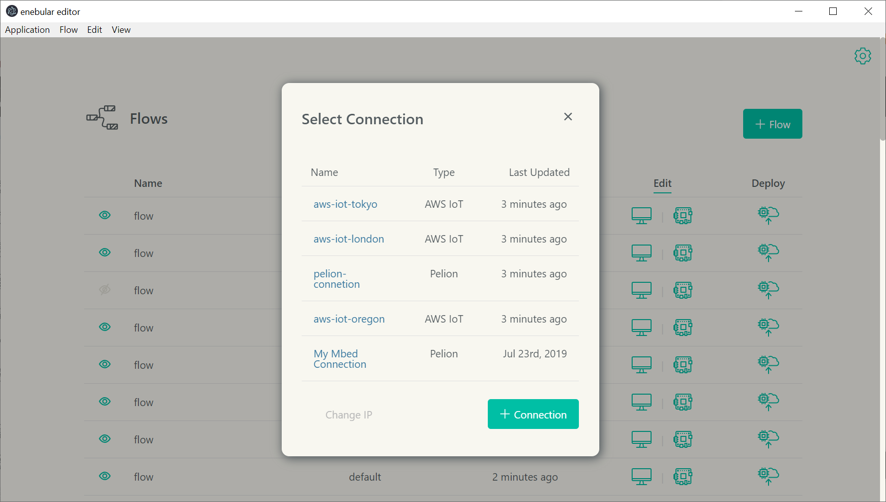
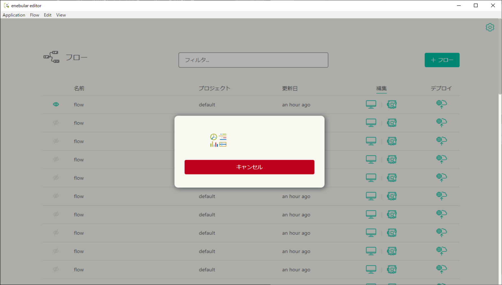

# リモートモードでフローを読み込み {#readFlowByRemoteMode}

開発者モードでインストールされた、enebular-agentはenebular editorのリモートモードでフローを編集することができます。  
※ バージョン 2.3.0 以降のenebular-agentを用意してください  
※ enebular-agentのインストール方法については[enebular-agentのインストール手順](../EnebularAgent/Installation.md)を参照してください  

1. デバイスと enebular editor を起動する PC が同じローカルネットワークに接続していることを確認してください
2. enebular-agentを起動します。 ※enebular-agentがスタートアッププログラムとして、設定されている場合もあります

3. PCで **enebular editor** からリモートモードでフローを開きます

    

4. enebular editor の IPアドレスを選択します(以前のIPアドレスの選択にて `Remember IP Address` にチェックを入れていた場合、このステップはスキップされます)

- 選択された IPアドレスは `Change IP` で変更可能です

    

5. AWS または Pelion Device Management の Connection を選択します

    

6. 該当する Thing または Device を選択します

    

7. Load をクリックします

    

途中でキャンセルする場合、`キャンセル`ボタンを押します。キャンセルが成功するとフローはデプロイ前の状態に戻ります。

## 注意事項 {#Notes}

- ファイアウォール等により enebular editor の通信が禁止されていないことををご確認ください
- 通常インストールされているenebular-agentのフローをリモートモードで読み込む際は、enebular-agentを[開発者モード](../EnebularAgent/Developer-Mode.md)で起動し直してください
- enebular editorのリモートモードでフローを編集してデプロイすると、フローは実行状態となります。このとき、enebular本体では、フローの実行状態を検知できないため、Devices画面のフローステータスとenebular-agentのフロー実行状態がずれてしまう場合があります。これを防止するため、リモートモードでのフロー編集の終了後には、enebular-agentを再起動してください
- enebular editorのリモートモードでのフローの読み込みを途中でキャンセルする際は、バージョン 2.14.0 以降のenebular-agentを用意してください
- [プライベートノード](../PrivateNodes/index.md)を登録したプロジェクトのフローをリモートモードで読み込むと、enebular-agentのバージョンが2.15.0以降の場合はNode-REDのパレットにプライベートノードを表示します(2.15.0未満の場合はパレットにプライベートノードを表示しません)
