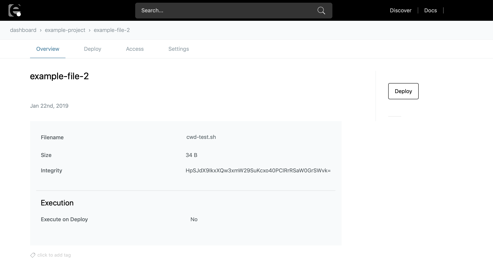
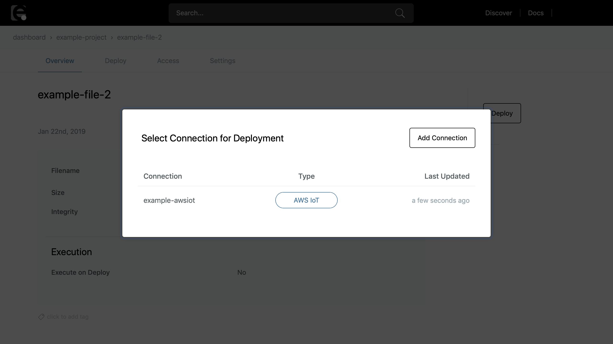
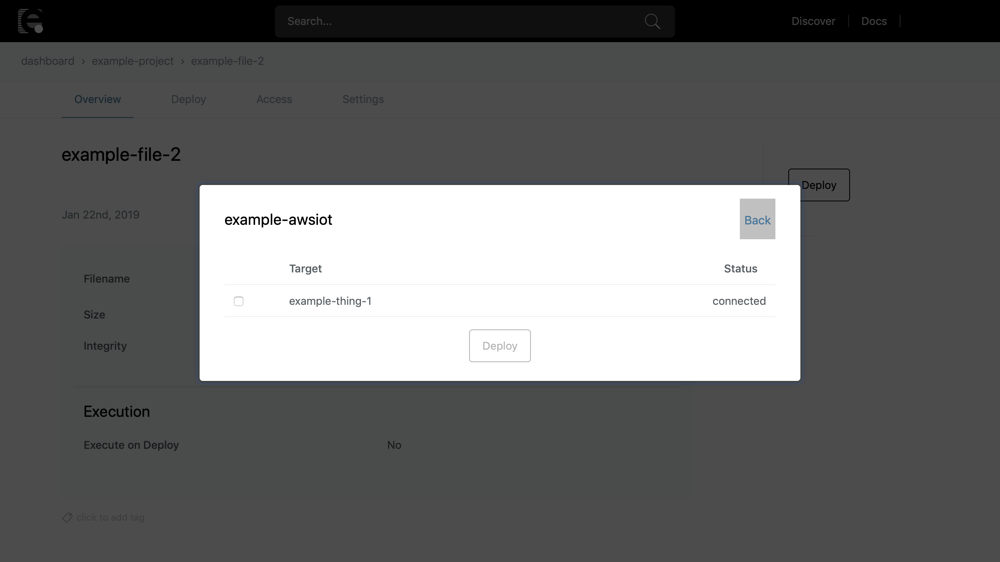
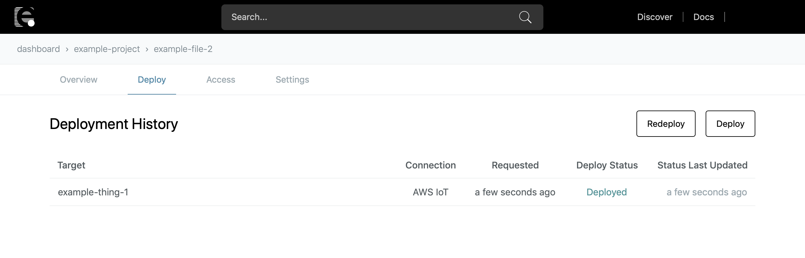

# ファイルのデプロイ {#Deploying Files}

enebularにアセットとして登録したファイルを有償デバイスにデプロイすることができます。ここではそのデプロイ方法について説明します。

## 対象デバイス {#Supported Devices}

以下の条件を満たしているデバイスのみにファイルをデプロイ出来ます。

- 有償デバイスであること
- デバイスが接続中であること
- デバイスにバージョン 2.3.0 以降の enebular-agent がインストールされていること

## デプロイ方法 {#Deployment Steps}

まずは、プロジェクトのメニューから **Files** を選択して登録済みファイルアセットの一覧を表示します。

ファイル一覧からデプロイしたいファイルを選択すると、ファイルの **Overview** が表示されます。

この **Overview** で **Deploy** ボタンをクリックすると、デバイス接続の一覧が表示されます。デバイス接続の一覧からデプロイしたいデバイスの接続を選択します。デバイスの接続をまだ登録していない場合、[Flowデプロイの説明](../Deploy/index.md)を参考にして登録してください。

デバイス接続の一覧から接続を選択すると、その接続のデバイスの一覧が表示されます。デプロイしたいデバイスを選択して **Deploy** ボタンをクリックします。

**Deploy** ボタンをクリックすると、デプロイ処理が開始し、ファイルの **Deployment History** が表示されます。ここでデバイスへのデプロイ状態を確認できます。

デプロイ処理が無事に完了すると、**Deploy Status** 欄で **Deployed** が表示されます。
