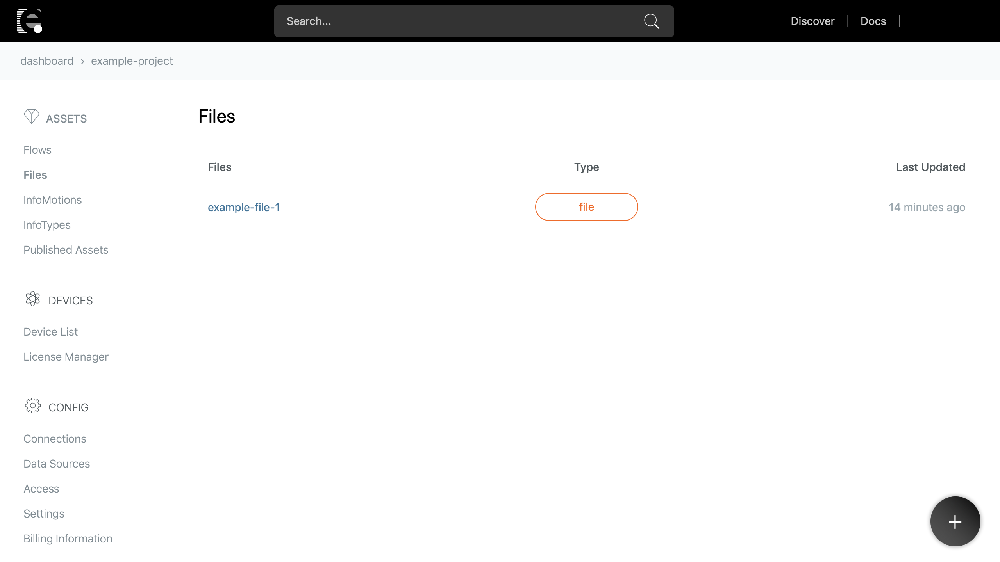
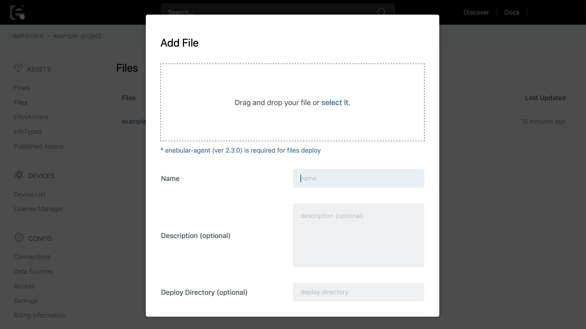
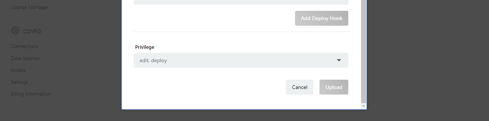

# ファイルの登録 {#Registering Files}

ファイルをデバイスにデプロイするには、まずはファイルをenebularにアセットとして登録します。ここでファイルの登録方法を説明します。

まずは、プロジェクトのメニューから **Files** を選択して登録済みファイルアセットの一覧を表示します。

ファイル一覧の右下にある **+** ボタンをクリックします。

**Add File** ポップアップが表示されます。ここでまずは登録したいファイルを選択します。

ファイルを選択してから、ファイルの設定を指定します。少なくとも、以下の項目を設定する必要があります。

| 項目名 | 説明 | 設定内容 |
| --- | --- |
| Name | ファイルのアセット名 | 分かりやすい任意の名前を入力します |

デプロイ先のディレクトリや、デプロイ時の実行、Hookなど、上記以外の設定項目の詳細については、[File Settings](FileSettings.md)を参照してください。

設定項目の指定ができたら、下にある ** Upload ** ボタンをクリックしてファイルをアップロードします。

アップロードが完了すると、ファイルがアセットとして登録され、ファイルの **Overview** が表示されます。

ここから、ファイルのデプロイや設定変更ができます。

デプロイ方法については、[Deploying Files](DeployFile.md)を参照してください。

