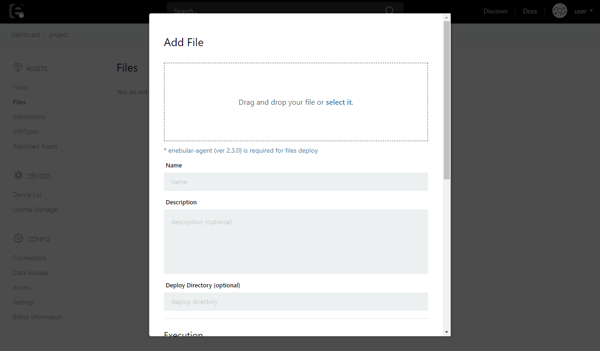

# ファイルの登録 {#Registering Files}

ファイルをデバイスにデプロイするには、まずはファイルをenebularにアセットとして登録します。ここでファイルの登録方法を説明します。

まずは、プロジェクトのメニューから **Files** を選択して登録済みファイルアセットの一覧を表示します。

ファイル一覧の右下にある **+** ボタンをクリックします。

**Add File** ポップアップが表示されます。ここでまずは登録したいファイルを選択します。

ファイルを点線内にドラッグアンドドロップする、もしくは **select it** をクリックして追加するファイルを選択してください。
また、以下の必須項目を設定してください。

| 項目名 | 説明 | 設定内容 |
| --- | --- |
| Name | ファイルのアセット名 | 分かりやすい任意の名前を入力します |

デプロイ先のディレクトリやデプロイ時の実行などの上記以外の設定項目の詳細は、[File Settings](FileSettings.md)を参照してください。

ファイルの選択、必須項目の入力後、ポップアップ下部の ** Upload ** ボタンをクリックしてファイルをアップロードします。

アップロードが完了すると、ファイルがアセットとして登録され、ファイルの **Overview** が表示されます。

ここから、ファイルのデプロイや設定変更ができます。

デプロイ方法については、[Deploying Files](DeployFile.md)を参照してください。

