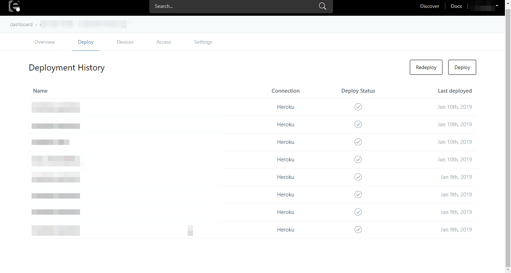

# Flow

フローは、ハードウェアデバイス・API およびオンラインサービスを接続するためのツール <a href="https://nodered.jp/" target="_blank">Node-RED</a> ベースのフローエディタを利用して作成するアセットの種類の一つです。

なお、下の画像のように、Node-RED 上でフローをデプロイすることができますが、こちらはフローを保存することが目的で、**数分間でスリープする**点に注意して下さい。

フローを長い時間稼働させたい場合は、[他のサービスへデプロイ](../Deploy/index.md)する必要があります。

[作成したフロー](./CreateFlow.md) は enebular 上で確認できます。

Flow を選択すると、フローの詳細画面に移動します。

## Overview

Overview では フローの編集、デプロイ、公開を行うことができます。

画面の説明は下記のとおりです。

| 項目名 | 説明 |
| --- | --- |
| preview | タブを選択すると、フローが作成済みの場合フローのイメージが表示されます。|
| source | タブを選択すると、フローの実体を表すJSONが表示されます。|
| Edit Flow | フローを編集することが出来ます。 |
| Deploy Flow | フローを外部サービスにデプロイすることが出来ます。詳細は Deploy の項を参照してください。 |
| Publish Flow | フローを公開することが出来ます。詳細は [Publish Flow](./PublishFlow.md) を参照してください。|

## Deploy

Deploy ではフローを特定のサービスへデプロイできます。

それぞれのサービスへの詳しいデプロイ方法は [Deploy](../Deploy/index.md) を参照してください。

## Devices

Devices では外部サービスへデプロイしたデバイスの状態を一覧で見ることができます。

詳細は [Device List](../Device/DeviceList.md)を参照して下さい。

## Access

Access ではフローのアクセス権を編集できます。

詳細は [Access Control](../Access/index.md) をご覧ください。

## Settings

Settings ではフローの名前や説明の編集、フローの削除ができます。

