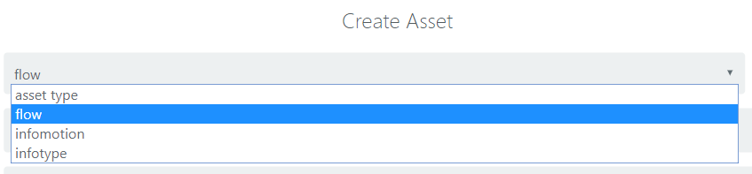
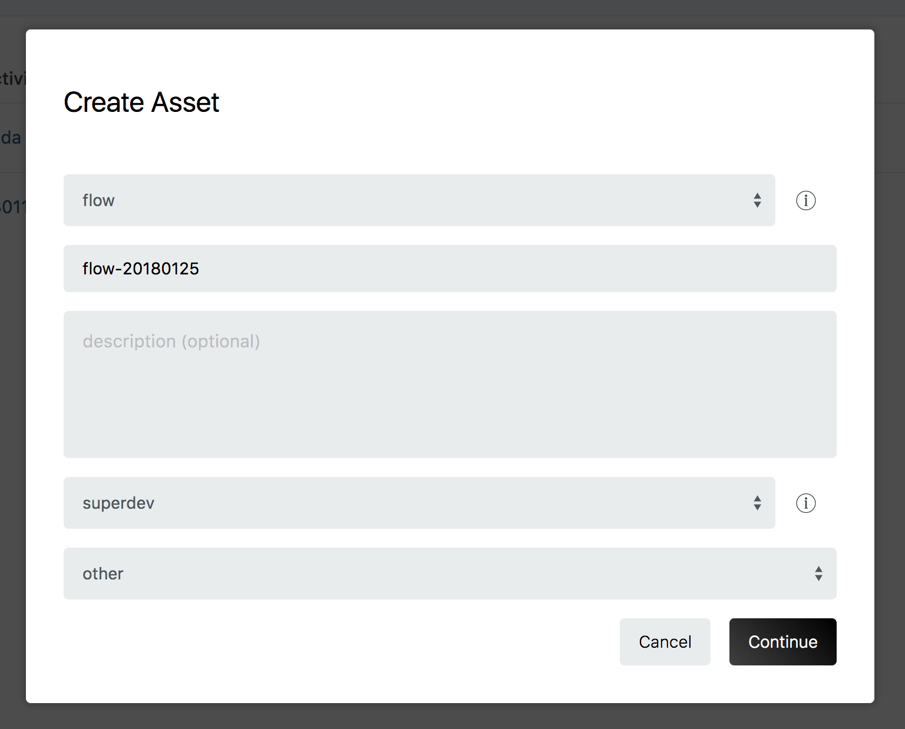
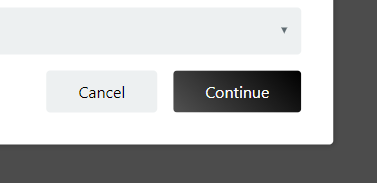
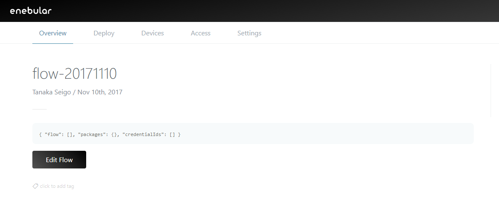

# フローの作成 {#フローの作成}

フローの作成方法を説明します。

プロジェクト一覧からプロジェクトを選択してプロジェクトの管理画面に移動します。

右下の + ボタンからモーダルを立ち上げます。

モーダルが立ち上がるのでまず Asset Type に flow を指定します。

flow を指定すると、アイコンやタイトルの指定、および、アクセス権限の設定ができます。

* タイトル
    * 任意のフローのタイトル
* 説明
    * 今回は何も入力しません
* アクセス権限
    * superdev
* カテゴリー
    * 今回の用途に合ったカテゴリを指定

設定ができたらContinueボタンをクリックします。

フローが作成されました。

ここからフローエディタを立ち上げて Node-RED を編集します。以下の例を参考ください。

- [Milkcocoa フロー](./FlowExampleMilkcocoa.md)

## Web Flow Editorの制限

Web Flow Editorは実行環境ではなく、開発環境として提供しています。
以下の制限があります。留意してください。

* ハードウェア依存のノードが使用できない
* 開発環境に依存するノードが使用できない
* 大きなサイズのノードをimportし、使用できない
    * リロードを繰り返してしまうことがあります
* 生成されるURLは一時的なものである
* Node-REDで定義されているキーボードショートカット機能が一部使用できません