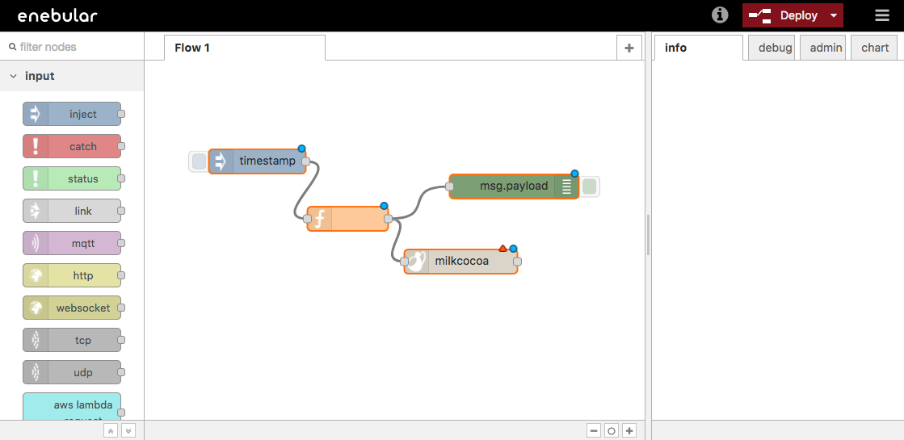
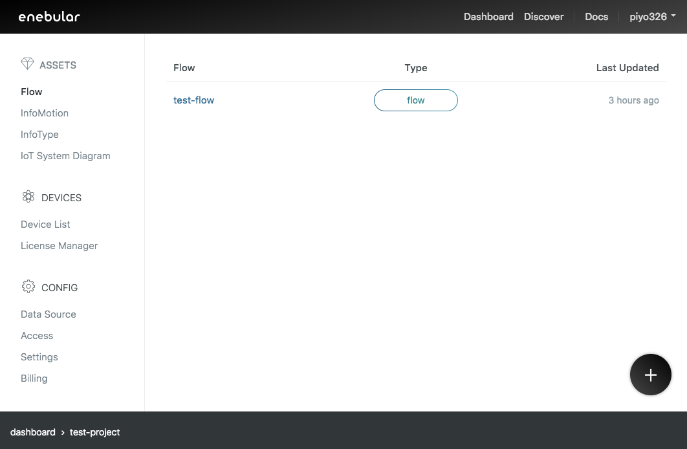
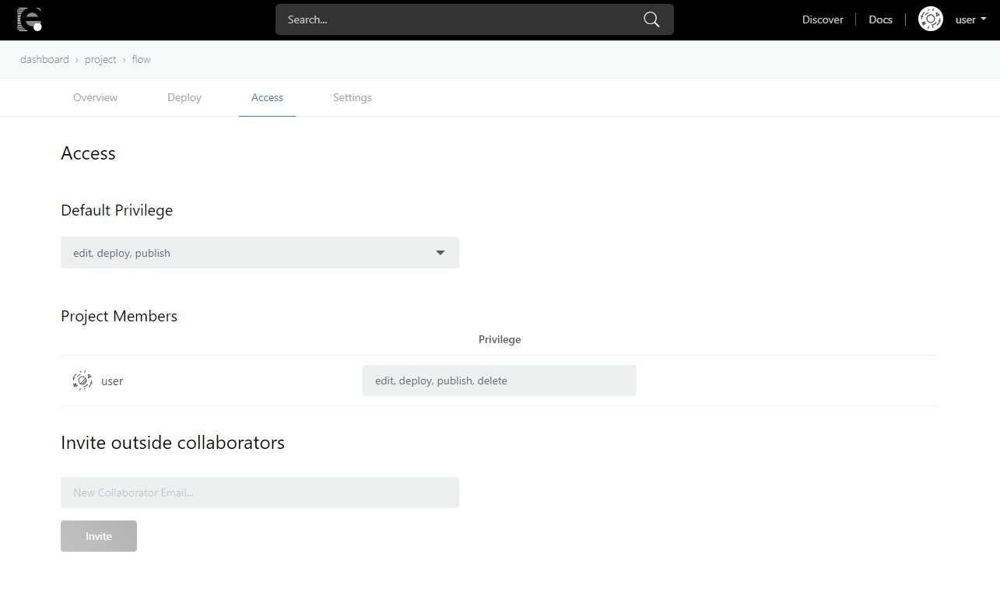

# Flows {#Flows}

Flow は、ハードウェアデバイス・API およびオンラインサービスを接続するためのツール <a href="https://nodered.jp/" target="_blank">Node-RED</a> ベースのフローエディタを利用して作成する、データフローのことです。

なお、下の画像のように、Node-RED 上で Flow をデプロイすることができますが、こちらは Flow を保存することが目的で、**数分間でスリープする**点に注意して下さい。

データフローを長い時間稼働させたい場合は、[他のサービスへデプロイ](../Deploy/index.md)する必要があります。

[作成した Flow](./CreateFlow.md) は enebular 上で確認できます。

Flow を選択すると、Flow の詳細画面に移動します。

## Overview {#Overview}

Overview では Flow 情報の編集、Flow の公開ができます。Flow 情報は、Flow を公開した際に他のユーザーが見てどういう Flow か理解しやすくする手助けになりますので、出来るだけすべての情報について記載することをおすすめします。

Flow の公開については [Publish Flow](./PublishFlow.md) をご覧ください。

## Version {#Version}

Version では Flow のバージョン管理を行うことができます。

本機能は Enterprise Plan のプロジェクトでのみ有効化されます。

詳しくは [Version Control](./VersionControlFlow.md) をご覧ください。

## Deploy {#Deploy}

Deploy では Flow を特定のサービスへデプロイできます。

また、デプロイ結果を確認することができます。

Redeploy ボタンを使えば最後に実行した Deploy を再度実行することが可能です。

それぞれのサービスへの詳しいデプロイ方法は [Deploy](../Deploy/index.md) をご覧ください。

## Access {#Access}

Access では Flow のアクセス権を編集できます。

詳しくは [Access Control](../Config/Access.md) をご覧ください。

## Settings {#Settings}

Settings では Flow の名前や説明の編集、Flow の削除ができます。

