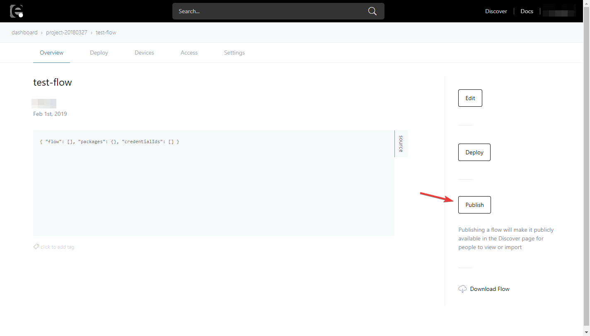
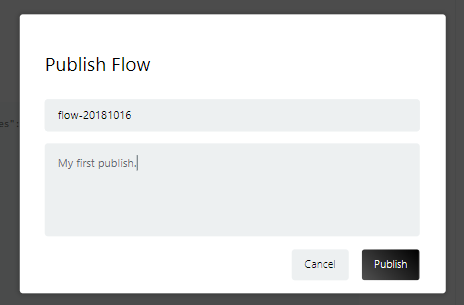
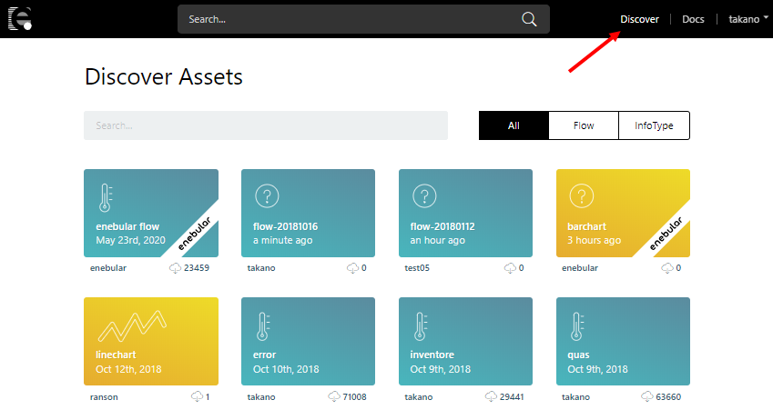
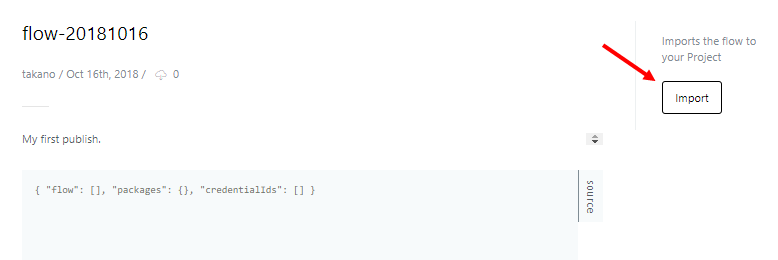
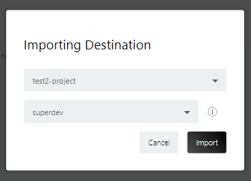

# Flow の公開

Flow の Overview ページの [Publish] から Flow を公開することが出来ます。公開された Flow は他のユーザーがインポートして使うことができます。

名前と説明を確認・追記して、公開できます。

## 公開された Flow のインポート

公開されたフローは、上部のグローバルナビの Discover から探すことが出来ます。

公開された Flow のインポートは、Flow 情報の [Import] からできます。

インポートするプロジェクトとデフォルトのアクセス権限を選択して [Import] を押してインポートします。

