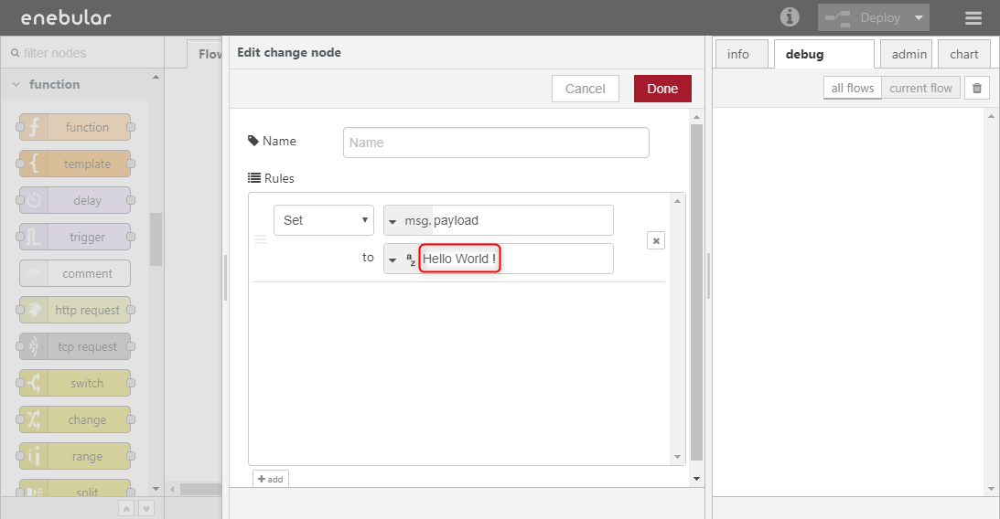

# Create Projects and Assets

このチュートリアルでは以下のことを行います。

- Project の作成
- Asset(フロー)の作成
- フローの編集

## Projectの作成

enebular を始めるには、まず Project を作成します。ログイン後の画面にある Create Project からプロジェクトを作成します。

適当な title を入力して、作成します。

## Assetの作成

Project を作成したら、enebular の Asset の1つである Flow を作成しましょう。作成した Project を選択して Project の管理画面に移動します。

右下の + を押すと Asset を作成するモーダルが開きます。

Asset Type は `flow` を選択して、Flow のタイトルをつけます。Flow へのデフォルトのアクセス権（default role to asset）は今回はとりあえず `superdev` に設定してください。一番下の category は何でも良いです。

Continue を押すと作成が完了します。

作成が完了すると、Flow の詳細ページに移動します。

Edit Flow を押すと、Node-RED の編集画面が立ち上がります。

## フローの編集

Asset の作成が完了したので、フローを編集してみましょう。

ここではコンソールに `Hello World !` と出力するシンプルなフローを作成します。

フローエディタでは、左に並んでいるノード(APIの名前がついているボックス)をシートにドラッグアンドドロップして、ノード同士を繋いでフローを作成していきます。

1. 下図の要領で`injectノード`をエディタの中にドラッグアンドドロップで配置してください。
`injectノード`は、フローを開始するトリガーとなるノードです。

1. 同様の手順で`debugノード`を配置します。
`debugノード`は debug タブ にメッセージを出力するノードです。

1. 下図のように`injectノード`と`debugノード`をつなぎます。
Deploy ボタンを押下しフローを保存した後、画面右上の debug タブを選択します。最後に`injectノード`のボタンをクリックすることでフローが起動しdebug タブにタイムスタンプが表示されます。

これでノードの配置、ノードのつなぎ方、そしてフローの起動方法が分かりました。

しかし今回はタイムスタンプではなく `Hello World !` と出力するフローを作成したいので、今作ったフローをさらに編集します。

`injectノード`はデフォルトの設定では、ボタンを押したときにタイムスタンプを `msg.payload` オブジェクトに出力します。
そして、`debugノード`はデフォルトの設定では、`mag.payload` オブジェクトに設定された値を debug タブに出力します。

これでは常にタイムスタンプが出力されてしまうため、injectノードが `msg.payload` オブジェクトにタイムスタンプを出力した後、`msg.payload`オブジェクトの値を`Hello World !`という文字列で置き換える必要があります。文字列の置き換えには `changeノード`が利用できます。

1. `injectノード`と`debugノード`の間に新しく`changeノード`を配置します。`changeノード`はパレットの中で function に分類されています。

1. 配置した`changeノード`をダブルクリックしノードのを設定を行います。赤線で囲んだ部分に`Hello World !`と入力しDoneボタンを押下します。

1. Deployボタンを押下しフローを保存した後、injectノードのボタンを押下します。debugタブに`Hello World !`と出力されます。

## Well Done!
enebularの Projectの作成方法、Asset(フロー)の作成方法、そしてシンプルなフローの編集が出来るようになりました。