# Data Visualization

enebular の InfoMotion の機能を使うことによって、データの可視化し、visualize することが可能です。
このチュートリアルでは、「アセットをインポートし、InfoMotionでデータを可視化する」ということを行います。（所要時間50分）

## Table of Contents

1. [flow のインポート](#importFlow)
1. [Datasource の作成](#CreateDatasourse)
1. [Flow の編集とデプロイ](#EditFlow)
1. [DataSource の登録](#RegisterDataSource)
1．[InfoType のインポート](#ImportInfoType)
1. [InfoMotion の作成](#CreateInfoMotion)

## flow のインポート{#importFlow}

enebular のユーザーはアセットを公開すること、また公開されているアセットをインポートすることができます。
公開されているフローをインポートする手順を説明します。
右上にある`Discover`をクリックしてください。

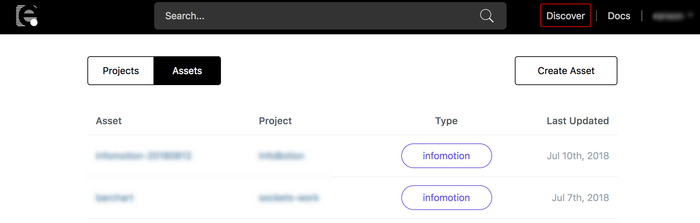

右のカテゴリーから `Flow` を選択して、「getting-started」と検索バーに入力してください。
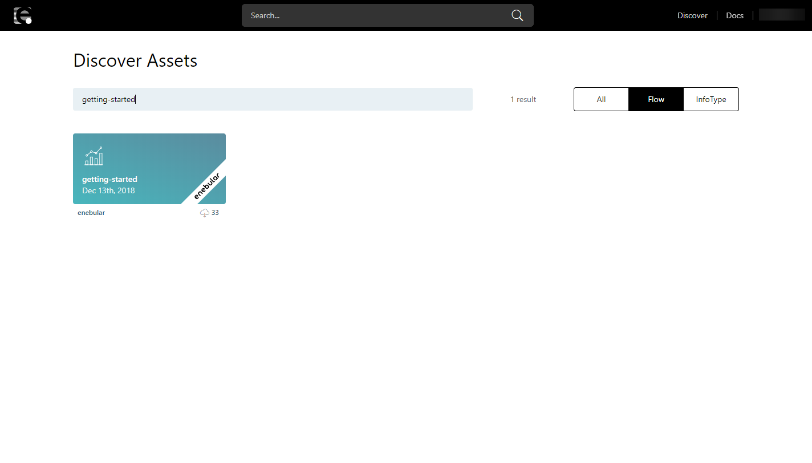

検索結果に出てきたenebularラベルのあるものをクリックし、下記のようなフロープレビューが表示されていることを確認してください。
右の `Import` ボタンよりフローをインポートできます。
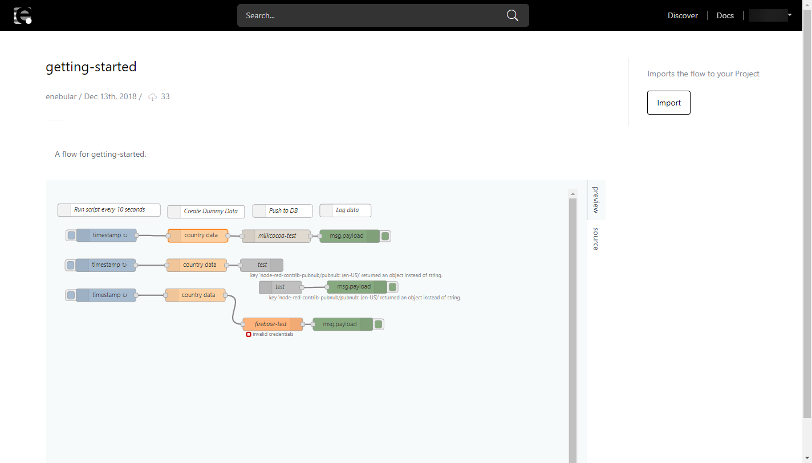

インポート先の適当なプロジェクトに初期値のロール設定(superdev)で import してください。
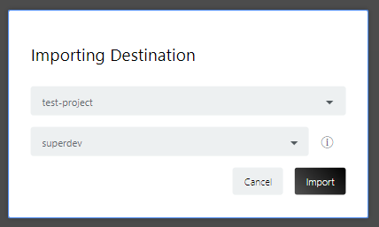

インポートしたプロジェクトのダッシュボードに新しくアセットが追加されています。

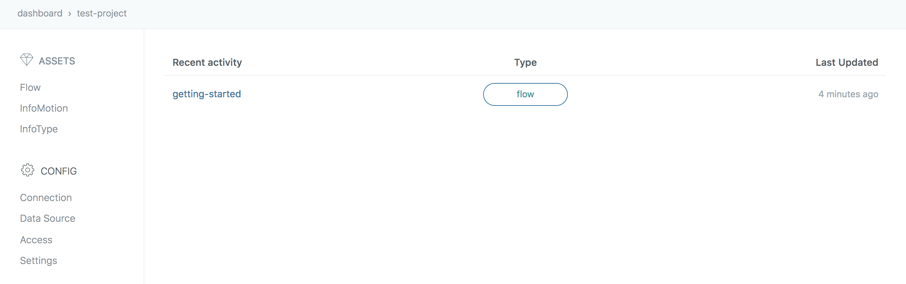

インポートしたフローを開いて、同じフローがインポートされていることを確認してください。

このフローはそれぞれのデータソースの認証情報がブランクになっているので、デプロイする前にフローを編集する必要があります。

## Datasource の作成{#CreateDatasourse}

InfoMotion は現在下記に挙げるリアルタイムデータベースに対応しています。詳しくは各ページを参照してください。

- [Milkcocoa-v2 DataSource](./../InfoMotion/DataSource/Milkcocoa/CreateDataSource.md)
- [Firebase DataSource](./../InfoMotion/DataSource/Firebase/CreateDataSource.md)
- [Pubnub DataSource](./../InfoMotion/DataSource/Pubnub/CreateDataSource.md)

この GetStarted では Firebase を用いて説明を進めます。
次の項に進む前に、[Firebase](./../InfoMotion/DataSource/Firebase/Setup.md)のページを参考にして、利用登録を済ませ、データストアを作成してください。

※ GetStarted の設定はテストに向けたものなので、実際に使用する際には推奨しません。

## Flow の編集とデプロイ{#EditFlow}

データストアの認証情報をフローに入力し、デプロイをします。

今回は Firebase のノードのみに認証情報を入力します。

### databaseURL の取得

データストア作成済みのアカウントで Firebase にログインし、 `ウェブアプリに Firebase を追加`をクリックします。

databaseURL をフローの中で使用します。

### ノードの編集

フロー編集画面から、 Firebase ノードをクリックし編集画面を開きます。さらに、Firebase の欄右にある鉛筆アイコンをクリックします。
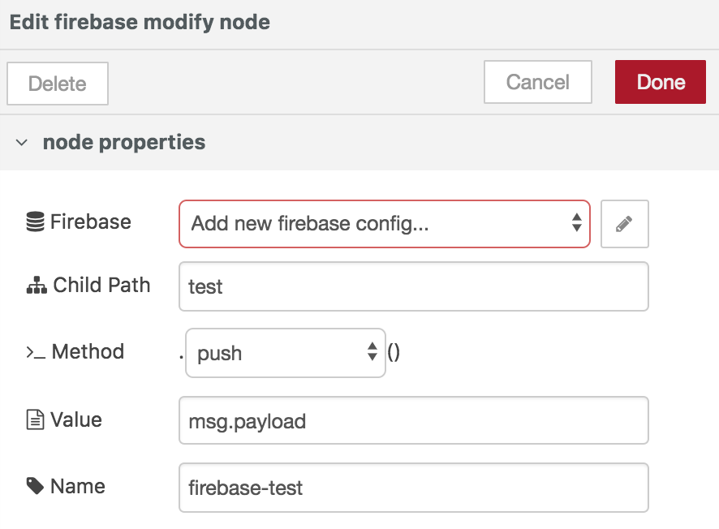

先ほど取得した databaseURL を入力してください。 update をクリックしてノードの編集を終了します。
AuthType は None のままとしてください。

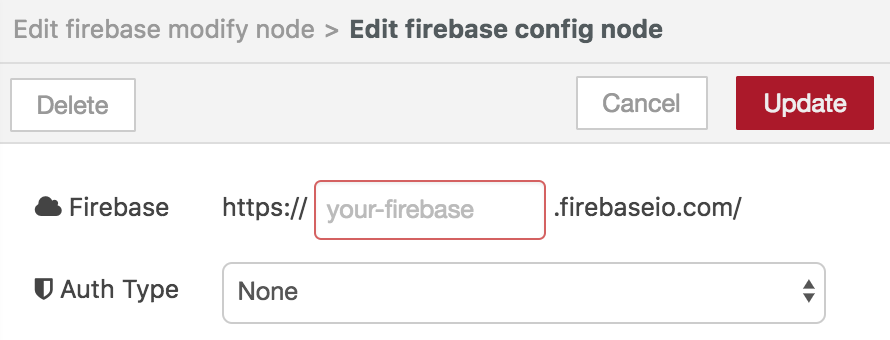

ノードの設定値を更新したら、画面右上の `Deploy` ボタンをクリックします。
デプロイ後、画面右の `debag` タブを開いてください。
デバッグログが毎 10 秒で更新されます(間隔については inject ノードで定義しています)。

デバッグログのイメージです。

InfoMotion を使うにはこのようなデータがプッシュされているデータストアを用意する必要があります。

**\*注 1**: enebular のエディタ上で動作するフローはアクセスが無いと自動的に 30 分でスリープモードになります。

**\*注 2**: 30 分を超えてフローエディタを立ち上げていると、デプロイ時「Unauthorized」と表示され、デプロイができません。この現象が起こった場合、ページを更新してください。

## DataSource の登録{#RegisterDataSource}

次に、作業しているプロジェクトにデータソースを登録します。
プロジェクトのダッシュボードの左のメニューから `Data Source` を選択して、+ ボタンをクリックしてください。

Title に任意の名前を入力し、DataSource Type から [Firebase] を選択してください。 Firebase 用の設定画面が開きます。 Firebase のページで「ウェブアプリに Firebase を追加」を選択した際に表示された設定スクリプトを参考にして、`Api Key`, `Auth Domain`, `Database URL`, `Project Id`,`Storage Bucket`, `Messaging Sender Id` を入力してください。
``Ref`にはフロー作成の際に用いた`Child path`を入力します。(Firebase ではコレクション名となっています。)`Ref`の設定値には`/(スラッシュ)` が前方に必要なので「/test」としてください。

データソースの設定ができたので、 InfoMotion を使用する準備ができました。

## InfoType のインポート{#ImportInfoType}

enebular のユーザーはアセットを公開すること、また公開されているアセットをインポートすることができます。
公開されている InfoType をインポートする手順を説明します。
右上にある`Discover`をクリックしてください。

右のカテゴリーから `InfoType` を選択して、「barchart」と検索バーに入力してください。

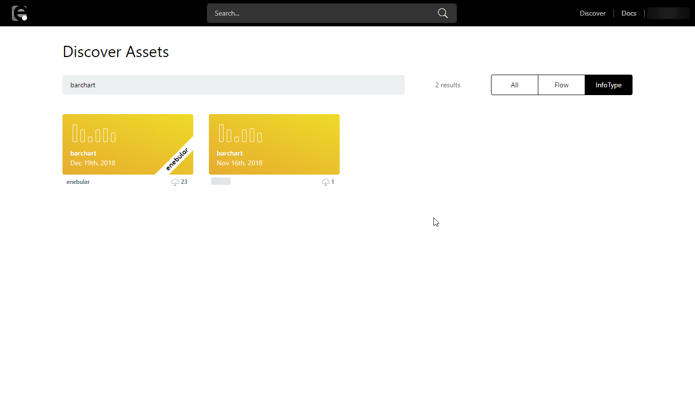

検索結果に出てきたenebularラベルのあるものをクリックし、下記のようなプレビューは表示されていることを確認してください。
右の `Import` ボタンよりフローをインポートできます。

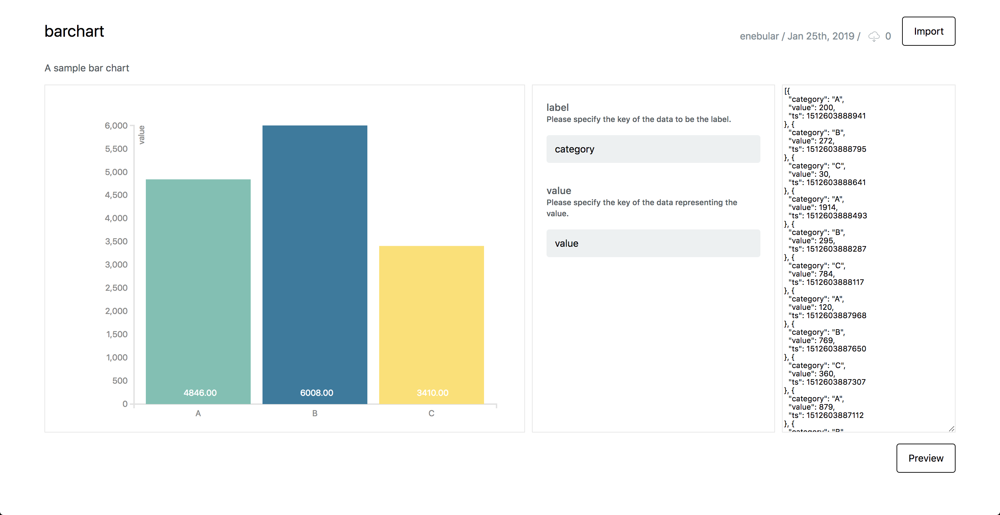

インポートするプロジェクトを選択して下さい。

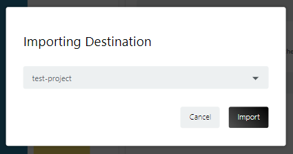

プロジェクトのダッシュボードにから、今インポートした InfoType が追加されていることを確認してください。

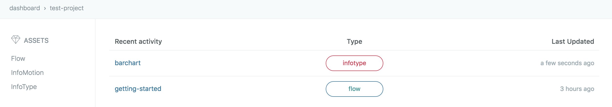

## InfoMotion の作成{#CreateInfoMotion}

これまでに追加した DataSource と InfoType を使用して InfoMotion を作成します。
左メニューから InfoMotion を選択し、ページ右下の「+」ボタンをクリックして、ダイアログを開きます。

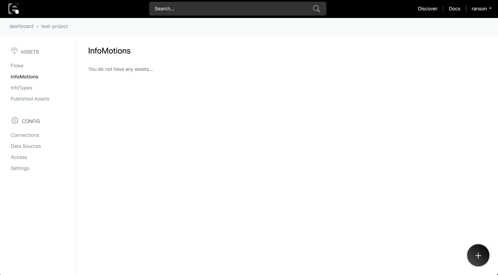

適当な名前を付けて、アクセス権限はデフォルトの `developer` を選択します。
下の欄のカテゴリーは任意のものを選択してください。

作成後 InfoMotion のダッシュボードを開きます。

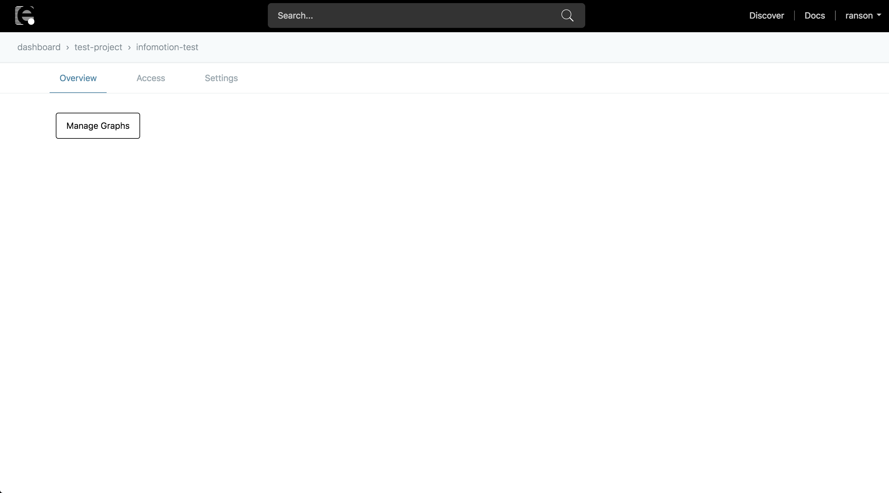

画面右側の「Add Graph」を選択してサイドバーを開いてください。ここではダッシュボードに追加されたグラフを見ることができます。
今は何も追加していない状態なので、何も表示されていません。

`New Graph` をクリックして、作成モーダルを開きます。
デフォルトで先ほど追加した、項目がそれぞれ入力されています。
Lavel は `category` と入力してください。グラフの X 軸 に対応します。
Value は `value` と入力してください。グラフの Y 軸 に対応します。
任意の名前を付けて `Create Graph` のボタンを押してください。

付けた名前のグラフがリストに追加されていることを確認してください。

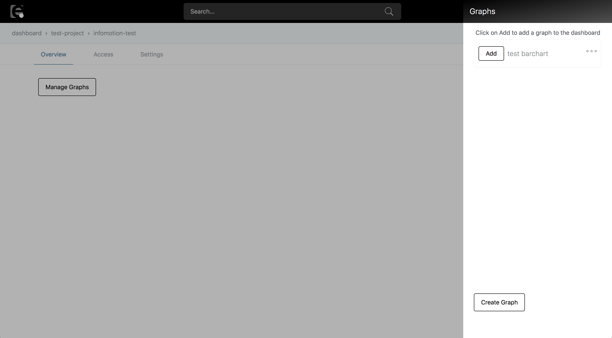

名前の左にある「+」ボタンをクリックするとダッシュボードにグラフが追加されます。
グラフが表示されない場合は、選択している時間範囲が適切でない可能性があります。右上の日付の項目からデータが保存されている時間に設定を変更してください。

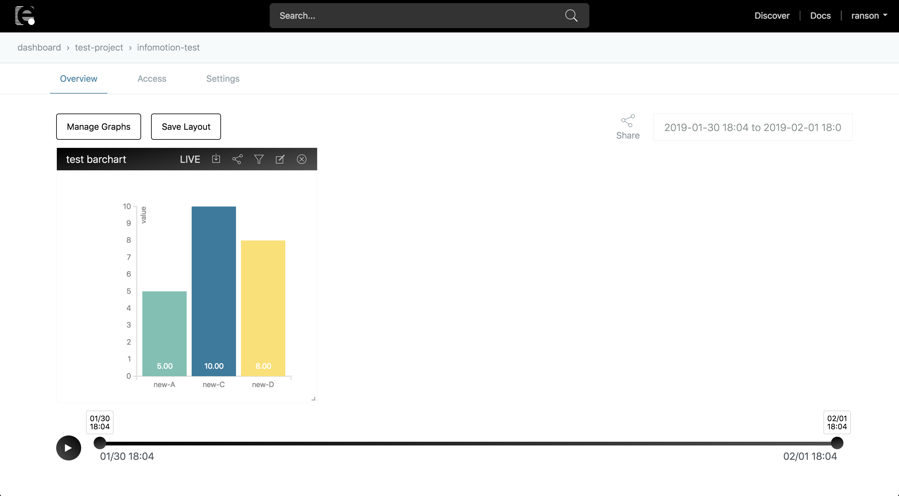

グラフの右下をドラッグすることによって、グラフのリサイズが可能です。グラフ上部の「Save」をクリックしてレイアウトを保存します。

## Well Done!

データフローの作成から、InfoMotion によるデータの可視化までのチュートリアルが終わりました。

このチュートリアルでは、用意されているサンプルの棒グラフを表示していますが、ユーザー独自の InfoType を作成し使用することもできます。詳しくは、 [InfoMotion Type Creation Tutorial](./../InfoMotion/InfoMotionTool.md)を参照してください。
