# Flow Deployment

enebular の特徴として、作成したフローを様々な環境にデプロイし動作させるというものがあります。
このチュートリアルでは、フローを別のサービス（Heroku）にデプロイし動作をさせてみましょう。

このチュートリアルでは以下のことを行います。

- Heroku へのフローデプロイ

なお、本ページは [Introduction](./Introduction.md) のチュートリアルで Asset(フロー) の作成方法については理解していることを前提としています。

## Heroku に送るフローを作成

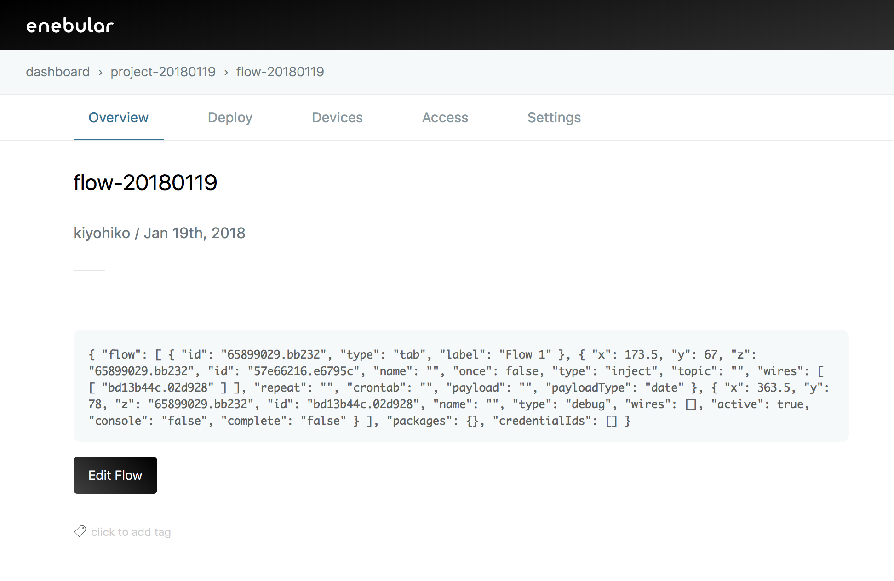

Assets からフローを作成します（既にフローを作成済みの場合、それを利用することも可能です）。

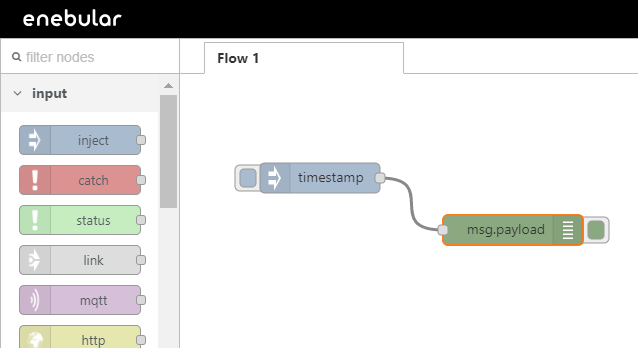

Heroku に送りたいフローを作成して、デプロイして保存します。

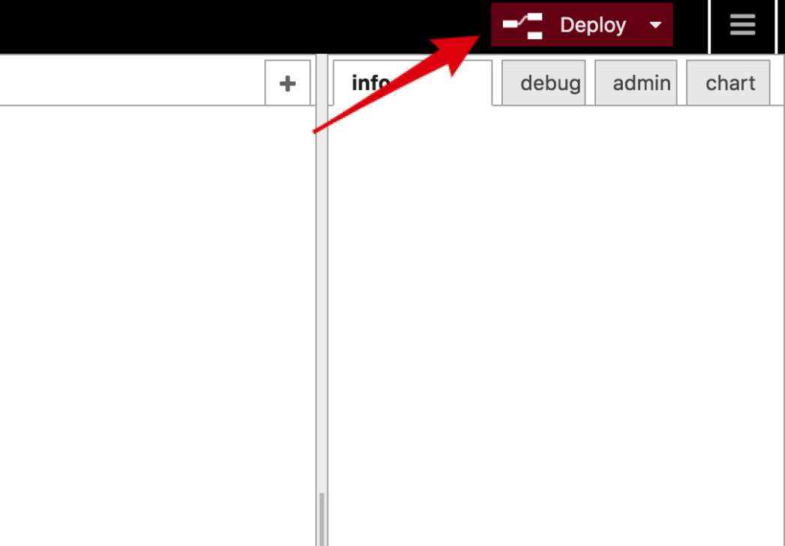

## デプロイの設定

つづいて、デプロイの設定をします。  
フローが作成できたら上部のメニューから Deploy ページに移動します。

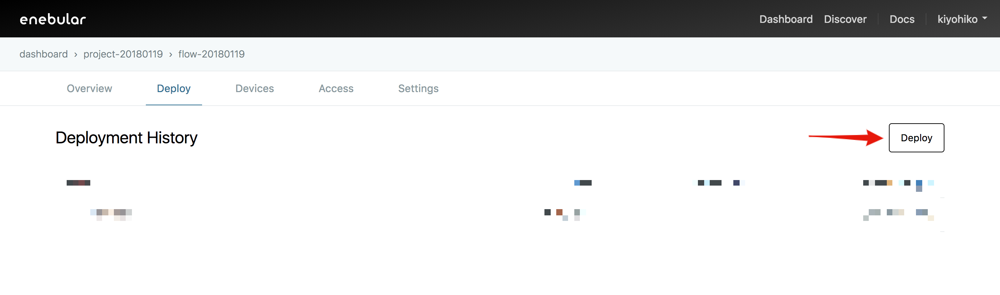

Select Connection Type から Heroku を選択します。

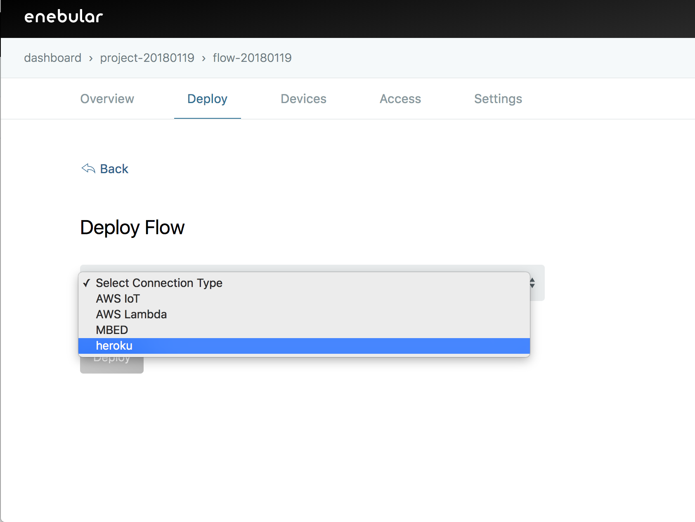

Heroku を選択すると右のカラムに出てくる [Deploy to Heroku] からアプリを作成します。

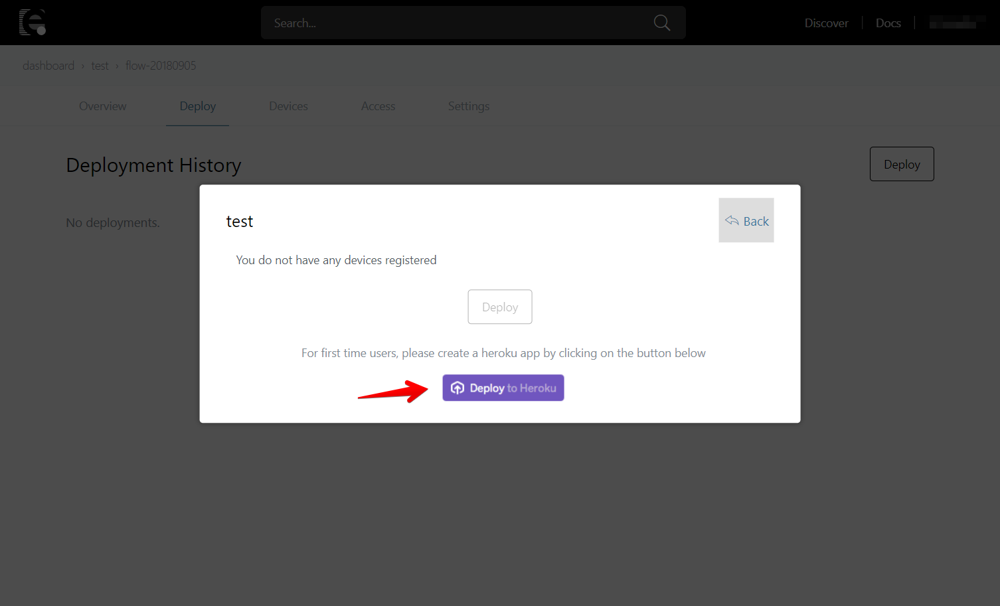

## Heroku ボタンでアプリを作成

Heroku ボタンでアプリを作成します。すでに作成されている方は読み飛ばして下さい。  
Heroku ボタンを押すとログインしていない場合、Heroku のログイン画面が出てくるのでログインします。

Heroku のアプリ設定が表示されます。

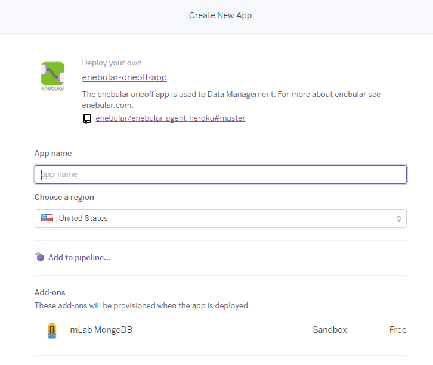

App name をわかりやすい名前で設定します。

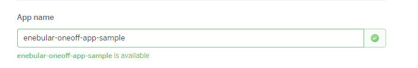

作成後 の enebular Node-RED のログインするための USERNAME/PASSWORD を設定します。

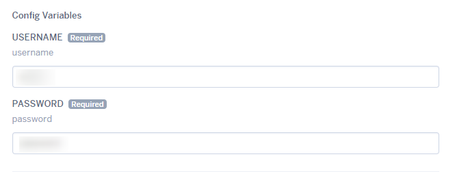

入力が完了したら Deploy app ボタンを押下してデプロイを行ってください。

Heroku にクレジットカード情報を登録していない場合、以下のような入力画面が出ますが、本アプリは無料で利用できますので入力して継続ください。

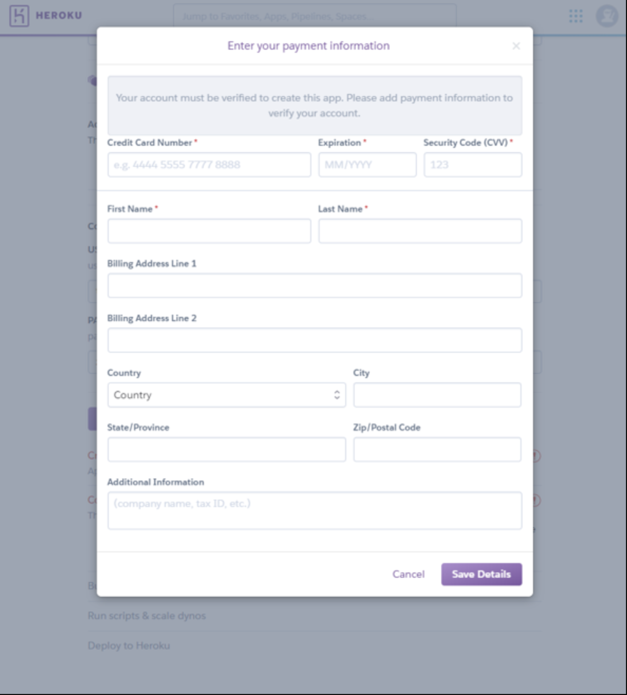

情報を入力すると、アプリの作成が始まります。

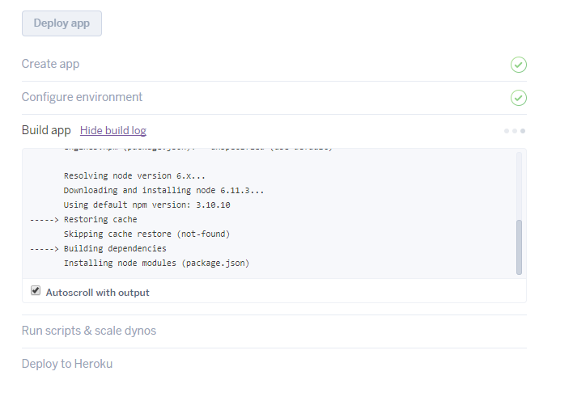

下記のようにアプリが作成されていきます。
アプリの作成が完了すると View ボタンが表示されるので押下します。

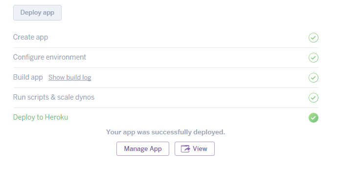

アプリが立ち上がり、enebular にログインするための USERNAME/PASSWORD の入力を求められます。  
さきほど設定したものを入力してログインします。エディタが表示されることを確認します。

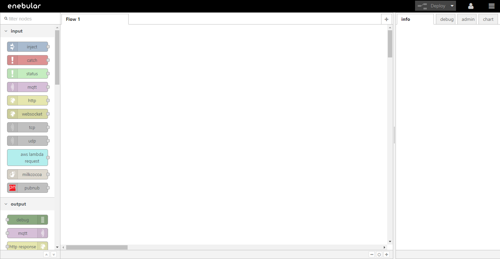

## デプロイ設定

Heroku アプリが作成できたらデプロイ設定をします。さきほどの画面に戻って設定を続けます。

[New] を押します。

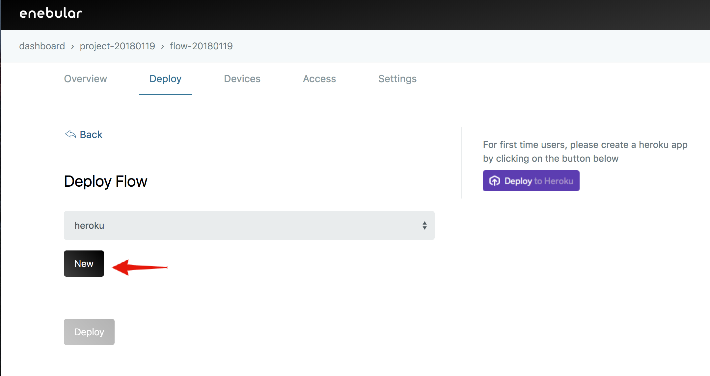

Connection Name はわかりやすい名前をつけます。Heroku API Token は Heroku の設定画面で確認します。

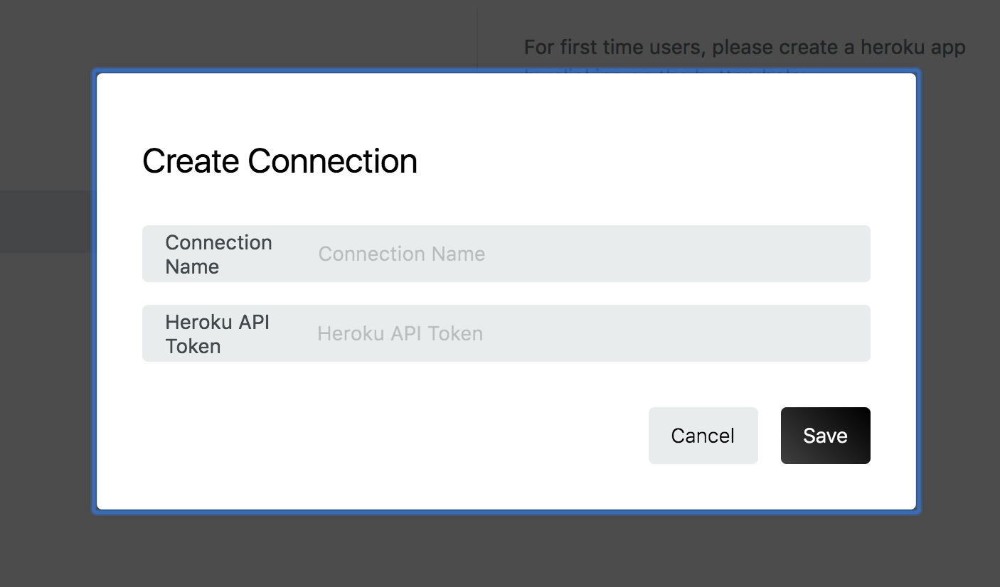

[Account Settings] を押します。

Manage Account ページで Account ページに移動します。

API Key 欄に移動し [Reveal] で API Key を表示します。

Heroku API Token に API Key をコピーして、[Save] を押します。

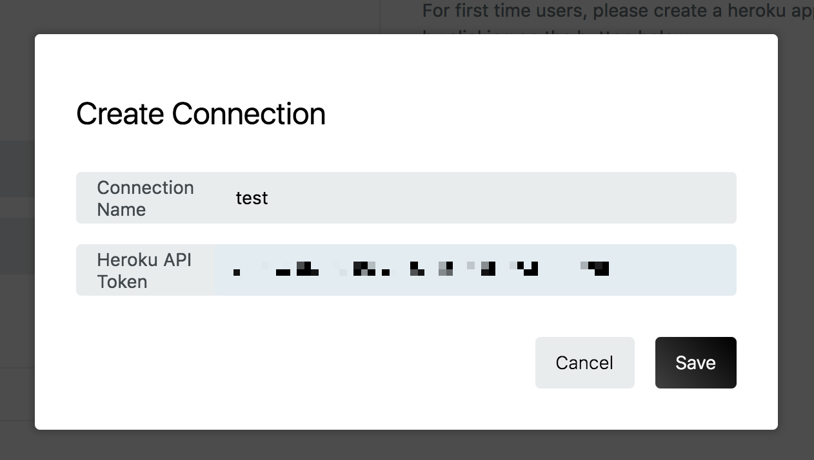

## デプロイ

保存されると Select Connection Type から Heroku を選択すると、Heroku アカウントが持つアプリ一覧が出てきます。

こちらから、さきほど作成した Heroku アプリをひとつチェックし [Deploy] を押します。

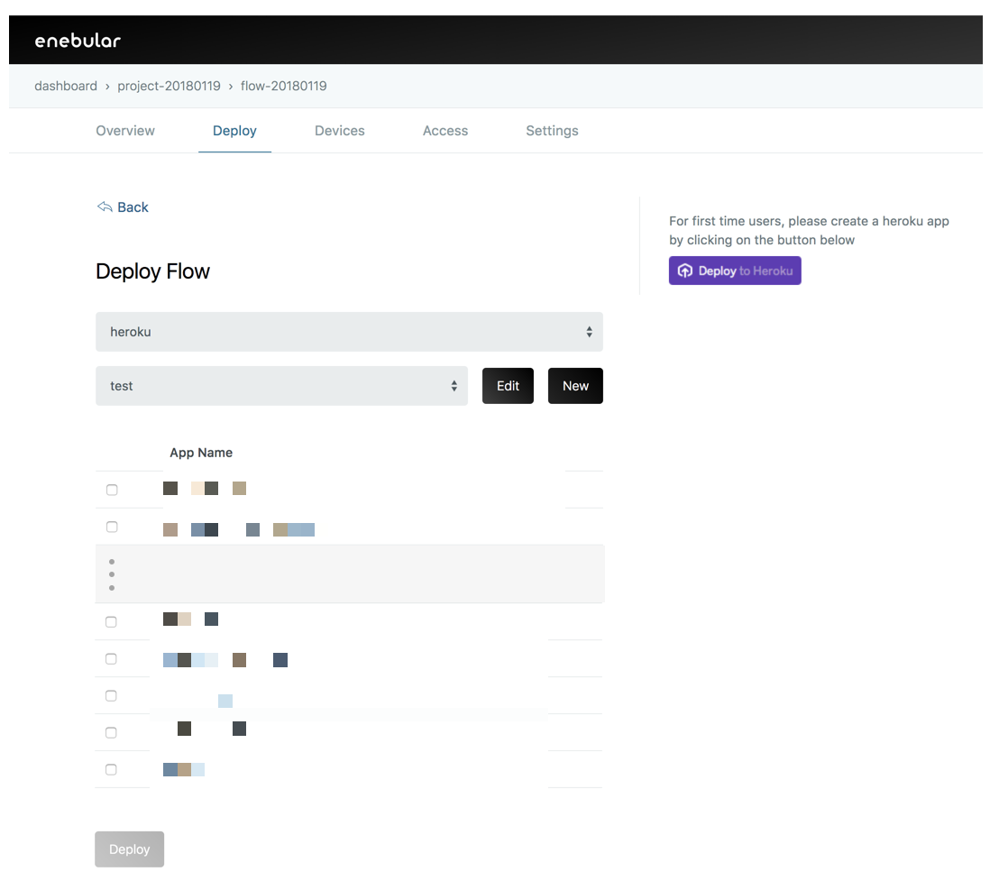

しばらく待っていると Deploy Added が表示されてデプロイが完了します。

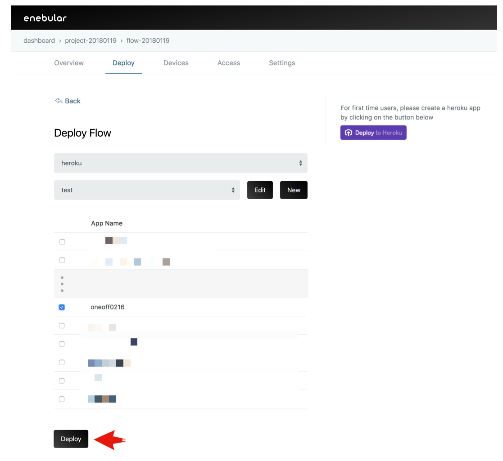

Heroku アプリで確認すると無事フローがデプロイされています。

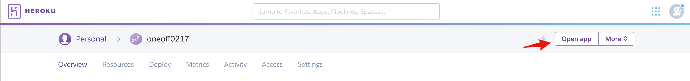

反映されたフローを確認します。

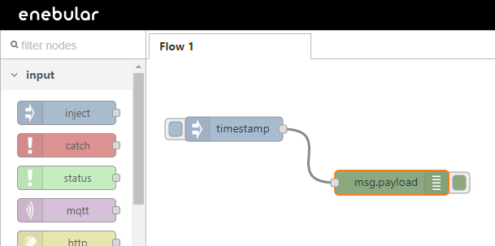

## Well Done!

enebular のデプロイ機能を使用して、作成した Asset(フロー)を別のサービスにデプロイすることが出来るようになりました。
