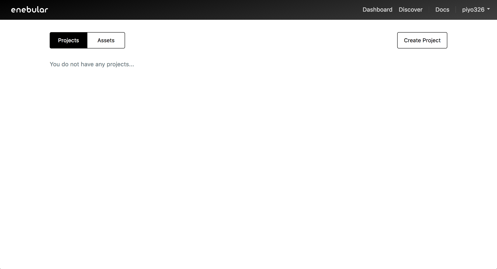
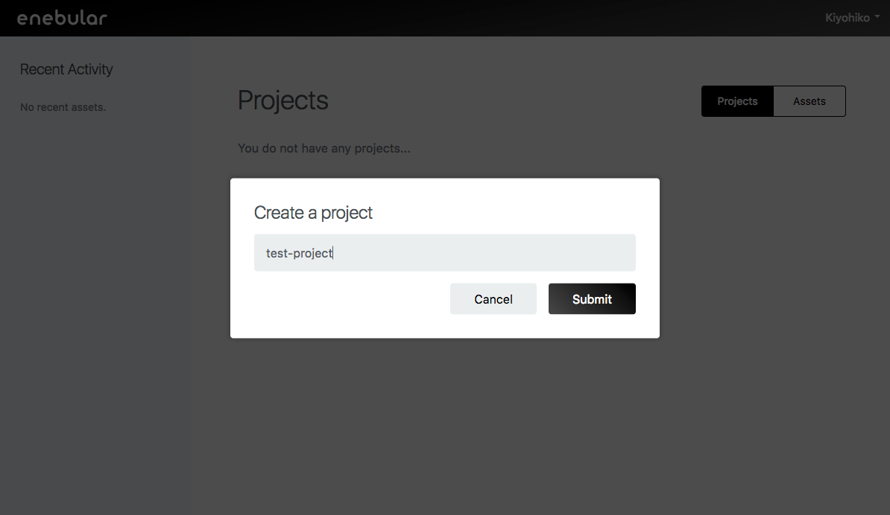
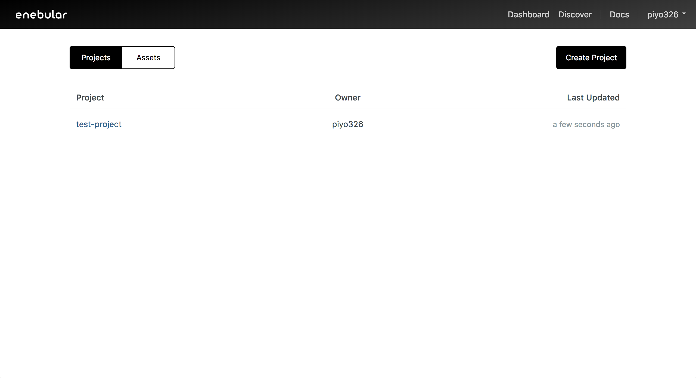
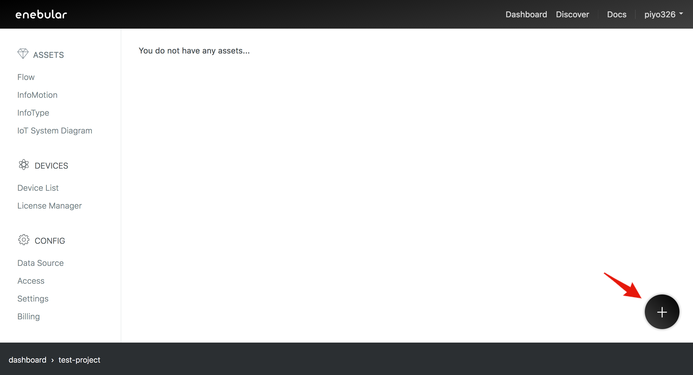
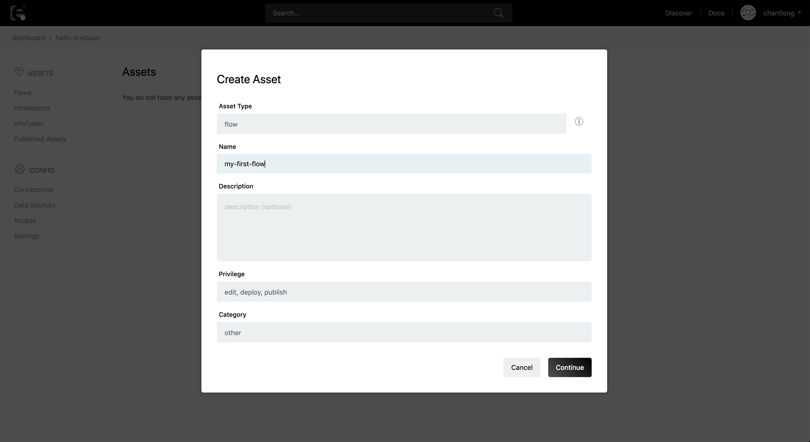
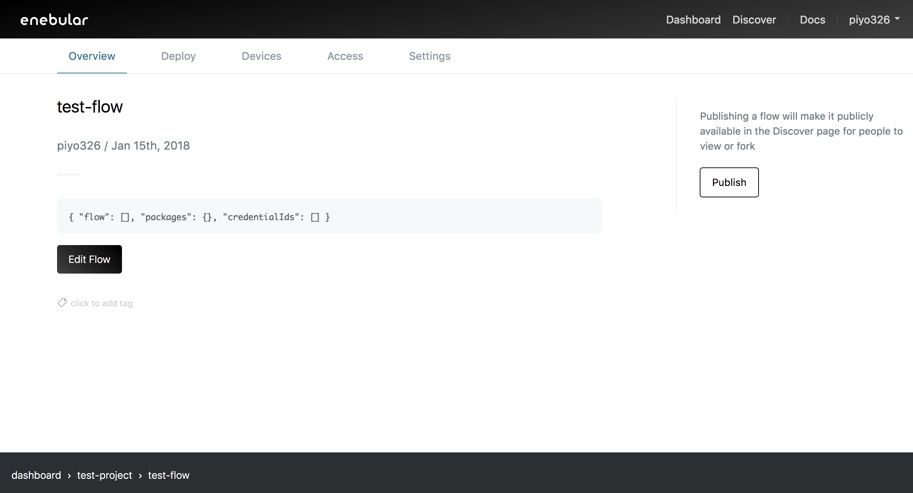
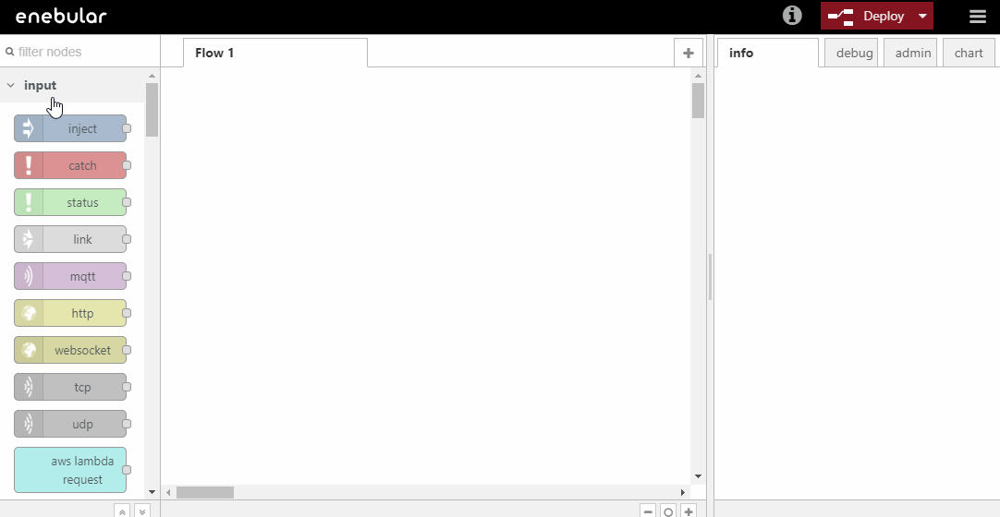
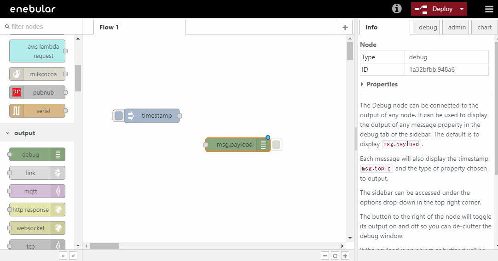
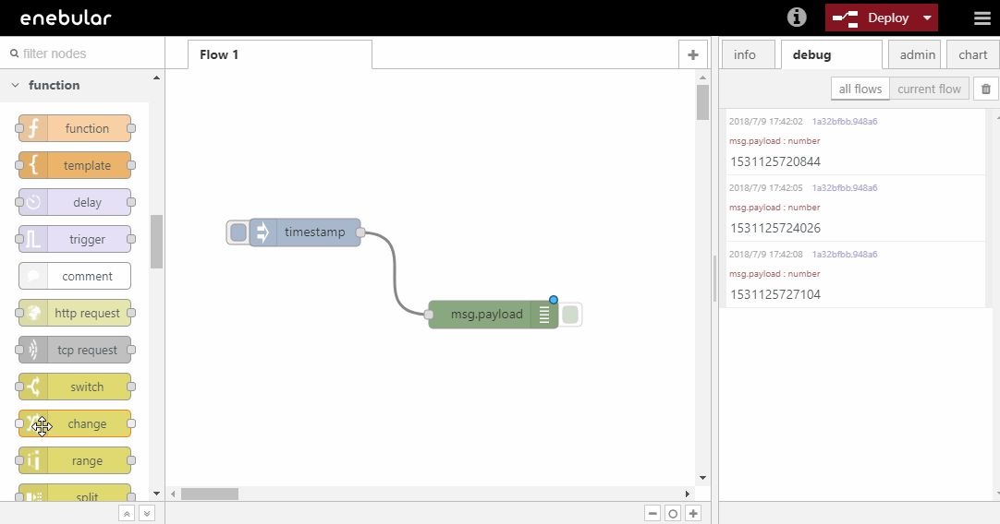
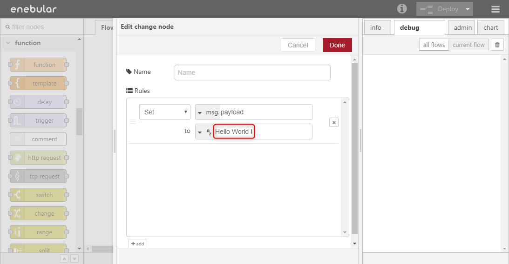

# Introduction

このチュートリアルでは以下のことを行います。

- Project の作成
- Asset(フロー)の作成
- フローの編集

## Projectの作成

enebular を始めるには、まず Project を作成します。ログイン後の画面にある Create Project からプロジェクトを作成します。

適当な title を入力して、Submit を押下します。

入力した名称で Project が作成されたことが一覧で確認できます。

## Assetの作成

Project を作成したら、enebular の Asset の1つである Flow を作成しましょう。作成した Project を選択して Project の管理画面に移動します。  
右下の + を押すと Asset を作成するモーダルが開きます。

Asset Type は `flow` を選択して、Flow のタイトルをつけます。Flow へのデフォルトのアクセス権（default role to asset）は今回は `superdev` に設定してください。一番下の category は任意のものを選択してください。  
Continue を押すと作成が完了し、Flow の詳細ページに移動します。

Edit Flow を押します。

フローを編集する画面が立ち上がります。

## フローの編集

Asset の作成が完了したので、フローを編集してみましょう。

ここではコンソールに `Hello World !` と出力するシンプルなフローを作成します。

フローエディタでは、左側のパレットに並んでいるノードをワークスペースにドラッグアンドドロップして、ノード同士を繋いでフローを作成していきます。

下図の要領で`injectノード`をワークスペースの中にドラッグアンドドロップで配置してください。`injectノード`はパレットの中で input に分類されています。
`injectノード`は、フローを開始するトリガーとなるノードです。

同様の手順で`debugノード`を配置します。`debugノード`はパレットの中で output に分類されています。
`debugノード`は 右メニューの debug タブ にメッセージを出力するノードです。

下図のように`injectノード`と`debugノード`をつなぎます。
Deploy ボタンを押下しフローを保存した後、画面右上の debug タブを選択します。最後に`injectノード`のボタンをクリックすることでフローが起動し debug タブにタイムスタンプが表示されます。

これでノードの配置、ノードのつなぎ方、そしてフローの起動方法が分かりました。

しかし今回はタイムスタンプではなく `Hello World !` と出力するフローを作成したいので、今作ったフローをさらに編集します。

`debugノード`はデフォルトの設定では、`msg.payload`に設定された値を debugタブに出力します。  
したがって`msg.payload`オブジェクトの値を `Hello World !` という文字列で置き換えることによって、目的を達成することができます。  
`msg.payload`の値を文字列に置き換えるには `changeノード`を使用します。

`injectノード`と`debugノード`の間に新しく`changeノード`を配置します。`changeノード`はパレットの中で function に分類されています。

配置した`changeノード`をダブルクリックしノードのを設定を行います。赤線で囲んだ部分に`Hello World !`と入力しDoneボタンを押下します。

Deployボタンを押下しフローを保存した後、injectノードのボタンを押下します。debugタブに`Hello World !`と出力されます。

## Well Done!

enebularの Projectの作成方法、Asset(フロー)の作成方法、そしてシンプルなフローの編集が出来るようになりました。