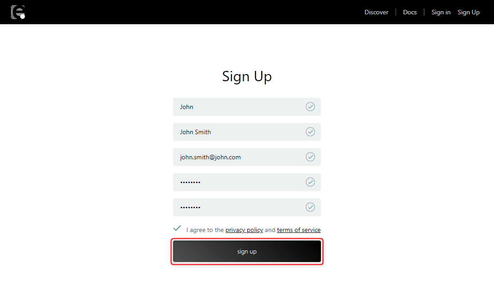

# Introduction

このチュートリアルでは「enebularにサインアップし、フローを編集する」ということを実施します。（所要時間20分）

## Table of Contents

1. [enebularへのサインアップ](#SignUp)
1. [Project の作成](#CreateProject)
1. [Asset(フロー)の作成](#CreateFlow)
1. [フローの編集](#EditFlow)

## enebularへのサインアップ{#SignUp}

** 注意 : enebular v1のアカウントではenebular v2にはサインインできません。enebular v1 ユーザーの方でenebular v2を使用したい場合、新しくアカウントを作成してください。**

https://enebular.com にアクセスし、`新規登録`ボタンを押下します。

入力フォームに必要な情報を入力してください。privacy policy と terms of service を確認したのち、`sign up`ボタンを押下してください。

下記の画面が表示され、登録したメールアドレスに登録確認用のメールが送信されます。メールが送信されるまで数分かかる場合があります。

登録確認用のメールにて、確認が完了すると enebular.com にサインイン可能になります。
`Go To Dashboard` をクリックしてください。

### 確認用メールが届かない場合

下記の手順で確認をお願いいたします。

1. 正しいメールアカウントをチェックしていることを確認してください
1. enebular.com からのメールがフィルタリングされていないことを確認してください
1. ** support@enebular.com **まで連絡をお願いします

## Projectの作成{#CreateProject}

enebular を始めるには、まず Project を作成します。サインイン後の画面にある Create Project からプロジェクトを作成します。

適当な title を入力して、Submit を押下します。

入力した名称で Project が作成されたことが一覧で確認できます。

## Asset(フロー)の作成{#CreateFlow}

Project を作成したら、enebular の Asset の1つである Flow を作成しましょう。作成した Project を選択して Project の管理画面に移動します。  
右下の + を押すと Asset を作成するモーダルが開きます。

Asset Type は `flow` を選択して、Flow のタイトルをつけます。Flow へのデフォルトのアクセス権（default role to asset）は今回は `superdev` に設定してください。一番下の category は任意のものを選択してください。  
Continue を押すと作成が完了し、Flow の詳細ページに移動します。

Edit Flow を押します。

フローを編集する画面が立ち上がります。

## フローの編集{#EditFlow}

Asset の作成が完了したので、フローを編集してみましょう。

ここではコンソールに `Hello World !` と出力するシンプルなフローを作成します。

フローエディタでは、左側のパレットに並んでいるノードをワークスペースにドラッグアンドドロップして、ノード同士を繋いでフローを作成していきます。

下図の要領で`injectノード`をワークスペースの中にドラッグアンドドロップで配置してください。`injectノード`はパレットの中で input に分類されています。
`injectノード`は、フローを開始するトリガーとなるノードです。

同様の手順で`debugノード`を配置します。`debugノード`はパレットの中で output に分類されています。
`debugノード`は 右メニューの debug タブ にメッセージを出力するノードです。

下図のように`injectノード`と`debugノード`をつなぎます。
Deploy ボタンを押下しフローを保存した後、画面右上の debug タブを選択します。最後に`injectノード`のボタンをクリックすることでフローが起動し debug タブにタイムスタンプが表示されます。

これでノードの配置、ノードのつなぎ方、そしてフローの起動方法が分かりました。

しかし今回はタイムスタンプではなく `Hello World !` と出力するフローを作成したいので、今作ったフローをさらに編集します。

`debugノード`はデフォルトの設定では、`msg.payload`に設定された値を debugタブに出力します。  
したがって`msg.payload`オブジェクトの値を `Hello World !` という文字列で置き換えることによって、目的を達成することができます。  
`msg.payload`の値を文字列に置き換えるには `changeノード`を使用します。

`injectノード`と`debugノード`の間に新しく`changeノード`を配置します。`changeノード`はパレットの中で function に分類されています。

配置した`changeノード`をダブルクリックしノードの設定を行います。赤線で囲んだ部分に`Hello World !`と入力しDoneボタンを押下します。

Deployボタンを押下しフローを保存した後、injectノードのボタンを押下します。debugタブに`Hello World !`と出力されます。

## Well Done!

enebularの Projectの作成方法、Asset(フロー)の作成方法、そしてシンプルなフローの編集が出来るようになりました。